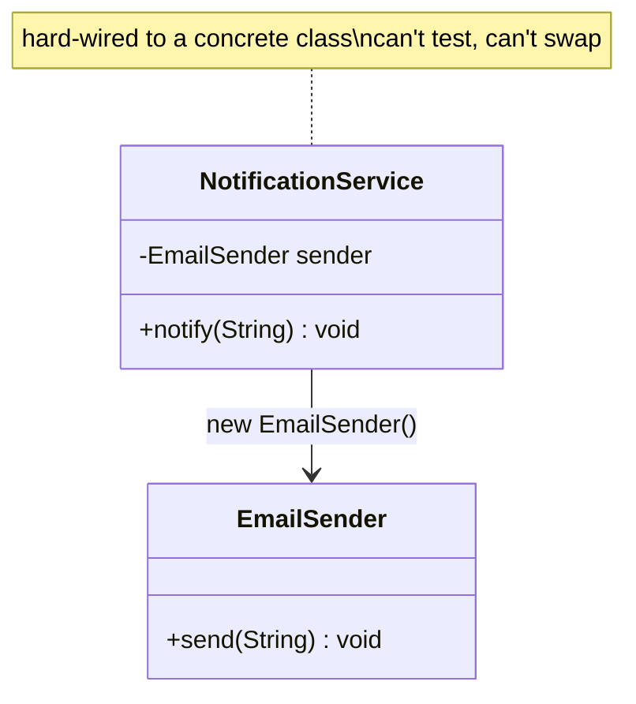
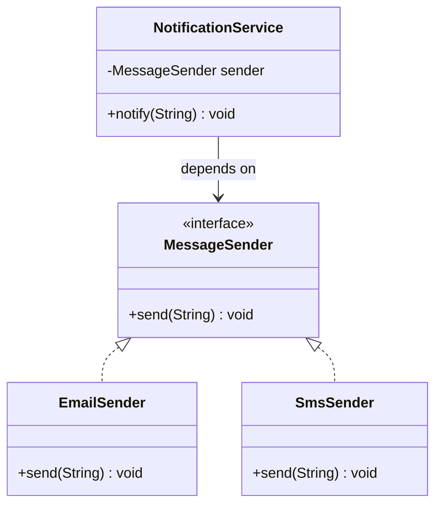
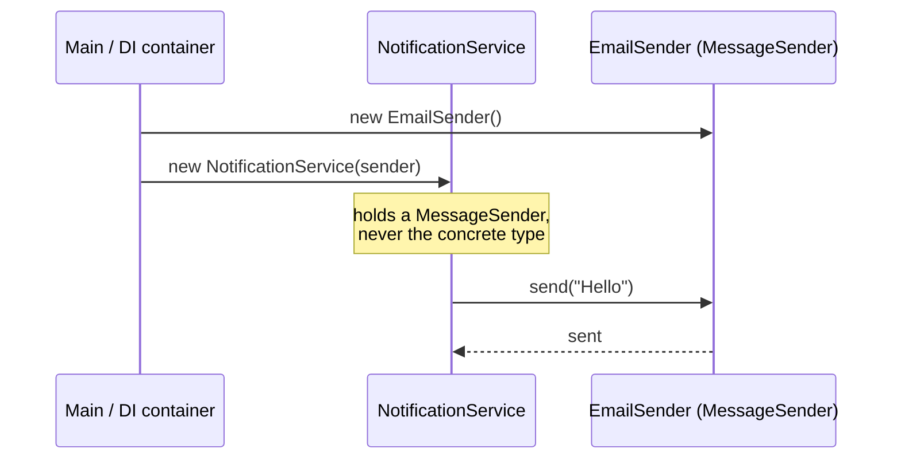

The **D** in SOLID. Two rules:

1. High-level modules should **not depend on** low-level modules. Both should depend on **abstractions**.
2. Abstractions should not depend on details. **Details** should depend on **abstractions**.

"Inversion" = the arrow of dependency is **flipped**. Instead of policy reaching down to a concrete tool, both policy and tool reach *up* to an interface.

## The smell: high-level glued to a concrete detail

`NotificationService` (policy) directly `new`s `EmailSender` (detail). Want SMS? You must edit the high-level class.



## The fix: both depend on an abstraction

Introduce a `MessageSender` interface. The service depends on it; `EmailSender`/`SmsSender` implement it. The dependency now points **inward** to the abstraction.



The concrete sender is **injected** from outside — usually through the constructor.

## Dependency Injection: who wires it up?

DIP says *depend on abstractions*; **Dependency Injection (DI)** is the technique that *supplies* the concrete implementation from the outside (constructor, setter, or a framework container) so the class never `new`s its own collaborators.



## Before vs after

````tabs
tabs:
  - label: Violation (hard-wired)
    body: |
      The high-level service constructs its own low-level detail.
      ```java
      class EmailSender {
          void send(String msg) { /* SMTP */ }
      }
      class NotificationService {
          private final EmailSender sender = new EmailSender(); // glued!
          void notify(String msg) { sender.send(msg); }
      }
      ```
      Swapping to SMS or unit-testing with a fake is impossible without editing this class.
  - label: Fix (DIP + constructor injection)
    body: |
      Depend on an interface; receive the implementation from outside.
      ```java
      interface MessageSender { void send(String msg); }

      class EmailSender implements MessageSender {
          public void send(String msg) { /* SMTP */ }
      }
      class SmsSender implements MessageSender {
          public void send(String msg) { /* SMS gateway */ }
      }

      class NotificationService {
          private final MessageSender sender;
          NotificationService(MessageSender sender) { // injected
              this.sender = sender;
          }
          void notify(String msg) { sender.send(msg); }
      }

      // wiring (composition root)
      var svc = new NotificationService(new EmailSender());
      // testing
      var test = new NotificationService(msg -> captured.add(msg));
      ```
````

:::key
DIP = **program to an interface, not an implementation.** DI is *how* you deliver that interface's concrete value (constructor / setter / container). Together they make code swappable, testable (inject a mock), and free of `new` on collaborators.
:::

:::gotcha
DIP ≠ "use a DI framework like Spring." You can fully honour DIP with plain constructor injection and a `new` in `main()`. The framework is optional sugar; the **inverted dependency** is the principle.
:::

:::senior
The abstraction should be **owned by the high-level module**, not the low-level one — that's what truly inverts control. In Clean Architecture the inner (policy) layer declares the interface, and the outer (detail) layer implements it, so all source-code dependencies point inward toward the stable core.
:::

## Check yourself

```quiz
title: DIP check
questions:
  - q: 'What does Dependency *Inversion* invert?'
    options:
      - text: 'The direction of the dependency — both policy and detail now point at an abstraction'
        correct: true
      - 'The order methods execute'
      - 'The inheritance hierarchy'
    explain: 'Instead of high-level → low-level, both depend on an interface. The source dependency is flipped to point at the abstraction.'
  - q: 'What is the relationship between DIP and Dependency Injection?'
    options:
      - 'They are the same thing'
      - text: 'DIP is the principle (depend on abstractions); DI is the technique that supplies the concrete implementation'
        correct: true
      - 'DI replaces DIP'
    explain: 'DIP says depend on abstractions; DI is one way to fulfil it by injecting the concrete collaborator from outside.'
  - q: 'A class does `new EmailSender()` inside its constructor. Which SOLID principle is violated?'
    options:
      - text: 'DIP — it depends on a concretion, not an abstraction'
        correct: true
      - 'LSP'
      - 'ISP'
    explain: 'Hard-wiring a concrete collaborator couples the high-level class to a low-level detail; inject a MessageSender abstraction instead.'
```
