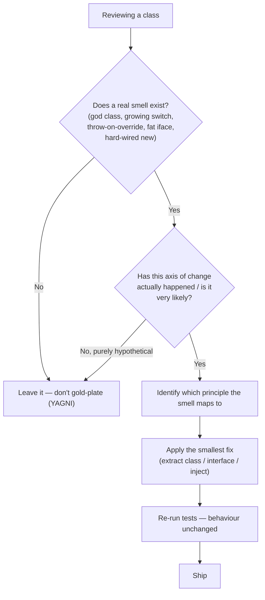

The five principles aren't a checklist you apply blindly — they're a **toolbox** you reach into when a smell appears. They also reinforce one another: good ISP makes DIP easier; OCP relies on LSP being honoured.

## The five at a glance

| | Principle | One-line rule | Core tool |
|--|--|--|--|
| **S** | Single Responsibility | One reason to change | Split by actor |
| **O** | Open/Closed | Extend without editing | Polymorphism / Strategy |
| **L** | Liskov Substitution | Subtypes stay substitutable | Honour the base contract |
| **I** | Interface Segregation | No fat interfaces | Small role interfaces |
| **D** | Dependency Inversion | Depend on abstractions | Inject via interfaces |

## Smell → principle → cure

| Code smell you notice | Principle at risk | Cure |
|--|--|--|
| A class touched by many unrelated teams / a "god class" | **SRP** | Split along reasons to change |
| A `switch`/`instanceof` that grows with every new type | **OCP** | Introduce an abstraction + Strategy |
| A subclass overriding a method to `throw` or no-op | **LSP** | Drop the inheritance; use composition |
| Implementers throwing `UnsupportedOperationException` | **ISP** | Segregate into role interfaces |
| `new ConcreteThing()` wired inside business logic | **DIP** | Depend on an interface; inject it |

## How to decide: refactor or leave it?



## Don't over-apply

:::warning
**SOLID can be over-engineered.** A factory for a factory, an interface with a single implementation that will never grow, one-method classes everywhere — this is **needless complexity** and **speculative generality**. Abstraction has a cost: indirection, more files, harder navigation.
:::

- Apply OCP/DIP abstractions on the axis that has **already** changed once or twice — not on every imagined future (**YAGNI**).
- A single-implementation interface is fine *if* it exists for testing/mocking or a real seam; it's waste if it exists "just in case."
- Prefer **composition over inheritance** to sidestep LSP traps entirely.

:::senior
Senior lens: SOLID is a means to the real goals — **low coupling, high cohesion, testability, and cheap change**. If a "violation" causes no pain and no realistic change is coming, the principled refactor is often the *wrong* call. Optimise for the change you can see, not the one you can imagine.
:::

## Recap flashcards

```flashcards
title: SOLID recall
cards:
  - front: '**S** — Single Responsibility'
    back: 'One reason to change; group by actor. Fix a god class by splitting it.'
  - front: '**O** — Open/Closed'
    back: 'Open for extension, closed for modification. Replace a growing `switch` with polymorphism/Strategy.'
  - front: '**L** — Liskov Substitution'
    back: 'Subtypes must be substitutable for the base without breaking correctness. Rectangle/Square is the classic violation.'
  - front: '**I** — Interface Segregation'
    back: 'No fat interfaces. Symptom: implementers throwing `UnsupportedOperationException`. Fix: small role interfaces.'
  - front: '**D** — Dependency Inversion'
    back: 'Depend on abstractions, not concretions. Inject collaborators (DI) instead of `new`-ing them.'
  - front: 'Biggest SOLID anti-pattern?'
    back: 'Over-applying it — speculative abstraction / needless complexity. Follow YAGNI.'
```

## Check yourself

```quiz
title: SOLID in practice check
questions:
  - q: 'You see a subclass that overrides `save()` to throw `UnsupportedOperationException`. Which principle is most directly violated?'
    options:
      - text: 'LSP — the subtype is no longer substitutable'
        correct: true
      - 'OCP'
      - 'SRP'
    explain: 'A subclass that cannot honour the base method breaks substitutability (LSP). It often also hints at an ISP problem.'
  - q: 'A single-implementation interface with no test or extension need is usually a sign of...'
    options:
      - 'Excellent DIP'
      - text: 'Over-engineering / speculative generality — violating YAGNI'
        correct: true
      - 'Good SRP'
    explain: 'Abstraction without a real seam adds indirection for no benefit. Add it when a second implementation or a test seam actually appears.'
  - q: 'What are the underlying goals SOLID serves?'
    options:
      - 'More classes and interfaces'
      - text: 'Low coupling, high cohesion, testability, and cheap change'
        correct: true
      - 'Faster runtime performance'
    explain: 'SOLID is a means, not an end. If a refactor does not improve those goals, it may not be worth doing.'
  - q: 'Which principle does a growing `if/else if` chain on a `type` field most directly signal?'
    options:
      - text: 'OCP — the class must be edited for each new type'
        correct: true
      - 'LSP'
      - 'ISP'
    explain: 'A type-dispatching conditional that grows with new types is the canonical Open/Closed violation.'
```

:::key
Learn the smell→principle map, apply the **smallest** fix on axes that actually change, and stop before you drown in abstraction. SOLID's north star is **cheap, safe change** — not maximising the number of interfaces.
:::
