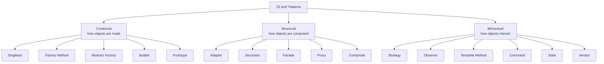

A **design pattern** is a *named*, reusable solution to a problem that keeps recurring in
object-oriented design. It is not code you paste — it is a **template** for how classes and
objects collaborate. Patterns give a team a shared vocabulary: say *"use a Factory here"* and
everyone pictures the same structure.

## The GoF map

The 23 classic patterns from *Design Patterns* (Gang of Four, 1994) split into **three
families** by what they organize.



## The three families at a glance

| Family | Question it answers | Key idea | Examples |
|--|--|--|--|
| **Creational** | *How is this object created?* | Decouple client from the concrete class it instantiates | Singleton, Factory Method, Abstract Factory, Builder, Prototype |
| **Structural** | *How are objects composed?* | Assemble objects & classes into larger structures | Adapter, Decorator, Facade, Proxy, Composite |
| **Behavioral** | *How do objects talk & share work?* | Assign responsibility and manage communication | Strategy, Observer, Template Method, Command, State, Iterator |

:::key
Memorize the split by the verb: creational = **create**, structural = **compose**,
behavioral = **communicate**. Almost every interview pattern question starts by asking which
family a pattern belongs to.
:::

## Why bother?

- **Vocabulary** — "wrap it in a Decorator" is faster than describing the mechanics.
- **Proven** — battle-tested structures beat inventing your own.
- **Flexibility** — patterns target the parts of a system *likely to change*, isolating them
  behind interfaces so change stays local.

:::warning
Patterns are a means, not a goal. Reaching for a pattern before you feel the pain it solves is
**over-engineering** — you pay for flexibility you never use. See *Choosing Patterns*.
:::

:::senior
The unifying advice behind almost every pattern is two principles: **program to an interface,
not an implementation**, and **favor object composition over class inheritance**. If a pattern
feels arbitrary, trace it back to one of these two.
:::

## The catalog, front to back

```flashcards
title: GoF family recall
cards:
  - front: 'Which family: **Singleton**?'
    back: '**Creational** — controls how (and how many) instances are created.'
  - front: 'Which family: **Adapter**?'
    back: '**Structural** — converts one interface into another so incompatible classes cooperate.'
  - front: 'Which family: **Observer**?'
    back: '**Behavioral** — one-to-many notification when a subject changes state.'
  - front: 'Which family: **Builder**?'
    back: '**Creational** — assembles a complex object step by step.'
  - front: 'Which family: **Decorator**?'
    back: '**Structural** — adds responsibilities to an object dynamically by wrapping it.'
  - front: 'Which family: **Strategy**?'
    back: '**Behavioral** — swaps interchangeable algorithms behind one interface.'
  - front: 'The two guiding principles behind the patterns?'
    back: 'Program to an **interface**, not an implementation · favor **composition** over inheritance.'
```

## Check yourself

```quiz
title: Patterns intro check
questions:
  - q: 'A pattern that decides *how an object gets instantiated* belongs to which family?'
    options:
      - text: 'Creational'
        correct: true
      - 'Structural'
      - 'Behavioral'
    explain: 'Creational patterns abstract the instantiation process so the client is decoupled from concrete classes.'
  - q: 'Which statement about design patterns is correct?'
    options:
      - 'They are ready-made classes you copy from a library.'
      - text: 'They are reusable templates describing how classes and objects collaborate.'
        correct: true
      - 'They are language features built into Java.'
    explain: 'A pattern is a design template, not finished code and not a language keyword.'
  - q: 'Adapter, Decorator, and Facade all belong to which family?'
    options:
      - 'Creational'
      - text: 'Structural'
        correct: true
      - 'Behavioral'
    explain: 'They all deal with how objects are composed into larger structures.'
  - q: 'What is the main risk of applying patterns eagerly?'
    options:
      - 'Slower compilation'
      - text: 'Over-engineering — adding flexibility and indirection you never need'
        correct: true
      - 'They break encapsulation'
    explain: 'Patterns add indirection. Use one only when the problem it solves actually appears.'
```
