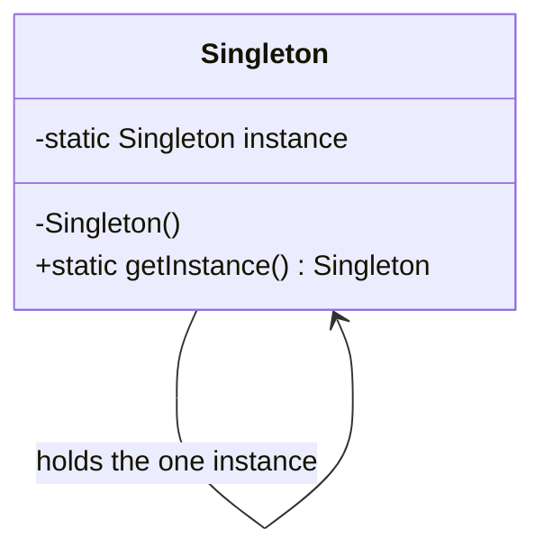
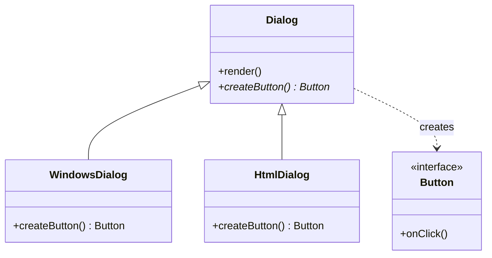
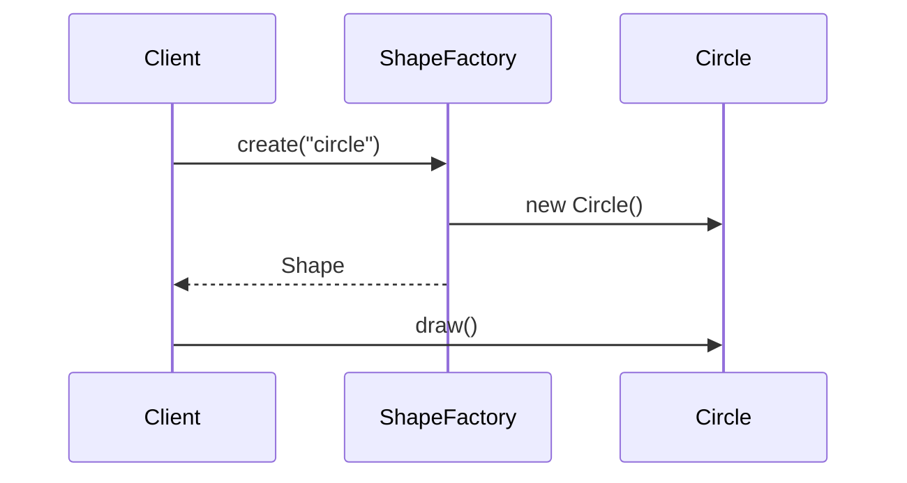
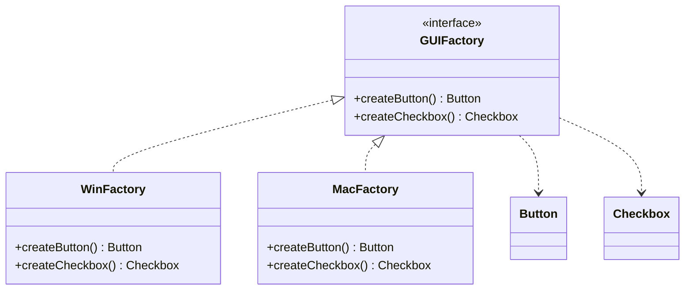
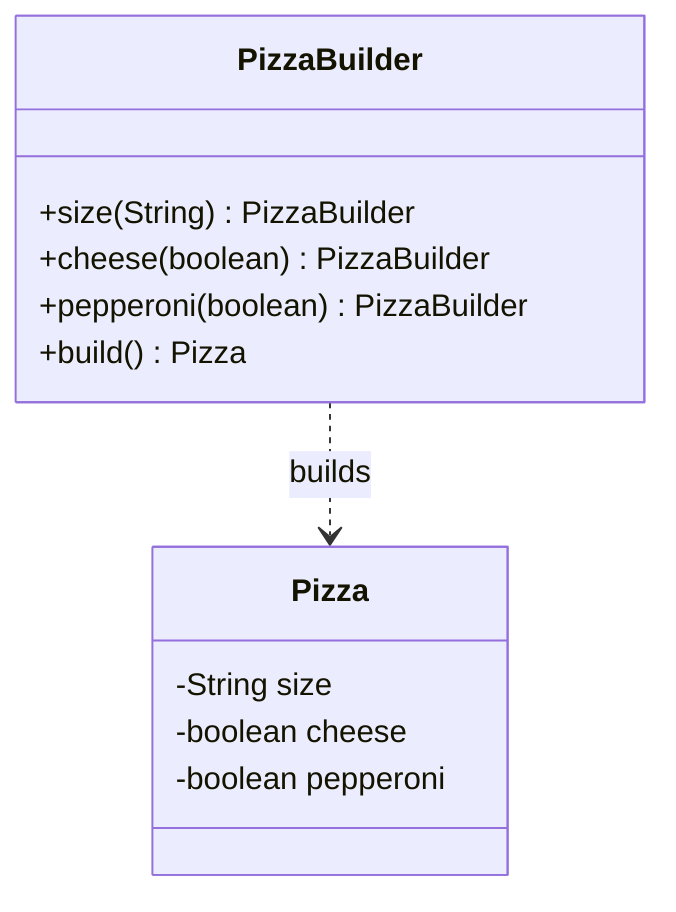
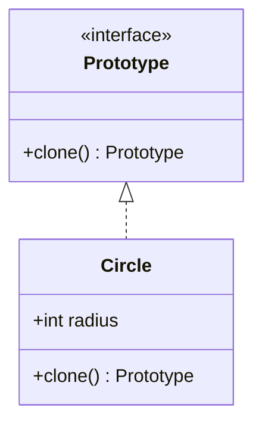

**Creational** patterns abstract *how objects come to exist*, so the client depends on an
interface instead of a concrete constructor. Change the class you instantiate without touching
the code that uses it.

| Pattern | Intent | One-line tell |
|--|--|--|
| **Singleton** | Exactly one instance, global access | `getInstance()` |
| **Factory Method** | Subclass decides which class to instantiate | one `create()`, many overrides |
| **Abstract Factory** | Create *families* of related objects | a factory of factories |
| **Builder** | Assemble a complex object step by step | fluent `.build()` |
| **Prototype** | Create by cloning an existing instance | `clone()` |

## Singleton

Guarantees a single instance and a global access point (config, logging, connection pool).



````tabs
tabs:
  - label: Enum (best)
    body: |
      The simplest thread-safe, serialization-safe Singleton in Java.
      ```java
      public enum Config {
        INSTANCE;
        private final Properties props = load();
        public String get(String k) { return props.getProperty(k); }
      }
      // use: Config.INSTANCE.get("url");
      ```
  - label: Lazy holder
    body: |
      Thread-safe lazy init via the classloader — no locking.
      ```java
      public final class Registry {
        private Registry() {}
        private static class Holder { static final Registry I = new Registry(); }
        public static Registry getInstance() { return Holder.I; }
      }
      ```
  - label: Double-checked
    body: |
      Classic lazy Singleton; the field **must** be `volatile`.
      ```java
      public final class Cache {
        private static volatile Cache instance;
        private Cache() {}
        public static Cache getInstance() {
          if (instance == null)
            synchronized (Cache.class) {
              if (instance == null) instance = new Cache();
            }
          return instance;
        }
      }
      ```
````

:::gotcha
Singleton is the most **overused** pattern — it is a global variable in disguise, hurting
testability and hiding dependencies. Prefer passing one shared instance via dependency
injection over a hardcoded `getInstance()`.
:::

## Factory Method

Defines a `create()` method that subclasses override to choose the concrete product. The
creator code works only against the product **interface**.



How a client gets an object without naming its class:



````tabs
tabs:
  - label: Factory Method
    body: |
      ```java
      interface Button { void onClick(); }

      abstract class Dialog {
        void render() { createButton().onClick(); }  // uses the product
        abstract Button createButton();               // subclass decides
      }
      class WindowsDialog extends Dialog {
        Button createButton() { return new WindowsButton(); }
      }
      ```
  - label: Simple factory
    body: |
      A static "simple factory" (not GoF, but common) centralizes the `switch`.
      ```java
      class ShapeFactory {
        static Shape create(String type) {
          return switch (type) {
            case "circle" -> new Circle();
            case "square" -> new Square();
            default -> throw new IllegalArgumentException(type);
          };
        }
      }
      ```
````

## Abstract Factory

Creates **families** of related products (a whole UI kit) without naming concrete classes, so
every product is guaranteed to match the same theme.



:::note
**Factory Method** makes *one* product via inheritance; **Abstract Factory** makes a *family*
of products via composition (you hold a factory object). Abstract Factory is usually built
*from* several Factory Methods.
:::

## Builder

Separates the construction of a complex object from its representation. Ideal when a
constructor would need many (often optional) parameters — the "telescoping constructor" smell.



````tabs
tabs:
  - label: Fluent builder
    body: |
      ```java
      Pizza p = new Pizza.Builder("large")
          .cheese(true)
          .pepperoni(true)
          .build();
      ```
  - label: The builder
    body: |
      ```java
      public class Pizza {
        private final String size; private final boolean cheese;
        private Pizza(Builder b) { size = b.size; cheese = b.cheese; }
        public static class Builder {
          private final String size; private boolean cheese;
          public Builder(String size) { this.size = size; }
          public Builder cheese(boolean v) { cheese = v; return this; }
          public Pizza build() { return new Pizza(this); }
        }
      }
      ```
````

## Prototype

Create new objects by **cloning** a prototype instead of calling `new` — cheaper when
construction is expensive, or when the concrete type is unknown at compile time.



```java
class Circle implements Cloneable {
  int radius;
  public Circle clone() { Circle c = new Circle(); c.radius = this.radius; return c; }
}
```

:::gotcha
Java's `Object.clone()` does a **shallow** copy — nested mutable objects are shared between
original and clone. For independent copies, deep-copy the mutable fields yourself.
:::

## Check yourself

```quiz
title: Creational check
questions:
  - q: 'You need a class with exactly one instance and a global access point. Which pattern?'
    options:
      - text: 'Singleton'
        correct: true
      - 'Prototype'
      - 'Builder'
    explain: 'Singleton restricts a class to a single instance and exposes it globally.'
  - q: 'A constructor has 8 parameters, most optional, and you want readable, immutable objects. Which pattern?'
    options:
      - 'Abstract Factory'
      - text: 'Builder'
        correct: true
      - 'Factory Method'
    explain: 'Builder replaces telescoping constructors with a fluent, step-by-step assembly and can produce immutable objects.'
  - q: 'What distinguishes Abstract Factory from Factory Method?'
    options:
      - text: 'Abstract Factory creates families of related objects; Factory Method creates one product via subclassing'
        correct: true
      - 'Abstract Factory always uses reflection'
      - 'They are identical'
    explain: 'Factory Method = one product per subclass (inheritance). Abstract Factory = a family of matching products (composition).'
  - q: 'Why must the double-checked-locking Singleton field be `volatile`?'
    options:
      - 'To make it faster'
      - text: 'To prevent other threads from seeing a partially constructed instance'
        correct: true
      - 'It is not required'
    explain: 'Without `volatile`, instruction reordering can publish a reference before the constructor finishes, so another thread sees a half-built object.'
```

:::key
Creational = decouple the client from **what** it instantiates. Singleton (one instance),
Factory Method (subclass picks one product), Abstract Factory (family of products), Builder
(step-by-step assembly), Prototype (clone).
:::
