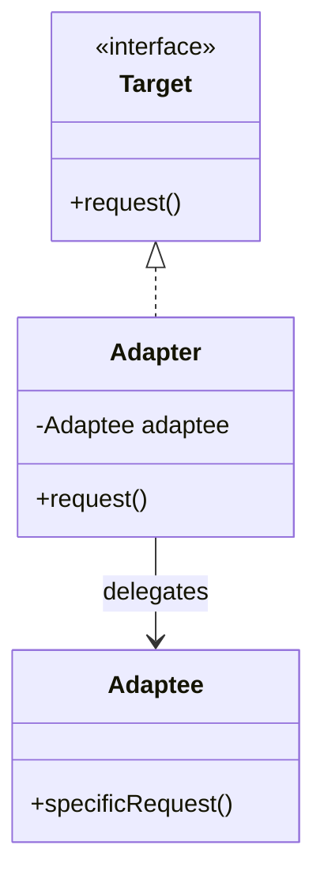
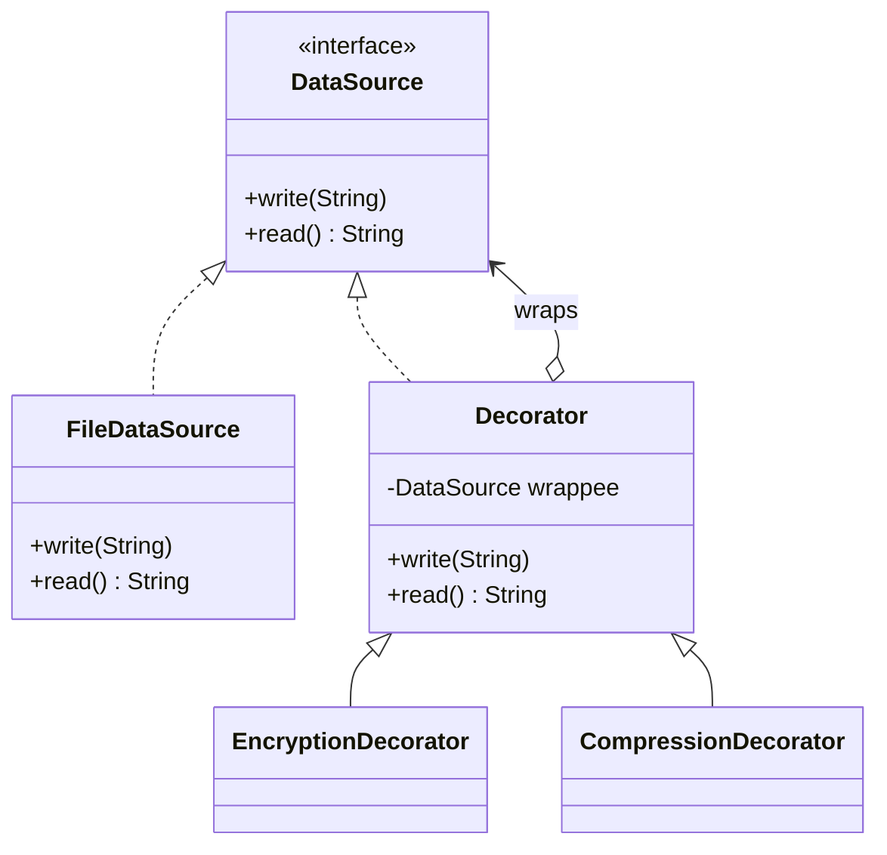
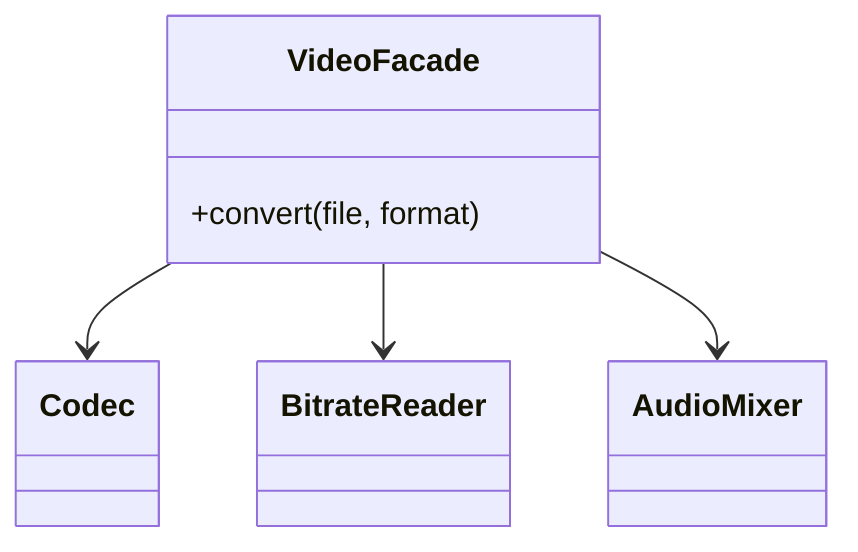
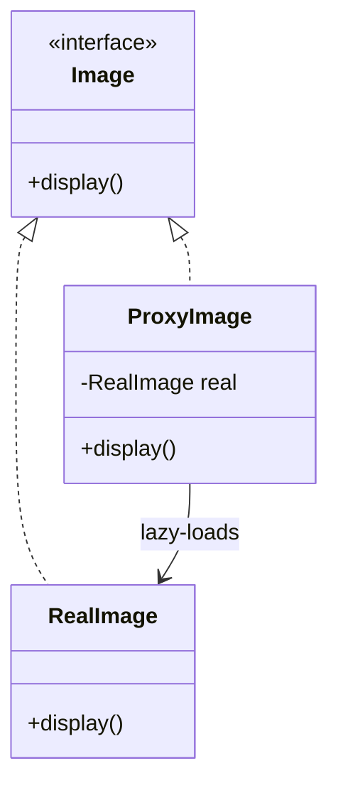
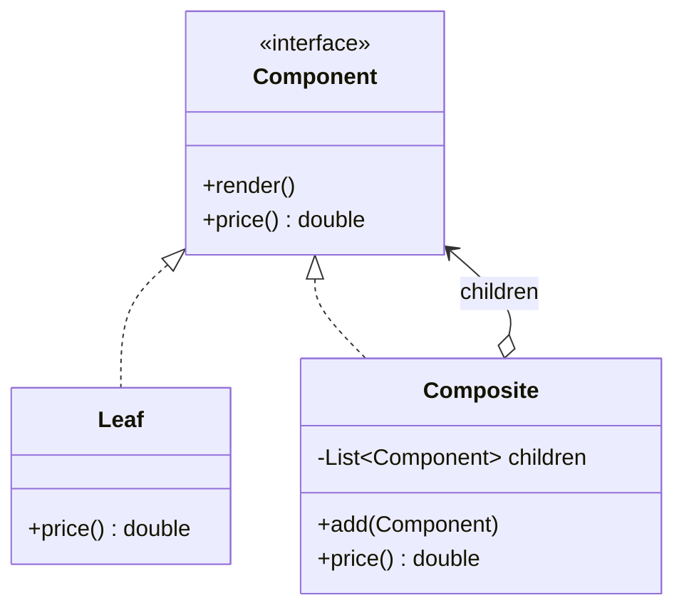

**Structural** patterns describe *how objects and classes are assembled* into bigger
structures while keeping them flexible and efficient. Most of them work by **wrapping** one
object in another.

| Pattern | Intent | Real Java example |
|--|--|--|
| **Adapter** | Convert one interface into another | `Arrays.asList()`, `InputStreamReader` |
| **Decorator** | Add behavior by wrapping, dynamically | `java.io` streams |
| **Facade** | One simple front for a complex subsystem | `javax.faces`, SLF4J |
| **Proxy** | A stand-in that controls access | Spring AOP, RMI, Hibernate lazy loading |
| **Composite** | Treat individual & groups uniformly | Swing containers, the file system |

## Adapter

Wraps an object with an **incompatible** interface so a client can use it. The classic
"power plug adapter."



```java
interface Target { String request(); }
class Adaptee { String specificRequest() { return "raw data"; } }

class Adapter implements Target {
  private final Adaptee adaptee;
  Adapter(Adaptee a) { this.adaptee = a; }
  public String request() { return "adapted: " + adaptee.specificRequest(); }
}
```

## Decorator

Adds responsibilities to an object **dynamically** by wrapping it in a decorator that shares
its interface. Decorators can stack — this is exactly how `java.io` builds streams.



````tabs
tabs:
  - label: java.io in the wild
    body: |
      Every wrap adds a layer of behavior — buffering, then data typing.
      ```java
      DataInputStream in = new DataInputStream(
          new BufferedInputStream(
              new FileInputStream("data.bin")));
      int n = in.readInt();  // buffered + typed reads
      ```
  - label: Your own decorator
    body: |
      ```java
      abstract class Decorator implements DataSource {
        protected final DataSource wrappee;
        Decorator(DataSource d) { this.wrappee = d; }
      }
      class EncryptionDecorator extends Decorator {
        EncryptionDecorator(DataSource d) { super(d); }
        public void write(String s) { wrappee.write(encrypt(s)); }
        public String read() { return decrypt(wrappee.read()); }
      }
      ```
````

:::note
**Decorator vs inheritance:** inheritance adds behavior at *compile time* to *every* instance.
Decorator adds it at *runtime* to *individual* objects, and combinations stack without a class
explosion (`Buffered` + `Encrypted` + `Compressed`).
:::

## Facade

Provides one simplified interface to a complicated subsystem. The client talks to the facade;
the facade orchestrates the messy internals.



```java
class VideoFacade {
  File convert(String file, String format) {
    var codec = CodecFactory.extract(file);
    var buffer = BitrateReader.read(file, codec);
    return AudioMixer.fix(buffer);   // client calls one method
  }
}
```

:::tip
Adapter changes an interface to match what the client *expects*; Facade *invents* a new,
simpler interface over many classes. Adapter wraps **one** object, Facade fronts **many**.
:::

## Proxy

A placeholder that has the **same interface** as the real object and controls access to it —
for lazy loading, caching, access control, or logging.



```java
class ProxyImage implements Image {
  private final String file;
  private RealImage real;   // heavy object, created on first use
  ProxyImage(String file) { this.file = file; }
  public void display() {
    if (real == null) real = new RealImage(file);  // lazy load
    real.display();
  }
}
```

:::senior
Proxy and Decorator have an **identical class structure** — both wrap an object sharing its
interface. The intent differs: a Decorator *adds behavior*; a Proxy *controls access* (and
often creates the real subject itself). Spring's AOP and Hibernate's lazy entities are dynamic
proxies.
:::

## Composite

Composes objects into **tree** structures and lets clients treat a single leaf and a whole
branch **uniformly** through one interface.



```java
interface Component { double price(); }
class Product implements Component {
  private final double p; Product(double p) { this.p = p; }
  public double price() { return p; }
}
class Box implements Component {
  private final List<Component> items = new ArrayList<>();
  void add(Component c) { items.add(c); }
  public double price() {                    // same call, whole subtree
    return items.stream().mapToDouble(Component::price).sum();
  }
}
```

## Check yourself

```quiz
title: Structural check
questions:
  - q: 'The `java.io` stack (`new BufferedInputStream(new FileInputStream(...))`) is an example of which pattern?'
    options:
      - 'Adapter'
      - text: 'Decorator'
        correct: true
      - 'Facade'
    explain: 'Each stream wraps another, adding behavior (buffering, typing) at runtime — the Decorator pattern.'
  - q: 'You must integrate a third-party class whose method names differ from the interface your code expects. Which pattern?'
    options:
      - text: 'Adapter'
        correct: true
      - 'Proxy'
      - 'Composite'
    explain: 'Adapter converts the existing interface into the one the client expects.'
  - q: 'Proxy and Decorator share the same structure. What differs?'
    options:
      - 'Proxy uses inheritance, Decorator uses composition'
      - text: 'Intent — Proxy controls access, Decorator adds behavior'
        correct: true
      - 'Nothing, they are the same pattern'
    explain: 'Both wrap an object with the same interface; the purpose (control access vs enhance) is what distinguishes them.'
  - q: 'You want clients to treat a single file and a folder of files the same way. Which pattern?'
    options:
      - 'Facade'
      - text: 'Composite'
        correct: true
      - 'Adapter'
    explain: 'Composite lets leaves and containers share one interface, so clients handle trees uniformly.'
```

:::key
Structural = **compose** objects. Adapter (convert interface), Decorator (add behavior by
wrapping), Facade (simplify a subsystem), Proxy (control access with same interface),
Composite (tree of parts treated uniformly).
:::
