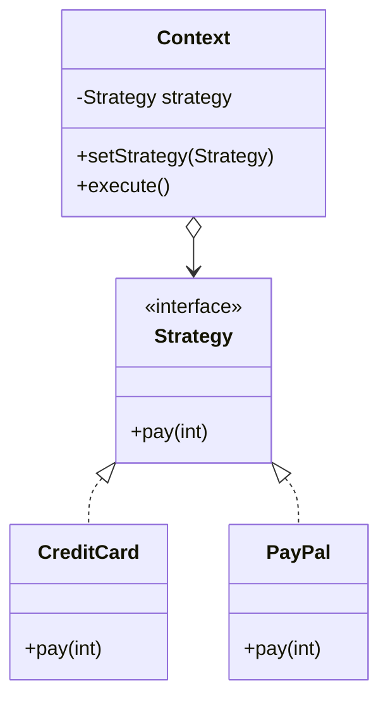
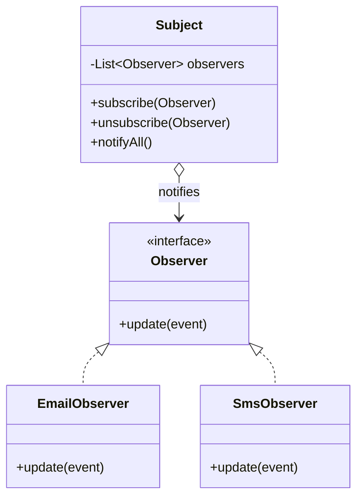
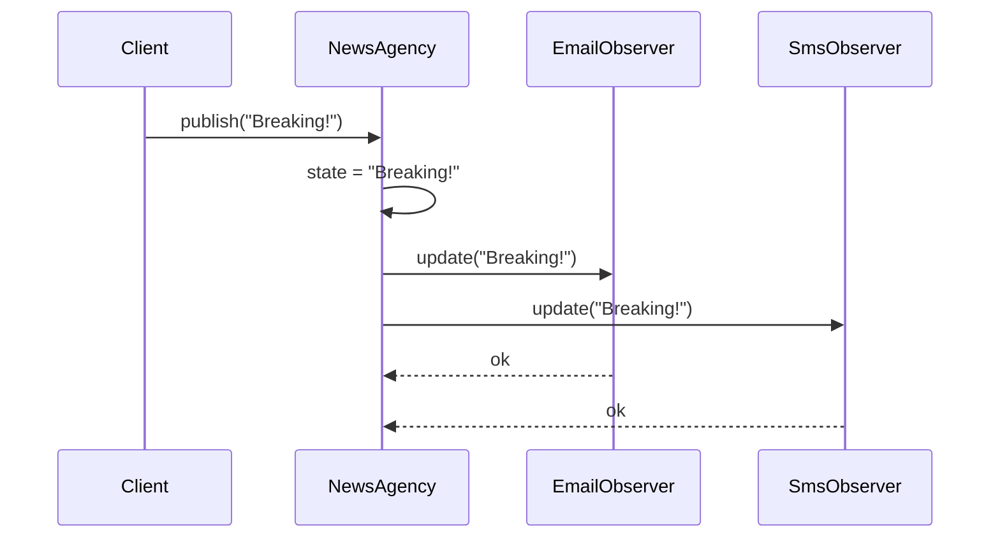
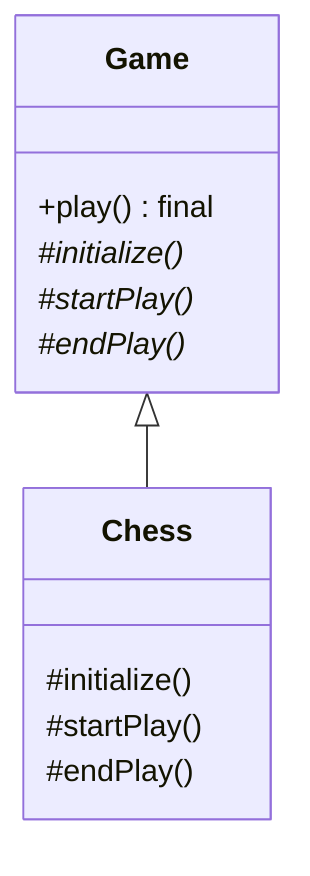
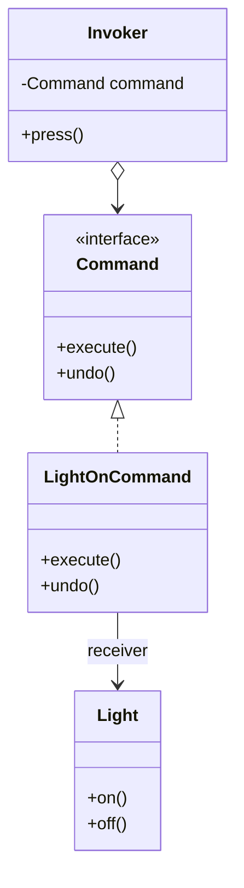
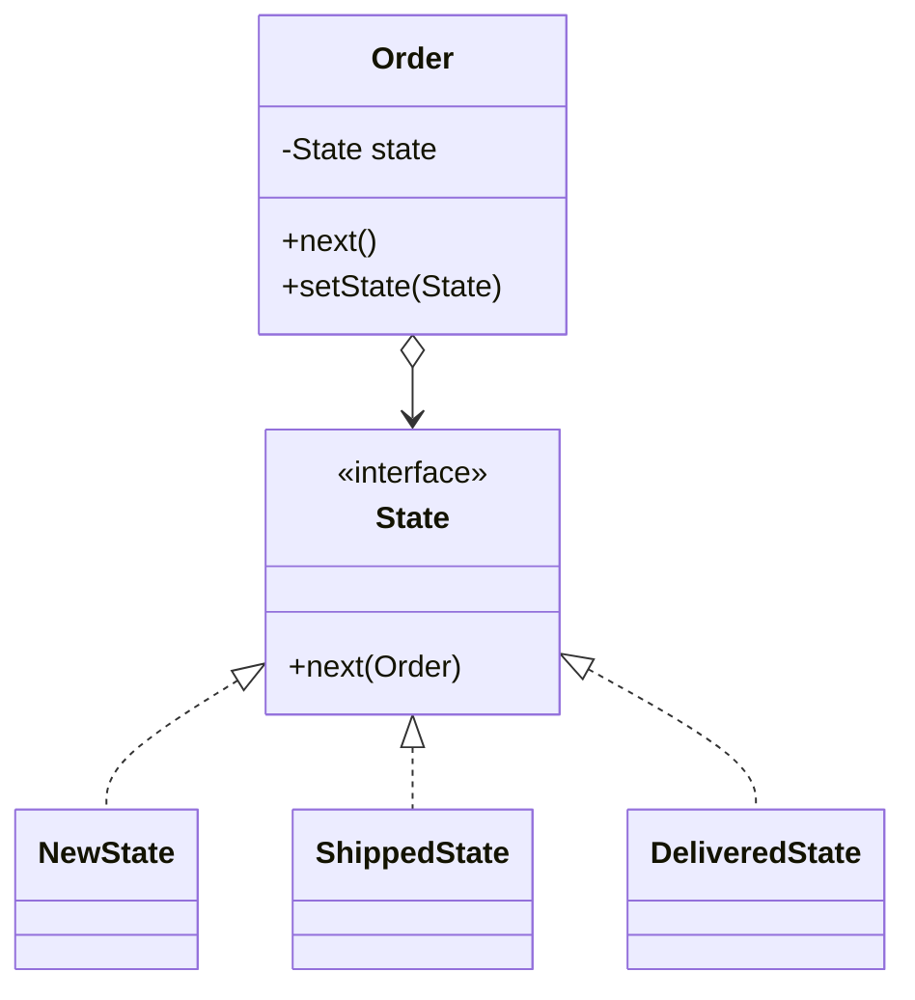

**Behavioral** patterns are about *responsibility and communication* — who does what, and how
objects talk without tight coupling.

| Pattern | Intent | One-line tell |
|--|--|--|
| **Strategy** | Swap interchangeable algorithms | inject a behavior object |
| **Observer** | One-to-many change notification | `subscribe()` / `notify()` |
| **Template Method** | Fixed skeleton, overridable steps | `final` method calls abstract steps |
| **Command** | Wrap a request as an object | `execute()` / `undo()` |
| **State** | Behavior changes with internal state | delegate to a state object |
| **Iterator** | Traverse without exposing internals | `hasNext()` / `next()` |

## Strategy

Defines a family of algorithms, encapsulates each, and makes them interchangeable at runtime.
The context holds a reference to a strategy interface.



```java
interface PayStrategy { void pay(int cents); }

class Checkout {
  private PayStrategy strategy;
  void setStrategy(PayStrategy s) { this.strategy = s; }
  void pay(int cents) { strategy.pay(cents); }   // delegates
}
// swap behavior at runtime:
checkout.setStrategy(new PayPalStrategy());
```

:::note
A `Comparator` passed to `list.sort(...)` **is** Strategy — you inject the comparison
algorithm. Lambdas make single-method strategies almost invisible.
:::

## Observer

Defines a one-to-many dependency: when the **subject** changes, all registered **observers**
are notified automatically. The backbone of event systems and MVC.



Watch a state change ripple out to every subscriber:



```java
interface Observer { void update(String news); }

class NewsAgency {
  private final List<Observer> subs = new ArrayList<>();
  void subscribe(Observer o) { subs.add(o); }
  void publish(String news) {
    for (Observer o : subs) o.update(news);   // fan-out
  }
}
```

:::gotcha
Observers can leak memory: a subject holding strong references keeps dead observers alive.
Always `unsubscribe`, or use weak references. Also beware notification storms and ordering
assumptions.
:::

## Template Method

Defines the **skeleton** of an algorithm in a `final` method, deferring specific steps to
subclasses. "Don't call us, we'll call you" (the Hollywood Principle).



```java
abstract class Game {
  public final void play() {   // fixed skeleton
    initialize();
    startPlay();
    endPlay();
  }
  protected abstract void initialize();
  protected abstract void startPlay();
  protected abstract void endPlay();
}
```

## Command

Encapsulates a request as an object, letting you parameterize, queue, log, and **undo**
operations.



```java
interface Command { void execute(); void undo(); }

class LightOnCommand implements Command {
  private final Light light;
  LightOnCommand(Light l) { this.light = l; }
  public void execute() { light.on(); }
  public void undo()    { light.off(); }
}
```

## State

Lets an object alter its behavior when its **internal state** changes — it appears to change
class. Replaces sprawling `if/switch` on a state field.



:::senior
**Strategy and State share the same UML.** The difference is intent: Strategy's algorithms are
chosen *by the client* and are independent of each other; State's objects *drive their own
transitions* and know about each other. State is a Strategy that swaps itself.
:::

## Iterator

Provides sequential access to a collection's elements without exposing its internal structure.
Java's `Iterator` / `Iterable` and the for-each loop are this pattern.

```java
List<String> names = List.of("Ann", "Bo");
Iterator<String> it = names.iterator();
while (it.hasNext()) System.out.println(it.next());
// for-each is syntactic sugar over the same Iterator
```

## Check yourself

```quiz
title: Behavioral check
questions:
  - q: 'You need to swap sorting/payment algorithms at runtime without changing the client. Which pattern?'
    options:
      - text: 'Strategy'
        correct: true
      - 'Observer'
      - 'Command'
    explain: 'Strategy encapsulates interchangeable algorithms behind a common interface, injected into the context.'
  - q: 'A UI must update several widgets whenever a data model changes. Which pattern?'
    options:
      - 'Template Method'
      - text: 'Observer'
        correct: true
      - 'State'
    explain: 'Observer notifies all registered dependents automatically when the subject changes — the heart of MVC.'
  - q: 'Strategy and State have identical class diagrams. What is the real difference?'
    options:
      - text: 'Intent — State objects manage their own transitions; Strategy algorithms are chosen by the client and are independent'
        correct: true
      - 'State uses inheritance, Strategy uses composition'
      - 'Nothing'
    explain: 'Same structure, different purpose: State drives transitions between related states; Strategy swaps independent algorithms.'
  - q: 'You want undo/redo and to queue user actions. Which pattern?'
    options:
      - 'Iterator'
      - text: 'Command'
        correct: true
      - 'Facade'
    explain: 'Command turns a request into an object with execute()/undo(), enabling queuing, logging, and undo.'
```

:::key
Behavioral = manage **communication & responsibility**. Strategy (swap algorithms), Observer
(one-to-many notify), Template Method (skeleton + hooks), Command (request as object with
undo), State (behavior per internal state), Iterator (traverse without exposing internals).
:::
