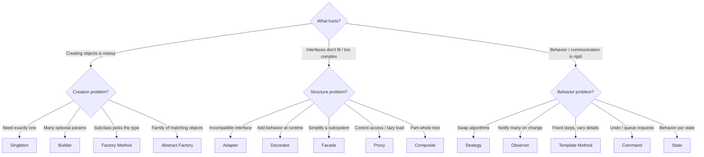
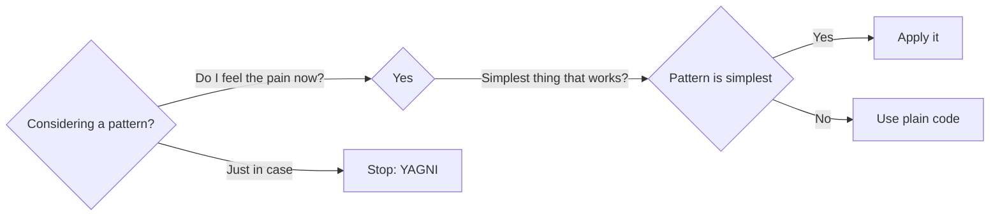

Knowing 23 patterns is easy; knowing *when not to use one* is senior-level. Start from the
**problem**, not the pattern.

## A decision guide

Follow the question that matches your pain point.



## Patterns combine

Real designs weave patterns together — they are not mutually exclusive.

| Combination | Why |
|--|--|
| Abstract Factory **of** Factory Methods | The factory's create-methods are Factory Methods |
| Builder **returns** a Composite | Assemble a tree step by step |
| Decorator **wraps** a Strategy | Layer behavior over a swappable algorithm |
| Command **+** Observer | Fire commands in response to events |
| Factory **produces** Singletons | Centralize access to shared services |

:::tip
Many patterns are variations on two moves: **program to an interface** and **favor
composition over inheritance**. If you internalize those, most patterns become obvious
applications rather than things to memorize.
:::

## Anti-patterns & overuse

The opposite of a pattern is a recurring *bad* solution. Recognize these smells.

| Anti-pattern | Smell | Fix |
|--|--|--|
| **Golden Hammer** | "Everything is a Factory/Singleton" | Match the pattern to the actual problem |
| **Singleton abuse** | Global mutable state, hidden deps, hard tests | Dependency injection of one shared instance |
| **God Object** | One class does everything | Split responsibilities (SRP); Strategy/Facade |
| **Over-abstraction** | Interfaces & factories with a single impl | Inline it (YAGNI) until change demands it |
| **Poltergeist** | Classes that only pass calls along | Remove; let callers talk directly |
| **Pattern soup** | Five patterns for a 50-line feature | Delete indirection; keep it simple |



:::warning
Adding a pattern always adds **indirection**. Indirection is a cost paid up front for
flexibility you might need later. If the flexibility never arrives, you have made the code
harder to read for nothing. Refactor *to* patterns when duplication or change pressure
appears — rarely before.
:::

:::senior
In interviews, when asked "which pattern?", first restate the *problem* and the axis of change
("the payment method varies" → Strategy). Naming the varying part shows you understand that
patterns isolate change — which is the whole point.
:::

## Check yourself

```quiz
title: Choosing check
questions:
  - q: 'A feature needs to vary the notification channel (email, SMS, push) at runtime. Which pattern fits best?'
    options:
      - text: 'Strategy'
        correct: true
      - 'Singleton'
      - 'Composite'
    explain: 'The channel is the axis of change; Strategy encapsulates each interchangeable algorithm.'
  - q: 'You introduce a factory and interface even though there will only ever be one implementation. This is:'
    options:
      - 'Good future-proofing'
      - text: 'Over-abstraction (YAGNI) — needless indirection'
        correct: true
      - 'The Adapter pattern'
    explain: 'Abstraction with a single implementation adds cost without benefit. Add it when a second implementation actually appears.'
  - q: 'What is the "Golden Hammer" anti-pattern?'
    options:
      - text: 'Applying one favorite pattern to every problem regardless of fit'
        correct: true
      - 'Using a Singleton for configuration'
      - 'Combining two patterns'
    explain: 'Golden Hammer = over-relying on a familiar tool instead of choosing the pattern the problem calls for.'
  - q: 'When should you generally introduce a design pattern?'
    options:
      - 'Up front, before writing any code, to be safe'
      - text: 'When duplication or change pressure actually appears — refactor toward the pattern'
        correct: true
      - 'Never, patterns are outdated'
    explain: 'Patterns pay off when the pain they solve is real. Refactoring to patterns beats speculative abstraction.'
```

:::key
Start from the problem and the **axis of change**, then pick the pattern that isolates it.
Patterns combine freely. Every pattern costs indirection — avoid the Golden Hammer, Singleton
abuse, and speculative over-abstraction (YAGNI). Refactor *to* patterns, rarely before.
:::
