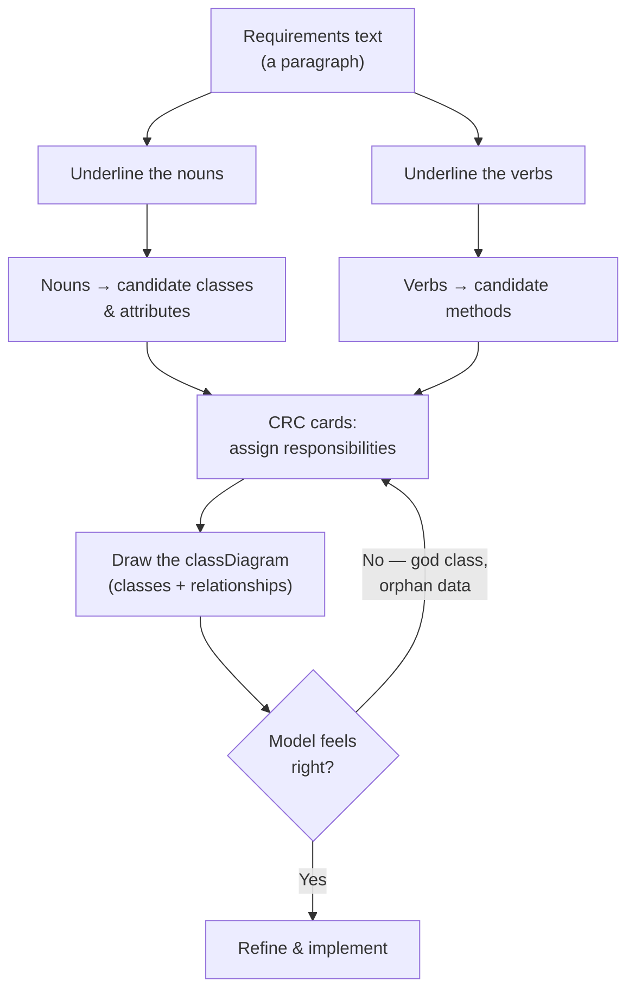
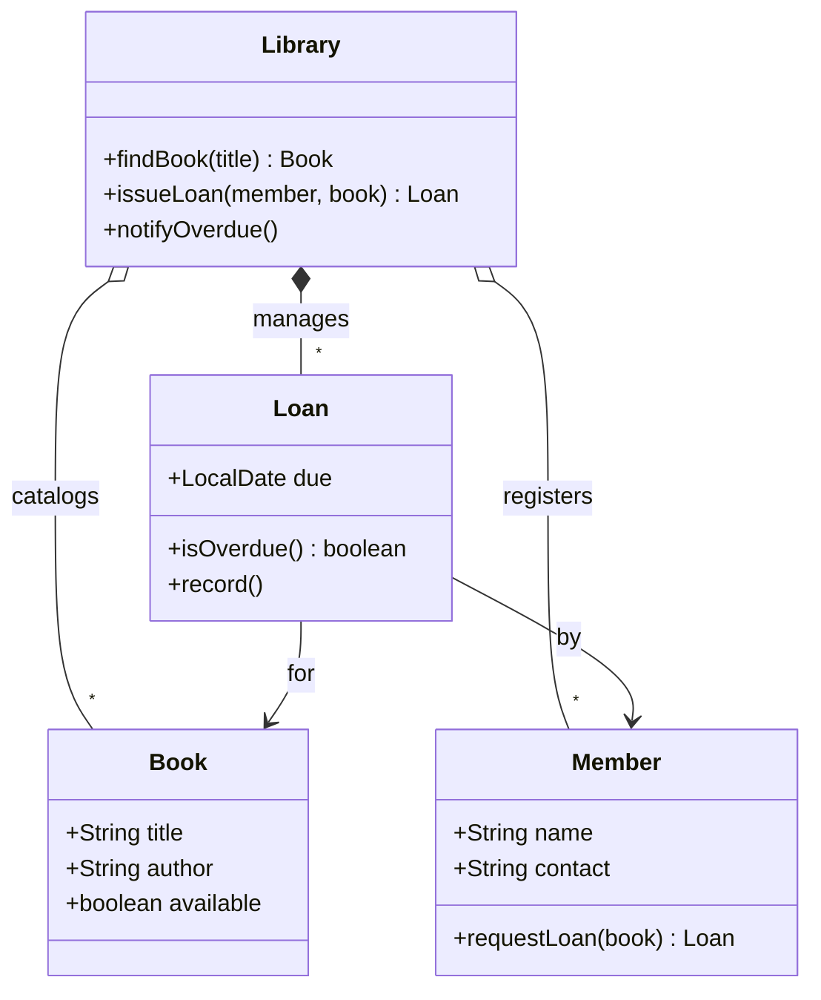

A **domain model** is the object-oriented picture of the problem you're solving — the *things*
that exist, what they *know*, what they *do*, and how they *relate*. Before writing a line of
logic, you translate the requirements text into classes. There's a mechanical starting move for
that, and a card game for the hard part.

## The modeling pipeline



## Noun → class, verb → method

The classic first pass: grammar drives structure. Take the requirement, mark the parts of speech.

> "A **member** can **borrow** a **book**. Each **loan** **records** the **due date**. The
> **library** **notifies** a member when a loan is **overdue**."

| Word in requirements | Part of speech | Becomes | Notes |
|--|--|--|--|
| member, book, loan, library | noun | **class** | core domain entities |
| due date | noun | **attribute** of `Loan` | data, not a class of its own |
| borrow, notify | verb | **method** | assign to the class that *owns* the data it touches |
| records | verb | **method** `Loan.record()` | the loan knows its own dates |
| overdue | adjective | **derived state** | `loan.isOverdue()` — computed, not stored |

:::gotcha
Noun→class is a *starting heuristic*, not a rule. Not every noun is a class (**due date** is an
attribute), and not every class is a visible noun (a `LoanPolicy` or `NotificationService` may
have no single word in the text). Use it to seed candidates, then prune.
:::

## CRC cards — assigning responsibilities

Nouns and verbs give you candidates; **CRC cards** decide who owns what. Each card is an index
card with three zones: the **C**lass, its **R**esponsibilities (what it knows/does), and its
**C**ollaborators (who it needs to fulfill them).

| Class | Responsibilities | Collaborators |
|--|--|--|
| **Member** | Knows name & contact; requests a loan | `Loan` |
| **Book** | Knows title, author, availability | — |
| **Loan** | Knows due date; knows if overdue; records dates | `Book`, `Member` |
| **Library** | Finds books; issues & returns loans; notifies overdue members | `Book`, `Loan`, `Member` |

The magic is the conversation: you *walk a scenario* ("a member borrows a book") and hand a card
to each responsibility. If one card is doing everything, split it. If data and the behavior that
uses it live on different cards, move the behavior — that's the **Information Expert** principle:
put a responsibility on the class that has the data to fulfill it.

:::tip
CRC cards are deliberately small (an index card). If your responsibilities list overflows the
card, that class is doing too much — a **god class** waiting to happen. The physical limit is a
built-in code smell detector.
:::

## The resulting model



Note the relationship choices: `Library o-- Book` (aggregation — books outlive any one library
session) but `Library *-- Loan` (composition — a loan has no meaning without the library that
created it). Modeling isn't just *which classes* but *how strongly they're bound*.

## From model to skeleton code

````tabs
tabs:
  - label: Requirements
    body: |
      Plain-English source — everything downstream traces back here.
      ```text
      A member can borrow a book. Each loan records the
      due date. The library notifies a member when a
      loan is overdue.
      ```
  - label: Skeleton classes
    body: |
      Nouns became classes/fields; verbs became methods on the data owner.
      ```java
      class Loan {
        private final Book book;
        private final Member member;
        private final LocalDate due;

        boolean isOverdue() {           // "overdue" derived, not stored
          return LocalDate.now().isAfter(due);
        }
      }

      class Library {
        Loan issueLoan(Member m, Book b) { /* ... */ }
        void notifyOverdue() { /* walks loans */ }
      }
      ```
````

:::senior
A good domain model is **anemic vs rich** on a spectrum. An *anemic* model has data-only classes
with all logic in "service" classes — easy to start, but behavior drifts away from the data it
uses (feature envy). A *rich* model keeps behavior next to data (`loan.isOverdue()`), which is
what Information Expert pushes you toward. Prefer rich until a genuine cross-entity policy forces
a dedicated service.
:::

## Check yourself

```quiz
title: Domain modeling check
questions:
  - q: 'In "each loan records the **due date**", what should `due date` most likely become?'
    options:
      - text: 'An **attribute** of `Loan` — it is data, not an independent entity'
        correct: true
      - 'A separate `DueDate` class'
      - 'A method on `Library`'
    explain: 'Not every noun deserves its own class. A due date is a value the `Loan` knows about — an attribute.'
  - q: 'The **Information Expert** principle says a responsibility should be assigned to…'
    options:
      - 'the class with the fewest collaborators'
      - text: 'the class that holds the data needed to fulfill it'
        correct: true
      - 'a central manager/service class'
    explain: 'Put behavior where the data lives. `isOverdue()` belongs on `Loan` because `Loan` knows the due date.'
  - q: 'Your CRC card for `Library` has 12 responsibilities and overflows the index card. This is a signal of…'
    options:
      - 'a well-factored central class'
      - text: 'a likely **god class** — split its responsibilities'
        correct: true
      - 'missing collaborators'
    explain: 'The small physical card is a deliberate limit; overflow means the class is doing too much and should be decomposed.'
```

:::key
**Noun→class, verb→method** seeds candidates from requirements; **CRC cards** assign
responsibilities by walking scenarios, guided by **Information Expert** (behavior lives with its
data). Prune nouns that are really attributes, split classes whose cards overflow, then draw the
`classDiagram` — including relationship *strength*.
:::
