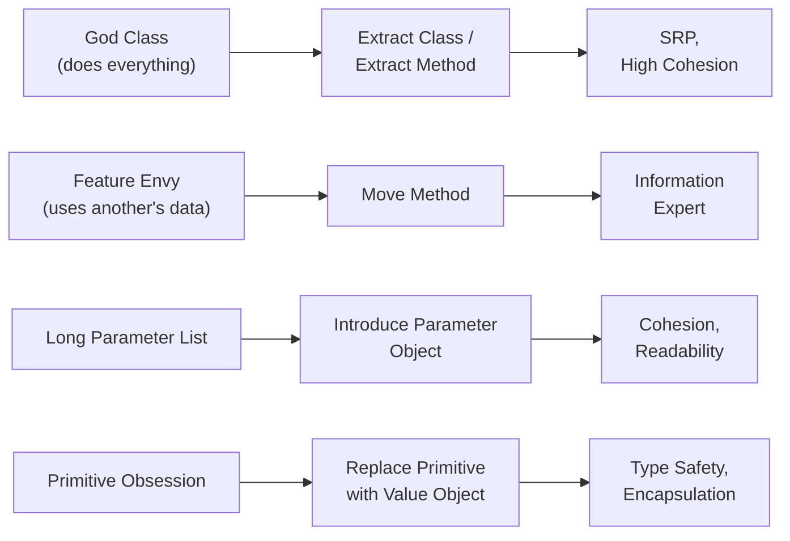

A **code smell** is a surface symptom that hints at a deeper design problem. Smells aren't bugs —
the code works — but they make it hard to change. Each well-known smell has a well-known
**refactoring** and a **principle** it restores.

## The smell → refactoring map



## Smell catalogue

| Smell | Tell-tale sign | Refactoring | Restores |
|--|--|--|--|
| **God class** | One class with hundreds of lines / many unrelated fields | **Extract Class**, **Extract Method** | Single Responsibility |
| **Feature envy** | A method reads another object's data more than its own | **Move Method** to that object | Information Expert |
| **Long parameter list** | Method takes 4+ params, often passed together | **Introduce Parameter Object** | Cohesion, clarity |
| **Primitive obsession** | `String email`, `double money` everywhere; validation scattered | **Replace primitive with Value Object** | Type safety, DRY validation |
| **Data clumps** | The same group of fields travels together | Extract them into a class | Cohesion |
| **Switch on type** | `switch (shape.type)` recurring | **Replace conditional with polymorphism** | Open/Closed |

:::tip
Smells are *heuristics, not laws*. A five-parameter constructor for an immutable value object can
be fine; a "god" `Facade` may be an intentional pattern. Ask "does this make the code hard to
change?" before refactoring — smell-driven refactoring should always leave the code easier to
modify, never just "cleaner-looking."
:::

## Feature envy → Move Method

The most common smell in beginner OO code: logic sits in the wrong class, reaching across to grab
another object's fields.

````tabs
tabs:
  - label: Smelly — feature envy
    body: |
      `Order` computes discount by rummaging through `Customer`'s data — it *envies* `Customer`.
      ```java
      class Order {
        double discount(Customer c) {
          // reads c's data, not Order's — envy!
          if (c.getLoyaltyYears() > 5)  return 0.20;
          if (c.isPremium())            return 0.10;
          return 0.0;
        }
      }
      ```
  - label: Refactored — Move Method
    body: |
      The behavior moves to the class that owns the data (Information Expert).
      ```java
      class Customer {
        double discountRate() {          // lives with its data
          if (loyaltyYears > 5) return 0.20;
          if (premium)          return 0.10;
          return 0.0;
        }
      }
      class Order {
        double discount(Customer c) {
          return c.discountRate();       // just asks
        }
      }
      ```
````

## Primitive obsession → Value Object

````tabs
tabs:
  - label: Smelly — primitives everywhere
    body: |
      An email is a raw `String`; validation is copied wherever one is created.
      ```java
      void register(String email) {
        if (!email.contains("@"))        // duplicated everywhere
          throw new IllegalArgumentException();
        // ...
      }
      ```
  - label: Refactored — Value Object
    body: |
      Validation lives once, in the type. Invalid `Email` objects cannot exist.
      ```java
      record Email(String value) {
        Email {                          // compact constructor validates once
          if (!value.contains("@"))
            throw new IllegalArgumentException("bad email");
        }
      }
      void register(Email email) { /* guaranteed valid */ }
      ```
````

:::gotcha
Refactor in **small, behavior-preserving steps**, each backed by tests. "Move Method" then rerun
tests; "Extract Class" then rerun tests. A big-bang rewrite disguised as refactoring is how you
turn one working smelly class into a broken clean one.
:::

:::senior
Smells cluster into **patterns**. A `switch` on a type code plus new cases appearing over time
points to **Replace Conditional with Polymorphism** — and often lands you on the **Strategy** or
**State** pattern. Learning smells is really learning the *entry points* to the design pattern
catalogue: the smell tells you which pattern the code is asking for.
:::

## Check yourself

```quiz
title: Smells & refactoring check
questions:
  - q: 'A `PriceCalculator` method calls six getters on the `Product` it receives and none of its own fields. Which smell is this?'
    options:
      - 'Primitive obsession'
      - text: 'Feature envy — apply Move Method toward `Product`'
        correct: true
      - 'Long parameter list'
    explain: 'A method that is more interested in another class''s data than its own envies it; move the behavior to where the data lives.'
  - q: 'You keep passing `(street, city, zip, country)` together through many methods. The best refactoring is…'
    options:
      - 'add a comment explaining the parameters'
      - text: 'Introduce a Parameter Object (`Address`) — these are a data clump'
        correct: true
      - 'make them static fields'
    explain: 'Fields that always travel together are a data clump; bundle them into a cohesive object and pass that.'
  - q: 'Modeling money as a bare `double` and re-validating it everywhere is an example of…'
    options:
      - text: 'Primitive obsession — replace with a `Money` value object'
        correct: true
      - 'God class'
      - 'Feature envy'
    explain: 'Using primitives for domain concepts scatters validation and loses type safety; a value object centralizes both.'
  - q: 'The safest way to perform a refactoring is to…'
    options:
      - 'rewrite the class from scratch, then test at the end'
      - text: 'apply small behavior-preserving steps, running tests after each'
        correct: true
      - 'change everything, then fix compile errors'
    explain: 'Refactoring means changing structure without changing behavior; small verified steps keep the code green throughout.'
```

:::key
Smells are symptoms, not bugs: **god class**→Extract Class (SRP), **feature envy**→Move Method
(Information Expert), **long parameter list / data clumps**→Parameter Object, **primitive
obsession**→Value Object, **type switches**→polymorphism (Strategy/State). Refactor in small,
test-backed steps — the goal is always *easier to change*, not merely *prettier*.
:::
