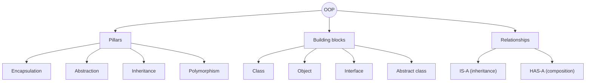
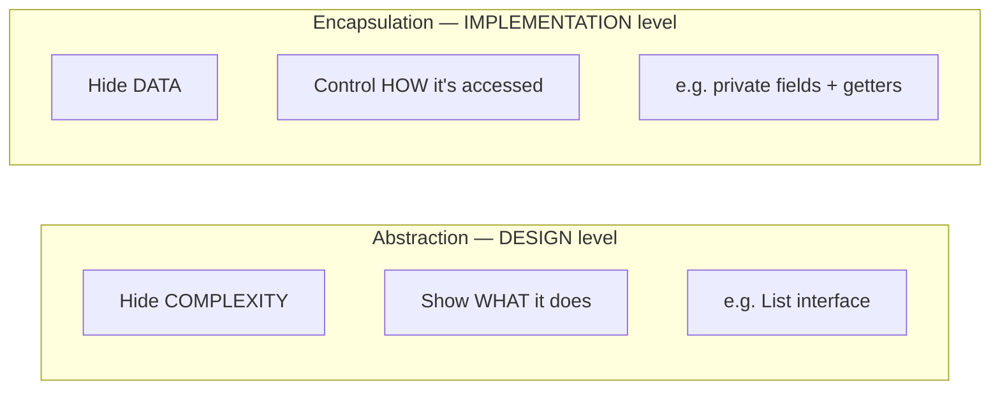
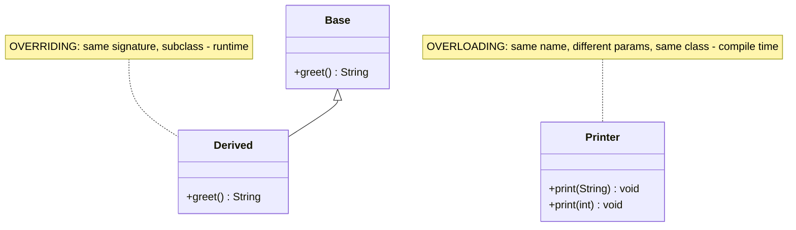
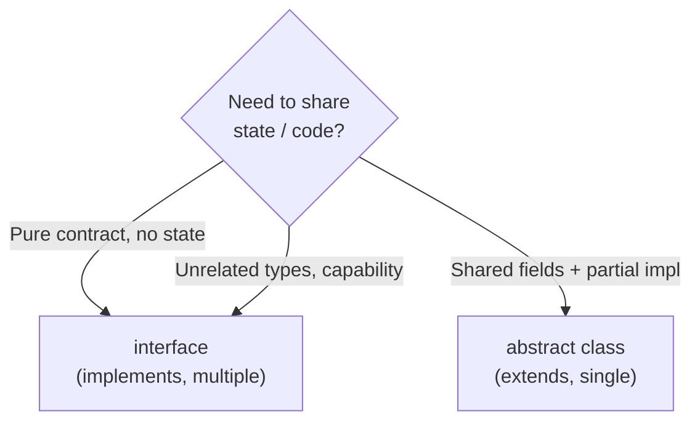
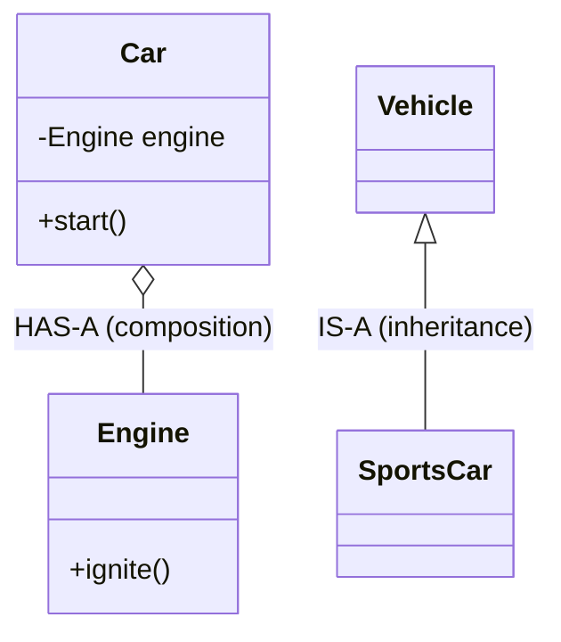

The questions on this page come up in almost every OOP interview. Learn them cold — the goal is a crisp one-liner plus a concrete example, not a rambling paragraph.

## The whole map at a glance



## Rapid-fire recall

```flashcards
title: Answer these in one breath
cards:
  - front: 'What is OOP?'
    back: 'A paradigm that models software as **objects** bundling **state** (fields) + **behaviour** (methods), interacting via messages. Built on 4 pillars: encapsulation, abstraction, inheritance, polymorphism.'
  - front: 'Class vs Object'
    back: '**Class** = blueprint / type (compile-time). **Object** = a concrete instance in memory (runtime). One class → many objects.'
  - front: 'Encapsulation'
    back: 'Bundle data with the methods that guard it; **hide fields**, expose a controlled API. Protects invariants.'
  - front: 'Abstraction'
    back: 'Expose **what** something does, hide **how**. Model the essential; drop the irrelevant. Achieved via interfaces / abstract classes.'
  - front: 'Inheritance'
    back: 'An **IS-A** relationship — a subclass reuses and extends a superclass. Enables polymorphism.'
  - front: 'Polymorphism'
    back: 'One interface, many forms. **Overriding** (runtime) + **overloading** (compile-time).'
  - front: 'Can you override a static method?'
    back: 'No. Redefining a static method **hides** it (resolved by reference type at compile time) — not polymorphism.'
  - front: 'Composition over inheritance?'
    back: 'Prefer HAS-A (delegate to a field) over IS-A. More flexible, no fragile base class, swappable at runtime.'
```

## The four pillars

| Pillar | One-liner | Mechanism in Java | Interview hook |
|--------|-----------|-------------------|----------------|
| **Encapsulation** | Hide data, expose behaviour | `private` fields + getters/setters | "protects invariants" |
| **Abstraction** | Hide implementation, show intent | `interface`, `abstract` | "what, not how" |
| **Inheritance** | Reuse via IS-A | `extends`, `implements` | "enables polymorphism" |
| **Polymorphism** | One name, many forms | overriding + overloading | "dynamic dispatch" |

:::tip
Mnemonic: **A PIE** — **A**bstraction, **P**olymorphism, **I**nheritance, **E**ncapsulation.
:::

```quiz
title: Do you know the pillars?
questions:
  - q: 'Which pillar is chiefly about *hiding the internal state* of an object?'
    options:
      - 'Abstraction'
      - text: 'Encapsulation'
        correct: true
      - 'Polymorphism'
      - 'Inheritance'
    explain: 'Encapsulation bundles data with its methods and hides fields (`private`). Abstraction hides *implementation complexity*, which is related but distinct.'
  - q: 'Which pillar most directly *enables* polymorphism?'
    options:
      - 'Encapsulation'
      - text: 'Inheritance (and interfaces)'
        correct: true
      - 'Abstraction'
    explain: 'You need a shared supertype (via `extends` or `implements`) before a call site can behave differently per subtype.'
```

## Abstraction vs Encapsulation

The single most confused pair. They travel together but solve **different problems**.



| | Abstraction | Encapsulation |
|--|-------------|---------------|
| **Hides** | complexity / implementation | data / state |
| **Question** | *what* does it do? | *how* is it protected? |
| **Level** | design | implementation |
| **Achieved by** | `interface`, `abstract class` | access modifiers, getters/setters |
| **Analogy** | the *steering wheel* (you steer, don't care how) | the *locked engine bay* (you can't touch internals) |

:::key
**Abstraction** = hiding *complexity* to expose a clean concept. **Encapsulation** = hiding *data* to protect it. One is about design, the other about access control.
:::

```quiz
questions:
  - q: 'A driver turns a steering wheel without knowing about the rack-and-pinion. Which pillar is that?'
    options:
      - text: 'Abstraction'
        correct: true
      - 'Encapsulation'
      - 'Inheritance'
    explain: 'You are shown *what* (turn to steer) and shielded from *how* — that is abstraction. Encapsulation would be the engine bay being locked so you cannot tamper with the internals.'
```

## Overloading vs Overriding



| | Overloading | Overriding |
|--|-------------|------------|
| A.k.a. | compile-time · static binding | runtime · dynamic binding |
| Where | **same** class | **subclass** |
| Signature | **different** params | **identical** |
| Return type | can differ | same or **covariant** |
| Access | any | **same or wider** |
| `static` allowed | yes | no (that is *hiding*) |
| Resolved by | **declared** type of args | **actual** object type |

```java
// Overloading — compiler picks by argument types
int    area(int side)            { return side * side; }
double area(double w, double h)  { return w * h; }

// Overriding — JVM picks by real object type at runtime
class Shape { double area() { return 0; } }
class Circle extends Shape {
    double r;
    @Override double area() { return Math.PI * r * r; }
}
```

```quiz
questions:
  - q: 'Two methods `log(String)` and `log(Object)` in the same class. What is this?'
    options:
      - 'Overriding'
      - text: 'Overloading'
        correct: true
      - 'Hiding'
    explain: 'Same name, same class, different parameter types → overloading, resolved at compile time by the declared argument type.'
  - q: 'Can an overriding method **narrow** the visibility of the parent method (e.g. public → protected)?'
    options:
      - 'Yes'
      - text: 'No — it may only keep or widen access'
        correct: true
    explain: 'Narrowing access would break Liskov substitutability, so the compiler forbids it. You may widen (protected → public) but never narrow.'
```

## Interface vs Abstract class



| | Interface | Abstract class |
|--|-----------|----------------|
| Keyword | `implements` | `extends` |
| Multiple inheritance | **yes** (many) | **no** (one) |
| State (instance fields) | no (only `static final`) | **yes** |
| Constructors | no | yes |
| Methods | abstract + `default` + `static` | any (abstract or concrete) |
| Access modifiers | implicitly `public` | any |
| "Is-a" strength | a **capability** (Comparable, Runnable) | a **type** (Animal, Shape) |

:::senior
Since Java 8, `default` methods let interfaces ship behaviour — blurring the line. Rule of thumb: reach for an **interface** first (keeps options open, allows multiple), use an **abstract class** only when you must share **fields / constructor logic** across subclasses.
:::

```quiz
questions:
  - q: 'You need every implementer to be BOTH `Serializable` and `Comparable` and have your capability. Interface or abstract class?'
    options:
      - text: 'Interface — a class can implement many'
        correct: true
      - 'Abstract class'
    explain: 'A class can extend only ONE class but implement MANY interfaces, so capabilities that combine freely belong in interfaces.'
```

## Composition vs Inheritance



| | Inheritance (IS-A) | Composition (HAS-A) |
|--|--------------------|---------------------|
| Coupling | **tight** — subclass sees parent internals | **loose** — talks through the field's API |
| Flexibility | fixed at compile time | swappable at **runtime** |
| Reuse | inherit implementation | delegate to a member |
| Risk | fragile base class, deep hierarchies | slightly more wiring |
| Guideline | use for a true "is-a" | **default choice** for reuse |

:::key
**"Favor composition over inheritance."** Inheritance couples you to a parent's implementation; composition lets you assemble behaviour from swappable parts. Use inheritance only for a genuine IS-A that will not fight Liskov.
:::

## The "gotcha" concept questions

| Question | Sharp answer |
|----------|--------------|
| Can you override a `static` method? | **No** — you *hide* it; resolved by reference type at compile time. |
| Can you override a `private` method? | **No** — it is invisible to the subclass; a same-named method is brand new. |
| Can you override a `final` method? | **No** — `final` explicitly forbids it. |
| Can a constructor be inherited? | **No** — constructors are not inherited (but `super(...)` chains to the parent's). |
| Does Java support multiple inheritance of classes? | **No** (diamond problem); yes for **interfaces**. |
| Can an `abstract` class have a constructor? | **Yes** — called via `super()` when a subclass is built. |
| Can an interface have state? | Only `public static final` constants, no instance fields. |

```quiz
title: The classic traps
questions:
  - q: 'Why can''t you truly override a `private` method?'
    options:
      - 'Because private methods are static'
      - text: 'It is not visible to the subclass, so the subclass method is a separate, unrelated method'
        correct: true
      - 'You can, it works normally'
    explain: 'Overriding requires the method to be visible and inherited. A `private` method is not inherited, so a same-signature method in the subclass is simply a new method — no polymorphic link.'
  - q: 'Why does Java forbid multiple inheritance of classes but allow multiple interfaces?'
    options:
      - 'Performance'
      - text: 'To avoid the diamond ambiguity of inherited *state/implementation*; interfaces (historically) carried no state'
        correct: true
      - 'It is an arbitrary rule'
    explain: 'Two parent classes could supply conflicting fields/implementations (the diamond problem). Interfaces declared only contracts, so no conflict — and Java 8 `default` methods add explicit conflict-resolution rules.'
```

## One-screen summary

| Concept | IS-A / has-a | Compile or Runtime | Keyword |
|---------|--------------|--------------------|---------|
| Overloading | — | compile | (same class) |
| Overriding | IS-A | runtime | `@Override` |
| Inheritance | IS-A | compile (link) | `extends` |
| Composition | HAS-A | runtime | field |
| Interface | capability | — | `implements` |
| Abstract class | partial type | — | `extends` + `abstract` |

:::key
If you remember nothing else: **Abstraction hides complexity, Encapsulation hides data. Overloading is compile-time, Overriding is runtime. Interfaces = many + contract, Abstract class = one + shared state. Favor composition over inheritance.**
:::
