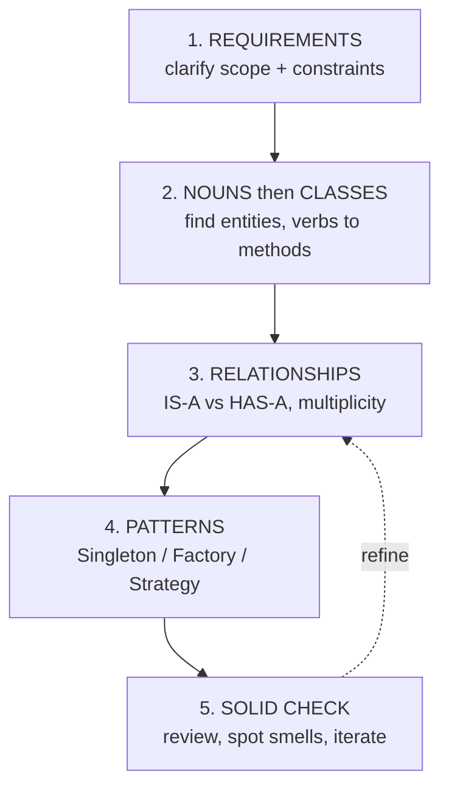
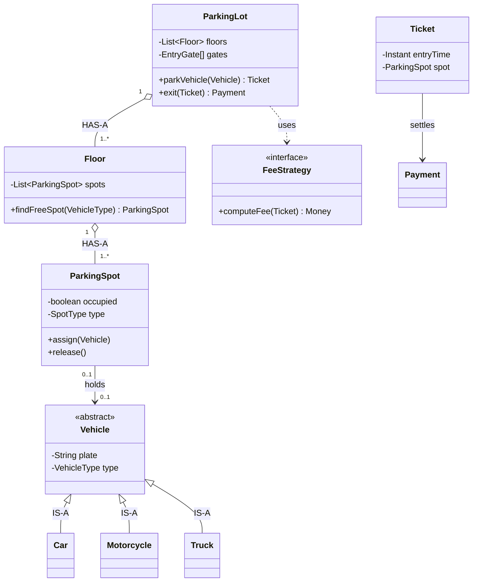
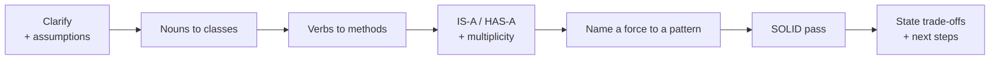

"Design a parking lot / elevator / deck of cards" is not about the *right* answer — it is about a **structured process**. Follow the same five steps every time and think out loud.

## The five-step framework



:::tip
Spend the **first 2-3 minutes on requirements** before drawing anything. Interviewers score you on clarifying questions — jumping to classes signals a junior.
:::

## Step 1 — Clarify requirements

Drive the scope yourself. For a parking lot you would ask:

| Dimension | Sample question |
|-----------|-----------------|
| Scale | How many floors / spots? |
| Vehicle types | Motorcycle, car, truck? Different spot sizes? |
| Pricing | Flat rate or hourly? Payment methods? |
| Entry/exit | Ticketed? Multiple gates? |
| Out of scope | (State it!) "I'll skip the reservation system for now." |

:::key
Explicitly **state your assumptions and what is out of scope.** A bounded problem you finish beats an unbounded one you don't.
:::

## Step 2 — Nouns become classes, verbs become methods

The oldest trick in OOD: underline the **nouns** in the requirements — they are your candidate classes; the **verbs** are candidate methods.

> "A **customer** parks a **vehicle** in a **spot** on a **floor**; the **system** issues a **ticket** and takes a **payment**."

| Noun → Class | Verb → Method |
|--------------|---------------|
| `ParkingLot`, `Floor`, `Spot` | `park()`, `unpark()` |
| `Vehicle` (Car, Bike, Truck) | `issueTicket()` |
| `Ticket`, `Payment` | `calculateFee()`, `pay()` |

## Step 3 — Model the relationships

Ask **IS-A or HAS-A** for every pair, and note **multiplicity** (1, 0..*, etc.).



:::note
Notice the shapes: `o--` (aggregation) for HAS-A ownership, `<|--` for IS-A inheritance, `..>` (dependency) for "uses a" `FeeStrategy`.
:::

## Step 4 — Apply patterns where they fit

Reach for a pattern only when a **force** demands it — name the force, then the pattern.

| Force in the design | Pattern | Why |
|---------------------|---------|-----|
| Exactly one lot / config object | **Singleton** | one shared, global point of access |
| Create Car/Bike/Truck from a type code | **Factory** | isolate `new`, open for new types |
| Hourly vs flat vs weekend pricing | **Strategy** | swap the fee algorithm at runtime |
| Gate must react when a spot frees up | **Observer** | notify listeners without coupling |

```java
// Strategy: pricing swappable without touching ParkingLot
interface FeeStrategy { Money computeFee(Ticket t); }

class HourlyFee  implements FeeStrategy { /* ... */ }
class FlatFee    implements FeeStrategy { /* ... */ }

class ParkingLot {
    private FeeStrategy feeStrategy;          // composed, not inherited
    void setFeeStrategy(FeeStrategy s) { this.feeStrategy = s; }
    Money exit(Ticket t) { return feeStrategy.computeFee(t); }
}

// Factory: hide construction of the concrete vehicle
class VehicleFactory {
    static Vehicle create(VehicleType type, String plate) {
        return switch (type) {
            case CAR        -> new Car(plate);
            case MOTORCYCLE -> new Motorcycle(plate);
            case TRUCK      -> new Truck(plate);
        };
    }
}
```

## Step 5 — SOLID self-review

Before you say "done", walk the acronym out loud:

| Letter | Ask yourself |
|--------|--------------|
| **S**RP | Does each class have one reason to change? (`Ticket` doesn't compute fees) |
| **O**CP | Can I add a new `VehicleType` / pricing **without editing** existing classes? |
| **L**SP | Can any `Vehicle` subtype stand in wherever `Vehicle` is used? |
| **I**SP | Are interfaces small? (No fat `ParkingService` God-interface) |
| **D**IP | Does `ParkingLot` depend on the `FeeStrategy` **abstraction**, not a concrete class? |

:::senior
The single biggest signal of seniority in LLD rounds: designing for **OCP** — "to add a truck-charging tier tomorrow, I add a class, I don't reopen `ParkingLot`." Say that sentence.
:::

## Watch it out loud

```quiz
title: Design-interview judgment
questions:
  - q: 'The interviewer says "design a deck of cards" and you immediately start writing the `Card` class. What did you skip?'
    options:
      - text: 'Clarifying requirements & scope (shuffle? jokers? which games?)'
        correct: true
      - 'Nothing — jump straight to code'
      - 'The database schema'
    explain: 'Always spend the first minutes clarifying scope and stating assumptions. Diving into code signals a junior and risks solving the wrong problem.'
  - q: 'Pricing must support hourly, flat, and weekend rates, swappable at runtime. Which pattern?'
    options:
      - 'Singleton'
      - text: 'Strategy'
        correct: true
      - 'Factory'
    explain: 'Strategy encapsulates interchangeable algorithms behind one interface, letting you swap the fee logic at runtime without touching `ParkingLot`.'
  - q: 'Which principle lets you add a new vehicle type WITHOUT modifying existing classes?'
    options:
      - 'Single Responsibility'
      - text: 'Open/Closed'
        correct: true
      - 'Liskov Substitution'
    explain: 'Open for extension, closed for modification — with a Factory + polymorphism you add a subclass and a switch arm rather than editing scattered logic.'
```

## Cheat-flow for any LLD prompt



:::key
The framework beats the diagram: **Requirements to Classes (nouns) to Relationships (IS-A/HAS-A) to Patterns (name the force) to SOLID check.** Think out loud, state assumptions, and defend one trade-off.
:::
