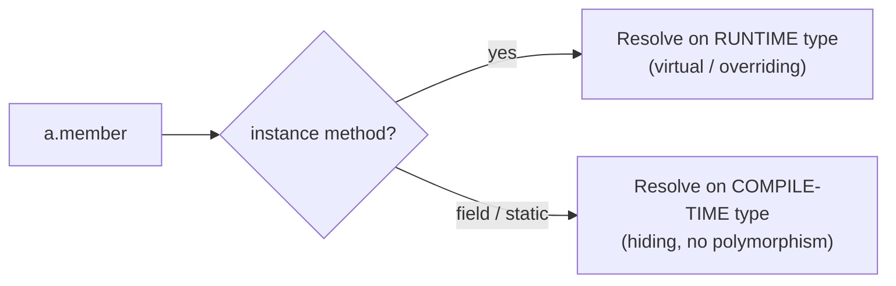

These "what prints?" traps separate people who *memorized* OOP from people who *understand dispatch*. The rule underneath almost all of them: **methods dispatch on the runtime object, fields and statics resolve on the compile-time type.**

## The one rule to survive them all



## Trap 1 — Field hiding vs method overriding

```java
class Animal {
    String name = "Animal";
    String who() { return "Animal"; }
}
class Dog extends Animal {
    String name = "Dog";              // HIDES the field
    @Override String who() { return "Dog"; }  // OVERRIDES the method
}

Animal a = new Dog();
System.out.println(a.name);   // ?
System.out.println(a.who());  // ?
```

```quiz
title: What prints?
questions:
  - q: 'What does `a.name` then `a.who()` print, with `Animal a = new Dog()`?'
    options:
      - text: '`Animal` then `Dog`'
        correct: true
      - '`Dog` then `Dog`'
      - '`Animal` then `Animal`'
      - '`Dog` then `Animal`'
    explain: 'Fields are **not** polymorphic — `a.name` resolves on the compile-time type `Animal` → "Animal". Methods **are** polymorphic — `a.who()` dispatches on the runtime `Dog` → "Dog".'
```

:::gotcha
**Fields are hidden, not overridden.** `a.name` uses the *declared* type (`Animal`), while `a.who()` uses the *actual* object (`Dog`). Never rely on a subclass field through a superclass reference.
:::

## Trap 2 — Constructor call order

```java
class Base {
    Base() { System.out.println("Base ctor"); }
}
class Derived extends Base {
    Derived() { System.out.println("Derived ctor"); }
}
new Derived();
```

```walkthrough
title: How a Derived object is built
code: |
  class Base    { Base()    { print("Base ctor"); } }
  class Derived extends Base { Derived() { print("Derived ctor"); } }
  new Derived();
steps:
  - text: '`new Derived()` runs. First, an implicit `super()` is inserted as the FIRST line of Derived''s constructor.'
    line: 2
  - text: 'Control jumps UP to `Base()` before any Derived code runs. Base fields are initialized.'
    line: 1
  - text: '`Base ctor` prints. Base is now fully constructed.'
    line: 1
  - text: 'Control returns to `Derived()`; Derived fields initialize, then its body runs.'
    line: 2
  - text: '`Derived ctor` prints. Output order: **Base ctor, then Derived ctor** — parent before child, always.'
    line: 3
```

:::key
Construction flows **top-down**: `super(...)` runs before the subclass body. Fields initialize *after* `super()` returns, in declaration order. Output: `Base ctor` then `Derived ctor`.
:::

## Trap 3 — Calling an overridable method from a constructor

The nastiest one. The subclass override runs **before the subclass fields are initialized**.

```java
class Base {
    Base() { init(); }                 // calls overridable method!
    void init() { System.out.println("Base.init"); }
}
class Derived extends Base {
    int value = 42;
    @Override void init() {
        System.out.println("Derived.init, value=" + value);
    }
}
new Derived();
```

```quiz
title: The deadly constructor trap
questions:
  - q: 'What does `new Derived()` print?'
    options:
      - text: '`Derived.init, value=0`'
        correct: true
      - '`Derived.init, value=42`'
      - '`Base.init`'
      - '`Derived.init, value=null`'
    explain: '`Base()` runs first and calls the overridden `init()` (dynamic dispatch → `Derived.init`). But `value = 42` has NOT run yet — that happens after `super()` returns — so `value` is still its default `0`.'
```

:::gotcha
**Never call an overridable (non-`final`, non-`private`) method from a constructor.** The override executes against a half-built object whose fields are still at their defaults (`0` / `null` / `false`). Make such helpers `private` or `final`.
:::

## Trap 4 — Static method hiding

```java
class Base    { static String id() { return "Base"; } }
class Derived extends Base { static String id() { return "Derived"; } }

Base b = new Derived();
System.out.println(b.id());        // ?
System.out.println(Derived.id());  // ?
```

```quiz
questions:
  - q: 'With `Base b = new Derived();`, what does `b.id()` print?'
    options:
      - text: '`Base` — static calls resolve on the compile-time type'
        correct: true
      - '`Derived` — dynamic dispatch'
      - 'Compile error'
    explain: 'Static methods are **hidden**, not overridden. `b.id()` is really `Base.id()` because `b` is declared `Base`. There is no virtual dispatch for statics. (Calling a static through an instance reference is itself a bad smell.)'
```

:::note
IDEs warn "static method called via instance reference" for exactly this reason — write `Base.id()` / `Derived.id()` to make the binding obvious.
:::

## Trap 5 — equals without hashCode

```java
class Point {
    int x, y;
    Point(int x, int y) { this.x = x; this.y = y; }
    @Override public boolean equals(Object o) {
        return o instanceof Point p && p.x == x && p.y == y;
    }
    // NO hashCode() override!
}

var set = new HashSet<Point>();
set.add(new Point(1, 1));
System.out.println(set.contains(new Point(1, 1)));  // ?
```

```quiz
title: The equals/hashCode contract
questions:
  - q: 'Overriding `equals` but NOT `hashCode`, what does `set.contains(new Point(1,1))` likely print?'
    options:
      - text: '`false` — the two equal points land in different buckets'
        correct: true
      - '`true`'
      - 'Compile error'
    explain: 'Default `hashCode` is identity-based, so two equal points get different hashes → different buckets → `contains` never even calls `equals`. You broke the contract: equal objects MUST have equal hash codes.'
  - q: 'What is the `equals`/`hashCode` contract?'
    options:
      - 'If a.equals(b) then a.hashCode() must NOT equal b.hashCode()'
      - text: 'If a.equals(b) then a.hashCode() == b.hashCode() (the reverse need not hold)'
        correct: true
      - 'hashCode must be unique per object'
    explain: 'Equal objects must share a hash code. Unequal objects *may* collide (that is fine). Always override both together — or use `record`, which generates both.'
```

:::gotcha
**Always override `equals` and `hashCode` together.** Break the contract and hash-based collections (`HashMap`, `HashSet`) silently misbehave. In modern Java, a `record` generates a correct pair for you.
:::

## Bonus rapid traps

| Snippet | Prints | Why |
|---------|--------|-----|
| `Integer a=127,b=127; a==b` | `true` | Integer cache (-128..127) reuses instances |
| `Integer a=128,b=128; a==b` | `false` | Outside cache → different objects; use `.equals()` |
| `"a"+1+2` | `a12` | Left-to-right string concatenation |
| `1+2+"a"` | `3a` | `1+2` computed first, then concatenated |
| `List<String> l = List.of("x"); l.add("y")` | throws | `List.of` is **immutable** → `UnsupportedOperationException` |

```quiz
questions:
  - q: 'What does `System.out.println("a" + 1 + 2);` print?'
    options:
      - text: '`a12`'
        correct: true
      - '`a3`'
      - '`3a`'
    explain: 'Evaluation is left-to-right. `"a"+1` is already a String `"a1"`, then `+2` concatenates → `"a12"`. Compare with `1+2+"a"` → `"3a"`.'
```

:::key
The master rule for every trap: **instance methods dispatch on the runtime object; fields and statics bind to the compile-time type.** And never call an overridable method from a constructor.
:::
