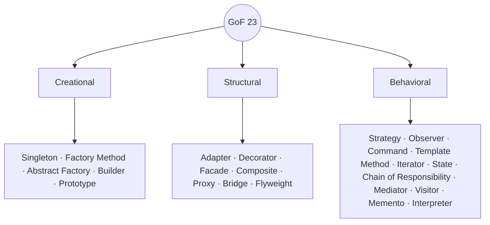
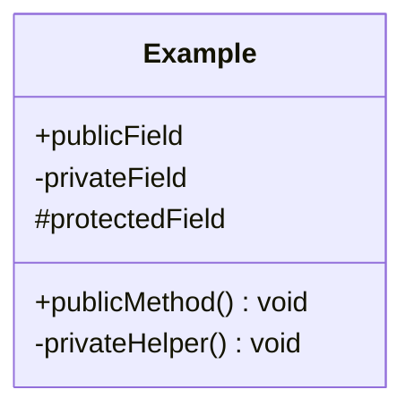

Everything from the track, compressed. Skim this last.

## The four pillars

| Pillar | One-liner | Java mechanism |
|--------|-----------|----------------|
| **Encapsulation** | hide data, expose behaviour | `private` + getters/setters |
| **Abstraction** | hide complexity, show intent | `interface`, `abstract` |
| **Inheritance** | reuse via IS-A | `extends`, `implements` |
| **Polymorphism** | one name, many forms | overriding + overloading |

## SOLID

| Letter | Principle | In one line |
|--------|-----------|-------------|
| **S** | Single Responsibility | one class, one reason to change |
| **O** | Open/Closed | open to extend, closed to modify |
| **L** | Liskov Substitution | subtypes must be usable as their base |
| **I** | Interface Segregation | many small interfaces > one fat one |
| **D** | Dependency Inversion | depend on abstractions, not concretions |

## GoF pattern catalog



### The ones you must know cold

| Pattern | Type | Solves | Java example |
|---------|------|--------|--------------|
| **Singleton** | creational | one shared instance | `Runtime.getRuntime()` |
| **Factory** | creational | hide `new`, pick subtype | `Calendar.getInstance()` |
| **Builder** | creational | many optional params | `StringBuilder`, `Stream.Builder` |
| **Adapter** | structural | make incompatible APIs fit | `Arrays.asList()` |
| **Decorator** | structural | add behaviour at runtime | `BufferedReader(new FileReader())` |
| **Strategy** | behavioral | swap algorithm at runtime | `Comparator` |
| **Observer** | behavioral | notify dependents | listeners / `PropertyChangeListener` |
| **Template Method** | behavioral | fixed skeleton, variable steps | `AbstractList` |

## UML notation



| Arrow | Meaning | Reads as |
|-------|---------|----------|
| `<|--` solid triangle | Inheritance | "IS-A" (extends) |
| `<|..` dashed triangle | Realization | "implements" (interface) |
| `o--` hollow diamond | Aggregation | "HAS-A", shared, independent lifecycle |
| `*--` filled diamond | Composition | "OWNS-A", part dies with whole |
| `-->` solid arrow | Association | "uses / refers to" |
| `..>` dashed arrow | Dependency | "depends on" (parameter, local) |

| Visibility symbol | Access |
|-------------------|--------|
| `+` | public |
| `-` | private |
| `#` | protected |
| `~` | package-private |

## Rapid recall deck

```flashcards
title: Night-before drill
cards:
  - front: 'Overloading vs Overriding — which is runtime?'
    back: '**Overriding** = runtime (dynamic dispatch). **Overloading** = compile-time (by arg types).'
  - front: 'Aggregation vs Composition diamond'
    back: '`o--` hollow = aggregation (shared, outlives whole). `*--` filled = composition (owned, dies with whole).'
  - front: 'Depend on abstractions, not concretions'
    back: 'The **D** in SOLID — Dependency Inversion.'
  - front: 'Add behaviour to an object at runtime by wrapping it'
    back: '**Decorator** pattern (e.g. `BufferedReader(new FileReader())`).'
  - front: 'One instance, global access point'
    back: '**Singleton** (e.g. `Runtime.getRuntime()`).'
  - front: 'Interface realization arrow'
    back: '`<|..` dashed line with a hollow triangle = implements.'
  - front: 'Can you override static / private / final?'
    back: 'No, no, no — static is *hidden*, private is invisible, final is forbidden.'
  - front: 'equals/hashCode rule'
    back: 'Equal objects MUST have equal hash codes. Override both together (or use a `record`).'
```

## Recap quiz

```quiz
title: Final check
questions:
  - q: 'Which SOLID letter means "depend on abstractions, not concrete classes"?'
    options:
      - 'S'
      - text: 'D'
        correct: true
      - 'O'
    explain: 'D = Dependency Inversion Principle: high-level modules and details both depend on abstractions.'
  - q: 'A filled diamond `*--` in UML denotes what?'
    options:
      - 'Aggregation (shared)'
      - text: 'Composition (owned, part dies with the whole)'
        correct: true
      - 'Dependency'
    explain: 'Filled diamond = composition (strong ownership). Hollow `o--` = aggregation (shared, independent lifecycle).'
  - q: '`BufferedReader(new FileReader(f))` wraps behaviour around an object. Which pattern?'
    options:
      - 'Adapter'
      - text: 'Decorator'
        correct: true
      - 'Factory'
    explain: 'Decorator wraps an object to add responsibilities at runtime while preserving its interface — the core idea of java.io streams.'
```

:::key
Pillars = **A PIE**. SOLID = one reason to change, extend-don''t-modify, subtypes substitutable, small interfaces, depend on abstractions. GoF split into **Creational / Structural / Behavioral**. UML: hollow triangle = IS-A, filled diamond = owns, hollow diamond = has.
:::
