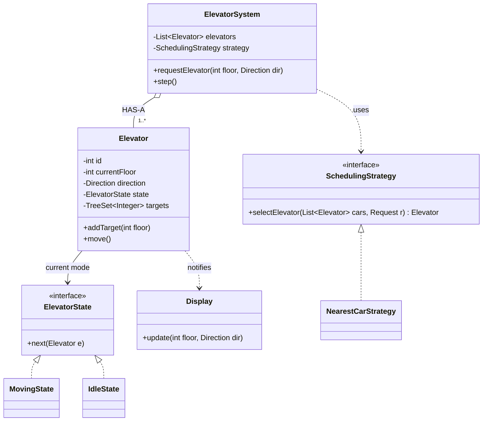

The elevator problem tests whether you can turn a fuzzy prompt into classes, pick patterns for the *right* reasons, and defend trade-offs. Follow the [five-step framework](/oop/topic/interview/oop-design-interview): **requirements → classes → relationships → patterns → SOLID.**

## Step 1 — Clarify requirements

| Dimension | Question | Assumption we'll make |
|--|--|--|
| Cars | One or a bank? | **N** elevators, **M** floors |
| Calls | Hall vs car calls? | Both: external (floor + direction) and internal (target floor) |
| Scheduling | How is a car chosen? | Pluggable — start with "nearest idle/same-direction car" |
| Scope | Weight limits? Fire mode? | **Out of scope** — state it and move on |

:::key
Say out loud: *"I'll model the pluggable **scheduling policy** as a Strategy so we can swap 'nearest car' for 'SCAN' without touching the dispatcher."* Naming the extension point up front signals seniority.
:::

## Steps 2 & 3 — Classes and relationships

Nouns → classes (`Elevator`, `Floor`, `Request`, `Dispatcher`, `Display`); verbs → methods (`requestElevator`, `move`, `openDoors`). A car's behavior depends on its **mode**, so model that as a `State`; the choice of car is a `Strategy`.



## Step 4 — Apply patterns (name the force)

| Force in the design | Pattern | Why |
|--|--|--|
| Swap the car-selection algorithm at runtime | **Strategy** | dispatcher depends on an interface, not "nearest car" |
| A car behaves differently while moving vs idle vs doors-open | **State** | transitions live in state classes, not a giant `switch` |
| Floor panels & in-car screens must reflect car position | **Observer** | car publishes; displays subscribe, stay decoupled |
| One system object coordinating the bank | **Singleton / Mediator** | single coordination point (use DI, not global static) |

````tabs
tabs:
  - label: Strategy (scheduling)
    body: |
      The dispatcher is closed for modification but open to new policies.
      ```java
      interface SchedulingStrategy {
          Elevator selectElevator(List<Elevator> cars, Request r);
      }

      class NearestCarStrategy implements SchedulingStrategy {
          public Elevator selectElevator(List<Elevator> cars, Request r) {
              return cars.stream()
                  .filter(c -> c.canServe(r))                 // idle or same direction
                  .min(Comparator.comparingInt(c -> Math.abs(c.floor() - r.floor())))
                  .orElse(cars.get(0));
          }
      }
      ```
  - label: State (per car)
    body: |
      Each mode decides the next transition — no sprawling conditionals.
      ```java
      interface ElevatorState { void next(Elevator e); }

      class MovingState implements ElevatorState {
          public void next(Elevator e) {
              e.stepTowardTarget();
              if (e.reachedTarget()) e.setState(new DoorsOpenState());
          }
      }
      class IdleState implements ElevatorState {
          public void next(Elevator e) {
              if (e.hasTargets()) e.setState(new MovingState());
          }
      }
      ```
````

## Step 5 — SOLID self-review

- **S**RP — `Elevator` moves; `Dispatcher` chooses; `Display` renders. Three reasons to change, three classes.
- **O**CP — a new policy (SCAN, energy-saving) is a *new* `SchedulingStrategy` class; the dispatcher is untouched.
- **D**IP — `ElevatorSystem` depends on the `SchedulingStrategy` abstraction, injected at construction.

:::senior
The trade-off interviewers want to hear: a `TreeSet<Integer>` of targets lets a moving car answer same-direction requests in sorted order (the **elevator/SCAN algorithm**) in O(log n) per insert, instead of naively serving in request order. Mention concurrency too: hall calls arrive from many threads, so the request queue must be thread-safe (a `BlockingQueue` or a lock around the `TreeSet`).
:::

## Check yourself

```quiz
title: Elevator design check
questions:
  - q: 'Why model the car-selection logic as a Strategy?'
    options:
      - text: 'So the scheduling algorithm can be swapped (nearest-car, SCAN, energy-saving) without modifying the dispatcher — Open/Closed'
        correct: true
      - 'Because Strategy makes it a Singleton'
      - 'To store the elevator state'
    explain: 'Strategy encapsulates interchangeable algorithms behind one interface, so new policies are new classes and the dispatcher stays closed for modification.'
  - q: 'Why prefer the State pattern over a big `switch (mode)` in `Elevator.move()`?'
    options:
      - text: 'Each state owns its own transitions, so adding a mode does not touch existing ones (fewer bugs, OCP)'
        correct: true
      - 'It runs faster'
      - 'It removes the need for the Elevator class'
    explain: 'State localizes per-mode behavior and transitions into separate classes; a switch centralizes and re-opens for every new mode.'
```

:::key
Elevator LLD in five steps: **N cars + M floors**, a pluggable **Strategy** for scheduling (nearest-car / SCAN), a **State** machine per car (idle/moving/doors), and **Observer** for displays. Keep targets in a sorted set for the SCAN sweep, make the request queue thread-safe, and inject the strategy for OCP + DIP.
:::
