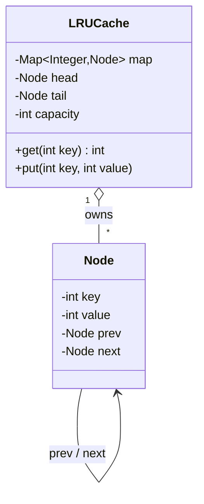

"Design an LRU cache with **O(1)** `get` and `put`" sits on the border of OOD and data-structure design. The whole trick is realizing **one** structure can't do it — you compose **two**.

## Step 1 — Requirements

- `get(key)` → value or "miss", and marks the key **most-recently-used**.
- `put(key, value)` → insert/update; if over **capacity**, evict the **least-recently-used** entry.
- Both must be **O(1)** average.

## Step 2 — Why two structures

| Need | Structure | Gives |
|--|--|--|
| Find a value by key in O(1) | **HashMap** | key → node lookup |
| Know & drop the LRU item in O(1) | **Doubly-linked list** | ordered by recency, O(1) unlink |

A HashMap alone can't tell you *which* entry is least-recently-used. A list alone can't find a key in O(1). Together: the map stores `key → node`, and the list keeps nodes ordered **most-recent at the head, LRU at the tail**. On any access, splice the node to the head; to evict, drop the tail.



## Step 3 — The implementation

The dummy `head`/`tail` **sentinels** remove all null-checking at the ends — a senior touch that eliminates the bug-prone edge cases.

```java
class LRUCache {
    private static class Node { int key, value; Node prev, next;
        Node(int k, int v) { key = k; value = v; } }

    private final Map<Integer, Node> map = new HashMap<>();
    private final Node head = new Node(0, 0), tail = new Node(0, 0);
    private final int capacity;

    LRUCache(int capacity) {
        this.capacity = capacity;
        head.next = tail; tail.prev = head;      // empty list between sentinels
    }

    public int get(int key) {
        Node n = map.get(key);
        if (n == null) return -1;
        moveToFront(n);                           // touch → most recent
        return n.value;
    }

    public void put(int key, int value) {
        Node n = map.get(key);
        if (n != null) { n.value = value; moveToFront(n); return; }
        if (map.size() == capacity) {             // evict LRU (node before tail)
            Node lru = tail.prev;
            remove(lru); map.remove(lru.key);
        }
        Node fresh = new Node(key, value);
        map.put(key, fresh); addFront(fresh);
    }

    private void remove(Node n)   { n.prev.next = n.next; n.next.prev = n.prev; }
    private void addFront(Node n) { n.next = head.next; n.prev = head;
                                    head.next.prev = n; head.next = n; }
    private void moveToFront(Node n) { remove(n); addFront(n); }
}
```

Every operation is a constant number of pointer swaps + one hash lookup → **O(1)**.

:::gotcha
The classic bug is forgetting to update the HashMap on eviction — you unlink the tail node but leave its key in the map, leaking memory and returning stale hits. Evict from **both** structures.
:::

:::senior
Know the JDK shortcut *and* the from-scratch version. `LinkedHashMap` with **access order** does LRU in a few lines — override `removeEldestEntry`:
```java
new LinkedHashMap<>(cap, 0.75f, true) {   // true = access-order
    protected boolean removeEldestEntry(Map.Entry<K,V> e) { return size() > cap; }
};
```
Interviewers usually want the hand-rolled map + list to prove you understand the O(1) mechanics; mention `LinkedHashMap` as the production answer, and note that a thread-safe cache needs external locking or a library like Caffeine.
:::

## Check yourself

```quiz
title: LRU cache check
questions:
  - q: 'Why does an LRU cache need both a HashMap and a doubly-linked list?'
    options:
      - text: 'The map gives O(1) lookup by key; the list gives O(1) reordering and O(1) eviction of the least-recently-used node'
        correct: true
      - 'For redundancy in case one fails'
      - 'The list sorts the keys alphabetically'
    explain: 'Neither alone is O(1) for both operations: the map can’t find the LRU item, the list can’t find a key quickly. Composing them gives O(1) get and put.'
  - q: 'Why use a doubly-linked list rather than a singly-linked one?'
    options:
      - text: 'Removing an arbitrary node in O(1) needs its predecessor pointer, which only a doubly-linked list provides'
        correct: true
      - 'It uses less memory'
      - 'Singly-linked lists cannot store integers'
    explain: 'On a cache hit you unlink a node from the middle; without a prev pointer that is O(n). Dummy head/tail sentinels further remove end-case null checks.'
  - q: 'What is the JDK class that implements access-order LRU out of the box?'
    options:
      - 'HashMap'
      - text: 'LinkedHashMap (constructed with accessOrder = true)'
        correct: true
      - 'TreeMap'
    explain: 'LinkedHashMap keeps a linked list of entries; in access-order mode plus an overridden removeEldestEntry it evicts the least-recently-used entry automatically.'
```

:::key
LRU = **HashMap (O(1) lookup) + doubly-linked list (O(1) reorder/evict).** Most-recent at the head, LRU at the tail; touch → move to front; full → drop the tail and remove it from **both** structures. Dummy head/tail sentinels kill the edge cases. Production shortcut: `LinkedHashMap` in access-order mode.
:::
