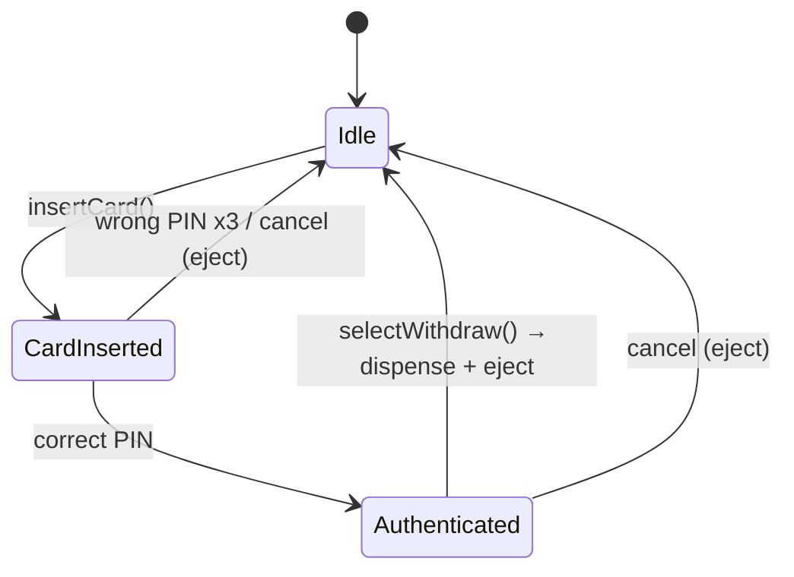
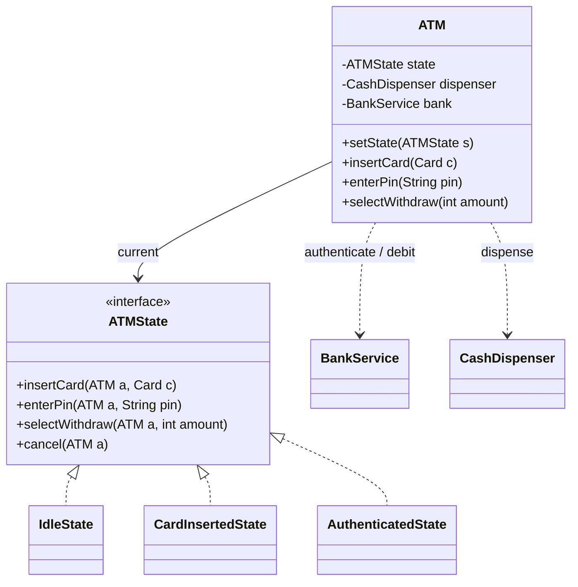

The ATM is the interview's showcase for the **State pattern**: what the machine *can do* depends entirely on where it is in the flow. `withdraw()` is meaningless before a PIN is verified — so instead of guarding every method with flags, each **state** exposes only its legal actions.

## Step 1 — Requirements

Insert card → authenticate (PIN) → choose a transaction (balance / withdraw / deposit) → dispense cash → eject. Clarify: retry limit on PIN? multiple denominations? We'll assume **3 PIN tries** and multi-denomination dispensing, and put receipt printing **out of scope**.

## Step 2 — The state machine



Each transition is a method that only *some* states honor — exactly what State encodes.

## Steps 3 & 4 — Classes and the State pattern

The `ATM` (context) holds the current state and the hardware; each state class implements the same interface but responds only to its legal operations (the rest are no-ops or errors).



```java
interface ATMState {
    default void insertCard(ATM a, Card c)      { reject(); }
    default void enterPin(ATM a, String pin)    { reject(); }
    default void selectWithdraw(ATM a, int amt) { reject(); }
    default void cancel(ATM a)                  { a.ejectCard(); a.setState(new IdleState()); }
    private void reject() { throw new IllegalStateException("Operation not allowed now"); }
}

class IdleState implements ATMState {
    public void insertCard(ATM a, Card c) {
        a.setCurrentCard(c);
        a.setState(new CardInsertedState());     // advance
    }
}

class CardInsertedState implements ATMState {
    public void enterPin(ATM a, String pin) {
        if (a.bank().authenticate(a.currentCard(), pin))
            a.setState(new AuthenticatedState());
        else if (a.recordFailedAttempt() >= 3)
            a.cancel();                            // eject after 3 tries
    }
}

class AuthenticatedState implements ATMState {
    public void selectWithdraw(ATM a, int amt) {
        if (a.bank().debit(a.currentCard(), amt)) {
            a.dispenser().dispense(amt);           // Chain of Responsibility over denominations
            a.cancel();                            // eject when done
        }
    }
}
```

:::senior
Two upgrades worth naming: **(1)** the **default-method "reject"** in the interface means each state only writes the transitions it *allows* — illegal calls fail loudly instead of silently. **(2)** the cash dispenser is a natural **Chain of Responsibility**: a 20 handler passes the remainder to a 10 handler to a 5 handler. And because a real ATM is touched by hardware callbacks, state transitions should be synchronized.
:::

## Step 5 — SOLID check

- **O**CP — a new state (e.g. `MaintenanceState`) is a new class; existing states don't change.
- **S**RP — the `ATM` coordinates; `BankService` authenticates/debits; `CashDispenser` counts notes.
- **L**SP — every `ATMState` is substitutable through the same interface; the context never checks the concrete type.

## Check yourself

```quiz
title: ATM design check
questions:
  - q: 'Why is the State pattern the natural fit for an ATM?'
    options:
      - text: 'The legal operations depend on the machine’s current state, so each state exposes only its valid transitions instead of scattering flag checks'
        correct: true
      - 'Because ATMs must be singletons'
      - 'To store the account balance'
    explain: 'State encapsulates mode-dependent behavior and transitions in per-state classes, replacing a web of boolean guards (hasCard, isAuthenticated) with polymorphism.'
  - q: 'Dispensing an amount across multiple note denominations maps cleanly to which pattern?'
    options:
      - 'Observer'
      - text: 'Chain of Responsibility (each denomination handler dispenses what it can, passes the rest on)'
        correct: true
      - 'Singleton'
    explain: 'Each handler (20, 10, 5 …) handles part of the request and delegates the remainder down the chain — the defining shape of Chain of Responsibility.'
```

:::key
ATM = the **State pattern**: `ATM` is the context; `IdleState → CardInsertedState → AuthenticatedState` each implement one interface and honor only their legal actions (illegal ones reject via a default method). Cash dispensing is **Chain of Responsibility** over denominations. New states are new classes (OCP).
:::
