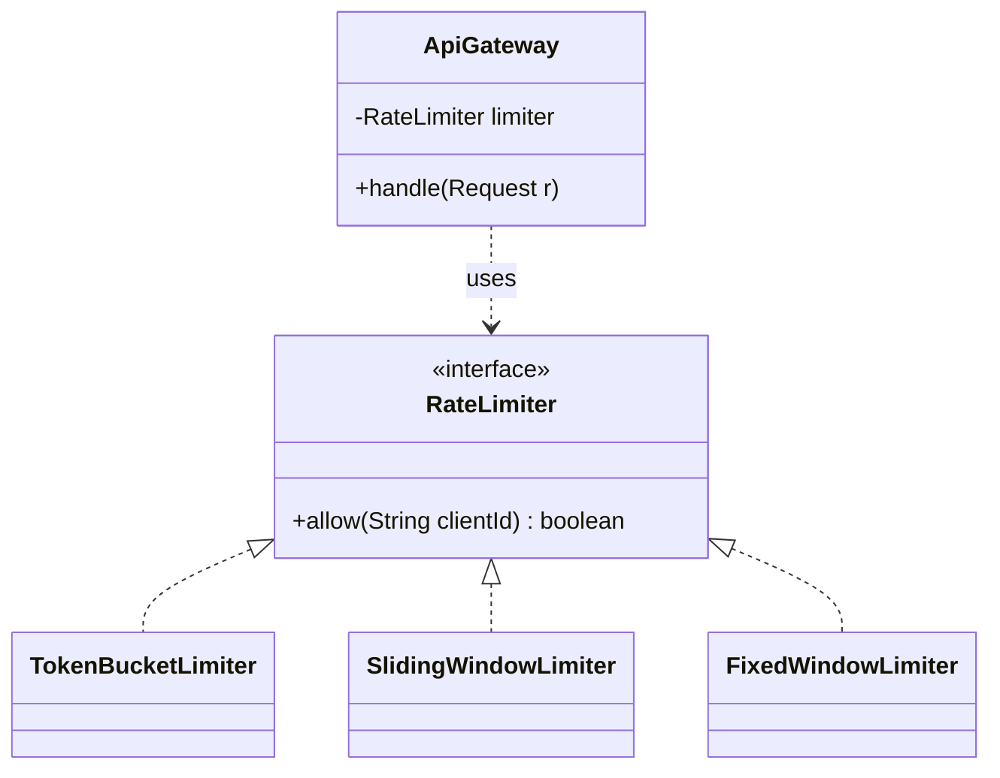

"Limit each client to **N requests per window**." The object design is small; the interview depth is in **which algorithm** you pick and its trade-offs. Hide the choice behind a **Strategy** so the algorithm is swappable, then implement one well.

:::note
This is the **single-node / LLD** view — class design plus one correct algorithm. The **distributed** version (shared counters in Redis, sticky vs. global limits) lives in the [System Design](/system-design/topic/communication/rate-limiting) track. Interviewers often start here and escalate there.
:::

## Step 1 — The five algorithms

| Algorithm | Idea | Burst? | Memory | Edge case |
|--|--|--|--|--|
| **Fixed window** | count per calendar window | allows 2× at borders | O(1) | boundary burst |
| **Sliding window log** | timestamps of every request | exact | **O(N)** | memory-heavy |
| **Sliding window counter** | weighted prev + current window | smooth, approximate | O(1) | slight inaccuracy |
| **Token bucket** | tokens refill at a rate; each request spends one | **yes, up to bucket size** | O(1) | — |
| **Leaky bucket** | requests queue, drain at fixed rate | no (smooths output) | O(queue) | added latency |

**Token bucket** is the usual default: O(1), allows controlled bursts, trivial to reason about.

## Steps 2–4 — Strategy over the algorithm



```java
interface RateLimiter { boolean allow(String clientId); }
```

## The token-bucket implementation

Each client owns a bucket that **refills lazily** based on elapsed time — no background thread needed. Every call computes how many tokens have accrued since the last check, caps at capacity, then tries to spend one.

```java
class TokenBucketLimiter implements RateLimiter {
    private final long capacity;          // max burst
    private final double refillPerMs;     // steady-state rate
    private final Map<String, Bucket> buckets = new ConcurrentHashMap<>();

    private static final class Bucket { double tokens; long lastRefillMs; }

    TokenBucketLimiter(long capacity, double ratePerSecond) {
        this.capacity = capacity;
        this.refillPerMs = ratePerSecond / 1000.0;
    }

    public boolean allow(String clientId) {
        Bucket b = buckets.computeIfAbsent(clientId, k -> {
            Bucket nb = new Bucket();
            nb.tokens = capacity; nb.lastRefillMs = System.currentTimeMillis();
            return nb;
        });
        synchronized (b) {                                  // per-client lock
            long now = System.currentTimeMillis();
            b.tokens = Math.min(capacity, b.tokens + (now - b.lastRefillMs) * refillPerMs);
            b.lastRefillMs = now;
            if (b.tokens >= 1) { b.tokens -= 1; return true; }
            return false;
        }
    }
}
```

:::gotcha
`allow()` is a **read-modify-write** on shared token state — a race here silently lets clients exceed the limit. Lock **per bucket** (as above) rather than one global lock, so different clients don't serialize against each other. This is exactly the atomicity problem from the [concurrency](/multithreading/topic/shared-state/race-conditions) track.
:::

:::senior
Interviewers push on the **border-burst** flaw of fixed windows: 100 requests at 00:00:59 and 100 more at 00:01:00 is 200 in two seconds while each window "passed." That's the reason to prefer sliding-window-counter or token-bucket. Then they escalate to **distributed**: the per-client bucket must live in a shared store (Redis `INCR` + TTL, or a Lua script for atomic token math), which reintroduces the same race across *machines*.
:::

## Step 5 — SOLID check

- **O**CP — a new algorithm is a new `RateLimiter` implementation; the gateway is untouched.
- **D**IP — the gateway depends on the `RateLimiter` interface, injected, not on `TokenBucketLimiter`.

## Check yourself

```quiz
title: Rate limiter design check
questions:
  - q: 'Why hide the limiting algorithm behind a RateLimiter interface?'
    options:
      - text: 'Different algorithms (token bucket, sliding window) trade off burst behavior, memory, and accuracy — Strategy lets you swap them without touching callers'
        correct: true
      - 'Interfaces make it thread-safe automatically'
      - 'It forces the limiter to be a singleton'
    explain: 'Strategy encapsulates interchangeable algorithms; the gateway depends only on allow(), so the policy can change per route or environment.'
  - q: 'What is the well-known weakness of a fixed-window counter?'
    options:
      - text: 'A burst straddling the window boundary can allow up to 2× the limit in a short span'
        correct: true
      - 'It uses O(N) memory'
      - 'It cannot allow any bursts at all'
    explain: 'Counts reset at window edges, so requests bunched at the end of one window and the start of the next both pass. Sliding-window and token-bucket smooth this.'
  - q: 'Why lock per-bucket instead of one global lock in the token-bucket limiter?'
    options:
      - text: 'allow() is a read-modify-write on token state; a per-client lock keeps it atomic without serializing unrelated clients'
        correct: true
      - 'Global locks are not supported in Java'
      - 'Per-bucket locks avoid using memory'
    explain: 'The refill-and-spend must be atomic to prevent over-admitting; locking each bucket preserves correctness while allowing different clients to proceed concurrently.'
```

:::key
Rate limiter = a **Strategy** over five algorithms. Know the trade-offs: **fixed window** (simple, border-burst), **sliding window** (accurate, more memory/compute), **token bucket** (O(1), controlled bursts — the usual default), **leaky bucket** (smooths output, adds latency). Implement token-bucket with **lazy time-based refill** and **per-client locking**; the distributed version pushes the same atomic read-modify-write into Redis.
:::
