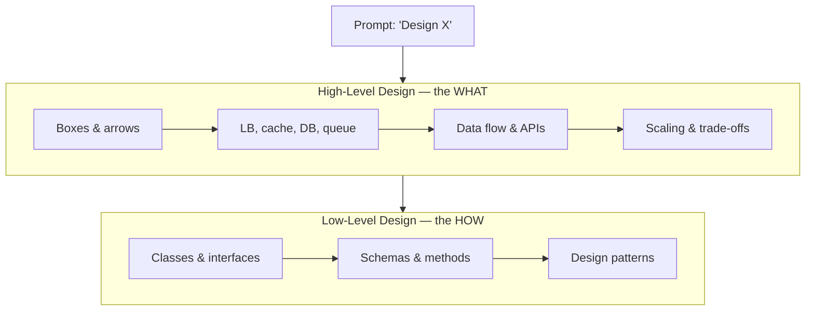

System design is the craft of arranging **components** (servers, caches, queues, databases) so a system meets its goals under real-world load. In an interview you are not writing code — you are **making and defending trade-offs out loud**.

## The two altitudes: HLD vs LLD

Every design lives at one of two zoom levels. HLD interviews (the focus of this track) stay at the "boxes and arrows" altitude.



| Dimension | High-Level Design (HLD) | Low-Level Design (LLD) |
|--|--|--|
| Zoom level | Whole system, components | A single service / module |
| Artifact | Architecture diagram | Class diagram, schema |
| Question | *"Design Twitter's feed"* | *"Design the `RateLimiter` class"* |
| Vocabulary | LB, shard, cache, queue, CDN | class, interface, method, pattern |
| Optimizes for | Scale, availability, latency | Extensibility, clean code |

:::note
This track is HLD-first. LLD (SOLID, patterns, class diagrams) lives in the OOP and Design Patterns tracks.
:::

## What interviewers actually score

The whiteboard is a proxy. They are watching *how you think*, not whether you memorized an architecture.

| Signal | What it looks like | Weak vs strong |
|--|--|--|
| **Requirements** | Clarifying questions before drawing | Weak: jumps to a database. Strong: scopes first |
| **Structured approach** | Requirements → estimate → API → data → scale | Weak: random boxes. Strong: a repeatable method |
| **Trade-offs** | *"SQL gives consistency; NoSQL scales writes"* | Weak: one true answer. Strong: names the cost |
| **Justification** | Every box has a reason | Weak: cargo-cults Kafka. Strong: *"a queue here because..."* |
| **Handling scale** | Reacts when told "10x the traffic" | Weak: freezes. Strong: adds cache/shard/replica |

:::senior
Seniority shows up as **driving the conversation**: you set the agenda, state assumptions out loud, and course-correct when the interviewer pushes back — instead of waiting to be quizzed.
:::

## Step 0: turn the vague prompt into requirements

"Design Instagram" is deliberately underspecified. Your first move is to split needs into two buckets.

- **Functional** — *what the system does* (features, verbs). "Users can upload a photo."
- **Non-functional** — *how well it does it* (qualities, the "-ilities"). "Feeds load in under 200 ms."

Non-functional requirements are what force the interesting architecture. Anyone can store a photo; making it load fast for 500M users is the design.

````tabs
tabs:
  - label: Functional
    body: |
      The verbs — user-visible features you can demo.
      ```text
      - Upload a photo with a caption
      - Follow another user
      - View a home feed of followees' posts
      - Like and comment
      ```
      Drives your **API** and **data model**.
  - label: Non-functional
    body: |
      The qualities — measurable properties under load.
      ```text
      - Availability: 99.9% uptime
      - Latency: feed p99 < 200 ms
      - Scale: 500M users, read-heavy
      - Durability: never lose an uploaded photo
      ```
      Drives your **scaling, caching, and replication**.
````

```flashcards
title: Requirements vocabulary
cards:
  - front: 'Functional requirement'
    back: 'What the system **does** — a feature or verb. *"Users can post a tweet."*'
  - front: 'Non-functional requirement (NFR)'
    back: 'How **well** it does it — a measurable quality: latency, availability, scalability, durability, consistency.'
  - front: 'The "-ilities"'
    back: 'Nickname for NFRs: scalability, availability, reliability, maintainability. They shape the architecture.'
  - front: 'Scope / constraints'
    back: 'Explicit limits you agree on up front: user count, read:write ratio, regions, what is out of scope.'
  - front: 'HLD vs LLD'
    back: 'HLD = boxes-and-arrows of the whole system. LLD = classes, methods, and schema of one component.'
```

:::key
A system-design interview is a **trade-off conversation**, not a coding test. Always start by splitting the prompt into **functional** (features) and **non-functional** (qualities) requirements — the NFRs are what force the architecture.
:::

## Check yourself

```quiz
title: Foundations check
questions:
  - q: '"The feed must load in under 200 ms for 99% of requests" is a…'
    options:
      - 'Functional requirement'
      - text: 'Non-functional requirement'
        correct: true
      - 'Low-level design detail'
    explain: 'It describes *how well* the system performs (latency), not a feature. Latency, availability, and scalability are all non-functional requirements.'
  - q: 'You are asked to "Design a chat app." What is the best first move?'
    options:
      - 'Draw a load balancer and three servers'
      - text: 'Ask clarifying questions to scope functional and non-functional requirements'
        correct: true
      - 'Pick between SQL and NoSQL'
    explain: 'Requirements first. Jumping to components before scoping is the most common way to lose points — you may solve the wrong problem.'
  - q: 'Which task belongs to Low-Level Design, not High-Level Design?'
    options:
      - 'Deciding to put a cache in front of the database'
      - text: 'Designing the class hierarchy and methods of a RateLimiter'
        correct: true
      - 'Choosing to shard the database by user ID'
    explain: 'Class hierarchies and method signatures are LLD. HLD stays at the level of components, data flow, and scaling decisions.'
```
