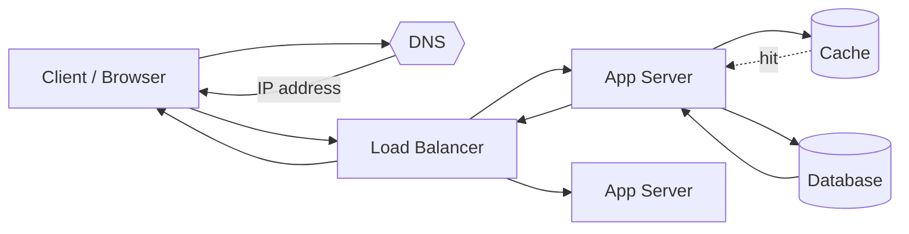
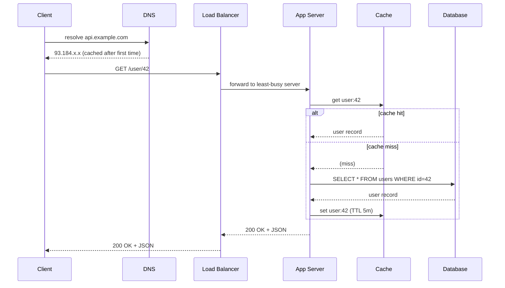
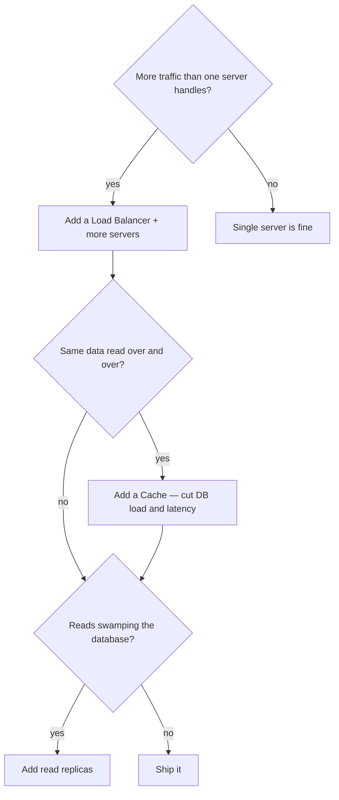

Before you can design a system, you must know the **journey of a single request**. Every component in an architecture diagram is just a stop on this path. Here it is, end to end.



## The stops on the path

| # | Stop | Job | Typical tech |
|--|--|--|--|
| 1 | **DNS** | Turn `api.example.com` into an IP address | Route 53, Cloudflare |
| 2 | **Load Balancer** | Spread traffic across servers; health-check | Nginx, ALB, HAProxy |
| 3 | **Web / App server** | Run business logic, orchestrate the request | Node, Java, Go |
| 4 | **Cache** | Serve hot data in-memory, skip the DB | Redis, Memcached |
| 5 | **Database** | The durable source of truth | Postgres, DynamoDB |

:::tip
DNS resolution happens **once** and is heavily cached (browser → OS → resolver), so it is not on the hot path for most requests. The load balancer onward is where your design decisions live.
:::

## Where the milliseconds go

Interviewers love "where does the time go on one request?" — quote a budget, not vibes. For a cache-hit read inside one data center:

| Hop | Typical cost | Notes |
|--|--|--|
| DNS lookup | ~0 ms (cached) / 20–120 ms cold | Once per TTL, not per request |
| TLS handshake | 1 RTT (TLS 1.3) — reused | Connection pooling amortizes it |
| Client → LB (internet) | 10–100 ms | Dominated by user's distance; a CDN/edge cuts this |
| LB → app server | ~0.5 ms | Same-DC round trip |
| App → cache (Redis) | ~0.5–1 ms | 0.5 ms RTT + sub-ms lookup |
| App → database | 1–10 ms (indexed query) | 10–100x worse if it hits disk or misses an index |
| App logic + serialization | 1–5 ms | JSON encoding is not free at scale |

Two consequences: the **internet leg dwarfs everything inside the DC**, which is why CDNs and regional deployments matter; and inside the DC, **each extra sequential hop adds ~0.5–1 ms plus a failure point**, which is why chatty microservice chains blow latency budgets. A p99 target of 200 ms leaves room for exactly one slow thing.

## Full flow as a sequence

Watch the request thread through every component. The cache check is the branch that decides whether the database is touched at all.



:::note
This is the **cache-aside** pattern: the app checks the cache, falls back to the DB on a miss, then populates the cache. It is the default read pattern in almost every design.
:::

## Why each hop exists

Think of the path as a decision tree — you add each component to solve a specific problem.



:::senior
Every hop adds **latency and a failure point**. A senior answer justifies each box — *"a cache here because reads are 100x writes"* — rather than reflexively drawing the full stack. Start minimal; add components only when a requirement forces it.
:::

## Check yourself

```quiz
title: Request lifecycle check
questions:
  - q: 'What is the primary job of the load balancer in the request path?'
    options:
      - 'Resolve domain names to IP addresses'
      - text: 'Distribute incoming requests across multiple servers and route around unhealthy ones'
        correct: true
      - 'Store frequently accessed data in memory'
    explain: 'DNS resolves names; caches store hot data. The load balancer spreads traffic across healthy servers so no single one is overwhelmed.'
  - q: 'In the cache-aside pattern, what happens on a cache miss?'
    options:
      - 'The request fails and returns a 404'
      - text: 'The app reads from the database, then writes the value back into the cache'
        correct: true
      - 'The load balancer retries on another server'
    explain: 'On a miss the app falls back to the database (source of truth), returns the data, and populates the cache so the next read is a hit.'
  - q: 'Why is DNS usually NOT a concern for per-request latency?'
    options:
      - 'It runs on the same machine as the app server'
      - text: 'Results are heavily cached at multiple layers, so resolution happens rarely'
        correct: true
      - 'The load balancer handles DNS internally'
    explain: 'The browser, OS, and resolvers all cache DNS answers with a TTL, so the lookup happens once and is reused for many subsequent requests.'
```

:::key
One request flows **DNS → Load Balancer → App Server → Cache → Database → back**. DNS is cached and off the hot path; the load balancer spreads traffic; the cache absorbs repeat reads via **cache-aside**; the database is the source of truth. Justify every hop by a requirement.
:::
