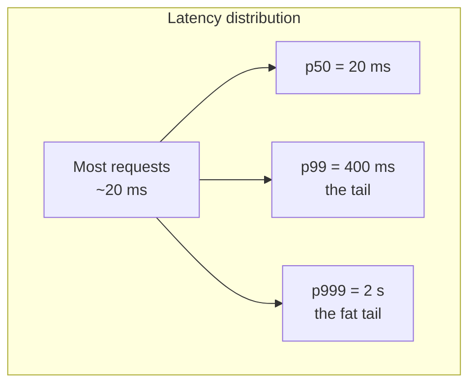

Great system designers reason with **numbers**, not vibes. If someone says "add a cross-region call to the hot path," you should instantly feel the ~150 ms cost. This topic gives you that intuition.

## Latency vs throughput

Two different questions. Do not confuse them.

| | **Latency** | **Throughput** |
|--|--|--|
| Question | How long for **one** request? | How many requests **per second**? |
| Unit | ms, µs, ns | requests/sec, MB/sec |
| Analogy | Time for one car to cross | Cars crossing per minute |
| Improve by | Faster path, caching, less work | Parallelism, batching, more servers |

:::note
They trade off. **Batching** raises throughput (fewer round-trips) but *adds* latency (a request waits for the batch to fill). A wide highway (high throughput) can still have a long drive (high latency).
:::

## The latency ladder

The famous "numbers every engineer should know." Memorize the **orders of magnitude**, not exact digits — the point is relative cost.

| Operation | Latency | Human scale (×1B) | Feel |
|--|--|--|--|
| L1 cache reference | ~1 ns | 1 sec | instant |
| L2 cache reference | ~4 ns | 4 sec | |
| Main memory (RAM) | ~100 ns | ~2 min | cheap |
| Read 1 MB from RAM | ~10 µs | ~3 hrs | |
| SSD random read | ~100 µs | ~1 day | avoid per-request |
| Read 1 MB from SSD | ~1 ms | ~11 days | |
| Network round-trip (same DC) | ~0.5 ms | ~6 days | |
| Rotational disk seek | ~10 ms | ~4 months | slow! |
| Read 1 MB over 1 Gbps network | ~10 ms | ~4 months | |
| Cross-region round-trip (US↔EU) | ~150 ms | ~5 years | very costly |

:::key
The takeaways that win points:
- **Memory is ~100,000x faster than a disk seek** → this is *why caches exist*.
- **SSD is ~100x faster than spinning disk** → the modern default.
- **Same-DC network (~0.5 ms) is cheap; cross-region (~150 ms) is not** → keep hot paths in one region.
:::

```flashcards
title: Latency numbers (orders of magnitude)
cards:
  - front: 'L1 cache reference'
    back: '~**1 ns** — effectively instant.'
  - front: 'Main memory (RAM) reference'
    back: '~**100 ns** — ~100x slower than L1, still cheap.'
  - front: 'SSD random read'
    back: '~**100 µs** — ~1000x slower than RAM.'
  - front: 'Rotational disk seek'
    back: '~**10 ms** — ~100,000x slower than RAM. This is why we cache.'
  - front: 'Round-trip within one datacenter'
    back: '~**0.5 ms** — cheap; safe to make several per request.'
  - front: 'Cross-region round-trip (US ↔ EU)'
    back: '~**150 ms** — dominated by the speed of light. Avoid on hot paths.'
  - front: 'Rule of thumb: RAM vs disk'
    back: 'Memory is roughly **100,000x** faster than a disk seek — the whole justification for caching.'
```

## Tail latency and p99

Averages lie. If one request in a hundred takes 2 seconds, the **average** hides it — but a busy user makes many requests and *will* hit that slow one. So we measure **percentiles**.

- **p50 (median)** — half of requests are faster than this.
- **p99** — 99% are faster; the slowest 1% (the "tail") is worse.
- **p999** — the truly unlucky requests.



:::gotcha
**Fan-out amplifies the tail.** If one page makes 100 parallel backend calls and each has a 1% chance of being slow (p99), the odds that *at least one* is slow is `1 − 0.99¹⁰⁰ ≈ 63%`. So most page loads hit some server's tail. This is why big systems obsess over p99, not the average.
:::

:::senior
State SLOs in percentiles: *"feed p99 < 200 ms"*, never *"average < 200 ms"*. Interviewers listen for whether you know that the **tail** is what users actually feel — and that fan-out makes the tail the common case.
:::

## Check yourself

```quiz
title: Performance numbers check
questions:
  - q: 'Reading from RAM vs seeking on a spinning disk differ by roughly what factor?'
    options:
      - 'About 10x'
      - 'About 100x'
      - text: 'About 100,000x'
        correct: true
    explain: 'RAM is ~100 ns and a disk seek is ~10 ms — roughly 100,000x. This enormous gap is the fundamental reason caches exist.'
  - q: 'A service reports average latency of 30 ms but p99 of 900 ms. Why might users still complain?'
    options:
      - 'The average is the only number that matters'
      - text: 'The slow 1% (tail) is hit often, especially when a page fans out to many backend calls'
        correct: true
      - 'p99 measures throughput, not latency'
    explain: 'Users feel the tail. With fan-out (many parallel calls per page), the chance that at least one call hits the slow p99 becomes high, so the tail dominates perceived performance.'
  - q: 'Batching many requests together generally…'
    options:
      - text: 'Increases throughput but can increase per-request latency'
        correct: true
      - 'Increases both throughput and reduces latency'
      - 'Reduces throughput'
    explain: 'Batching amortizes overhead across more work (higher throughput) but each request waits for the batch to fill, adding latency. Classic throughput-vs-latency trade-off.'
```
