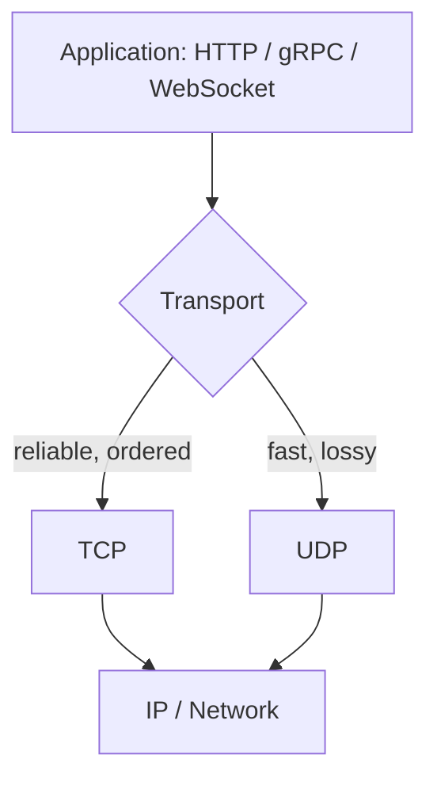
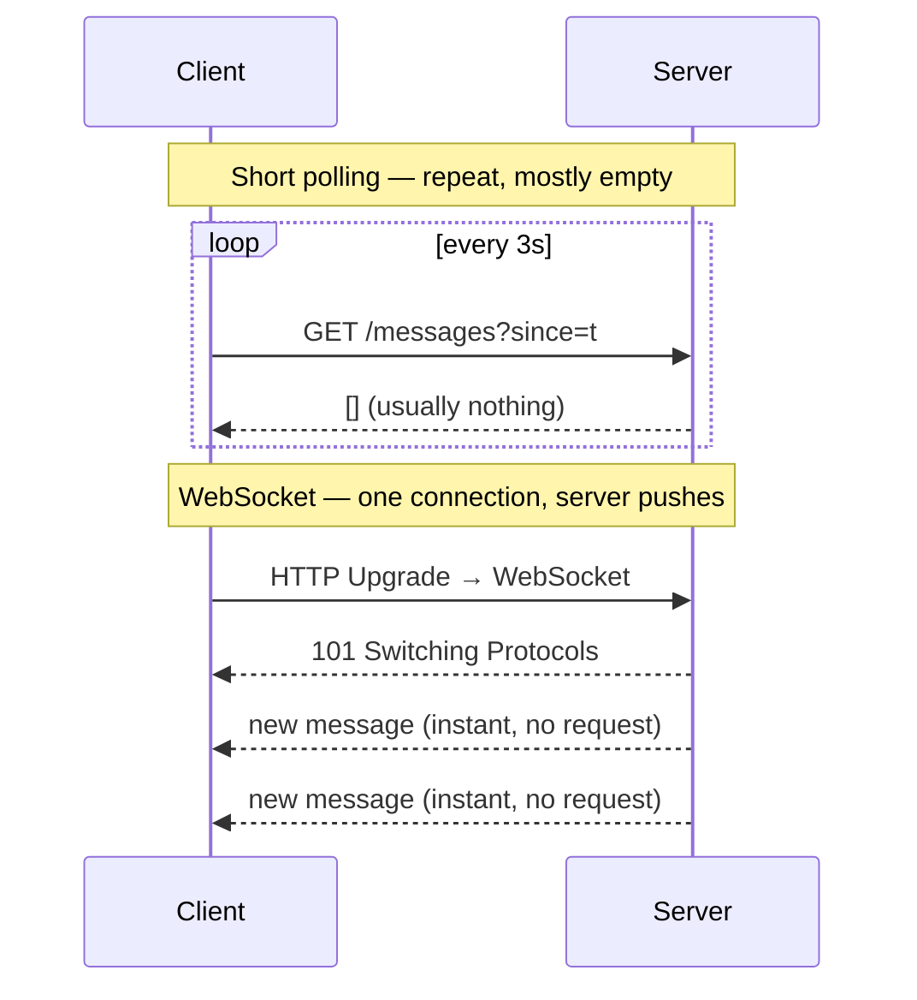

Every arrow in your architecture diagram runs over a protocol. Choosing the right one — and knowing why — is a frequent interview probe. Here is the layered picture, then the trade-offs.



## TCP vs UDP — the transport choice

Everything above sits on one of these two. TCP guarantees delivery; UDP just fires packets.

| | **TCP** | **UDP** |
|--|--|--|
| Connection | Handshake first (SYN/ACK) | Connectionless — just send |
| Reliability | Guaranteed, retransmits lost packets | Best-effort, packets may drop |
| Ordering | In-order delivery | No ordering |
| Overhead | Higher (ACKs, state) | Minimal |
| Speed | Slower to start | Fast, low latency |
| Use for | Web, APIs, databases, anything correct | Video calls, gaming, DNS, live streams |

:::tip
Mnemonic: **TCP = phone call** (connect, confirm, ordered). **UDP = shouting across a room** (fast, no confirmation, some words lost). HTTP/1 and HTTP/2 run on TCP; HTTP/3 (QUIC) runs on UDP.
:::

## HTTP / HTTPS

**HTTP** is the request/response protocol of the web: a client sends a method (`GET`, `POST`, ...) and a path, the server returns a status code and body. It is **stateless** — each request stands alone. **HTTPS** is HTTP wrapped in **TLS** for encryption, integrity, and server identity. Always use HTTPS.

| Version | Runs on | Headline feature |
|--|--|--|
| HTTP/1.1 | TCP | One request at a time per connection (head-of-line blocking) |
| HTTP/2 | TCP | Multiplexing — many streams over one connection |
| HTTP/3 | UDP (QUIC) | No TCP head-of-line blocking; faster connection setup |

## API styles: REST vs gRPC vs GraphQL

All three typically ride over HTTP. They solve different problems.

````tabs
tabs:
  - label: REST
    body: |
      Resources as URLs, HTTP verbs, JSON. The web default — simple, cacheable, universal.
      ```text
      GET  /users/42
      POST /users/42/posts
      ```
      **Weakness:** over-fetching (you get the whole object) and under-fetching (need N calls for N resources).
  - label: gRPC
    body: |
      Binary Protobuf over HTTP/2. Fast, strongly-typed contracts, streaming built in.
      ```text
      service Users {
        rpc GetUser(GetUserReq) returns (User);
      }
      ```
      **Best for** internal service-to-service calls. Not natively browser-friendly.
  - label: GraphQL
    body: |
      One endpoint; the **client** specifies exactly the fields it wants — no over/under-fetching.
      ```text
      query { user(id:42) { name posts { title } } }
      ```
      **Cost:** harder caching and a server that can execute expensive nested queries.
````

| | REST | gRPC | GraphQL |
|--|--|--|--|
| Payload | JSON (text) | Protobuf (binary) | JSON |
| Transport | HTTP/1.1+ | HTTP/2 | HTTP |
| Typed contract | Loose (OpenAPI) | Strong (`.proto`) | Strong (schema) |
| Fetching | Over/under-fetch | Fixed methods | Exact fields |
| Sweet spot | Public APIs | Internal microservices | Rich/mobile clients |

## Real-time: getting the server to push

Plain HTTP is client-pull. For live updates (chat, tickers, notifications) you need one of these.



| Technique | Direction | Connection | Best for |
|--|--|--|--|
| **Short polling** | Client pulls | New request each time | Simple, infrequent updates |
| **Long polling** | Client pulls (held open) | Request held until data | Fallback when WS unavailable |
| **SSE** | Server → client only | One long-lived HTTP stream | Feeds, notifications, tickers |
| **WebSocket** | Full duplex (both ways) | One persistent TCP connection | Chat, gaming, collaboration |

:::senior
Pick the **least powerful tool that works**. Notifications are one-directional → **SSE** (simpler, auto-reconnect, plain HTTP). Chat and collaborative editing are two-way → **WebSocket**. Reaching for WebSockets when SSE suffices adds needless connection-management and scaling cost.
:::

:::gotcha
Persistent connections (WebSocket/SSE) are **stateful** — each ties up a server socket. Behind a load balancer you need sticky sessions or a shared pub/sub layer (e.g. Redis) so any server can push to any client. This is a common scaling gotcha.
:::

## Check yourself

```quiz
title: Protocols check
questions:
  - q: 'A live video call drops a few frames but must stay real-time. Which transport fits?'
    options:
      - text: 'UDP — low latency matters more than perfect delivery'
        correct: true
      - 'TCP — every frame must arrive in order'
      - 'HTTP/1.1 — it is the web standard'
    explain: 'For live media, a retransmitted late frame is useless. UDP trades reliability for low latency, which is exactly the right call here.'
  - q: 'A mobile app suffers from over-fetching and needs many round-trips per screen. Which API style directly addresses this?'
    options:
      - 'REST'
      - text: 'GraphQL'
        correct: true
      - 'gRPC'
    explain: 'GraphQL lets the client request exactly the fields it needs in one query, eliminating over-fetching and multiple round-trips — its core value for rich mobile clients.'
  - q: 'You need the server to push notifications to browsers, one direction only. Best choice?'
    options:
      - 'WebSocket, because it is the most powerful'
      - text: 'SSE — one-directional server push over plain HTTP'
        correct: true
      - 'Short polling every second'
    explain: 'SSE is purpose-built for one-way server-to-client streams: simpler than WebSockets, runs over HTTP, and auto-reconnects. Use the least powerful tool that solves the problem.'
```

:::key
**TCP** = reliable/ordered (APIs, web); **UDP** = fast/lossy (media, gaming). **HTTPS** everywhere. API styles: **REST** for public APIs, **gRPC** for internal service calls, **GraphQL** for flexible client fetching. Real-time: **SSE** for one-way push, **WebSocket** for two-way — persistent connections are stateful and complicate load balancing.
:::
