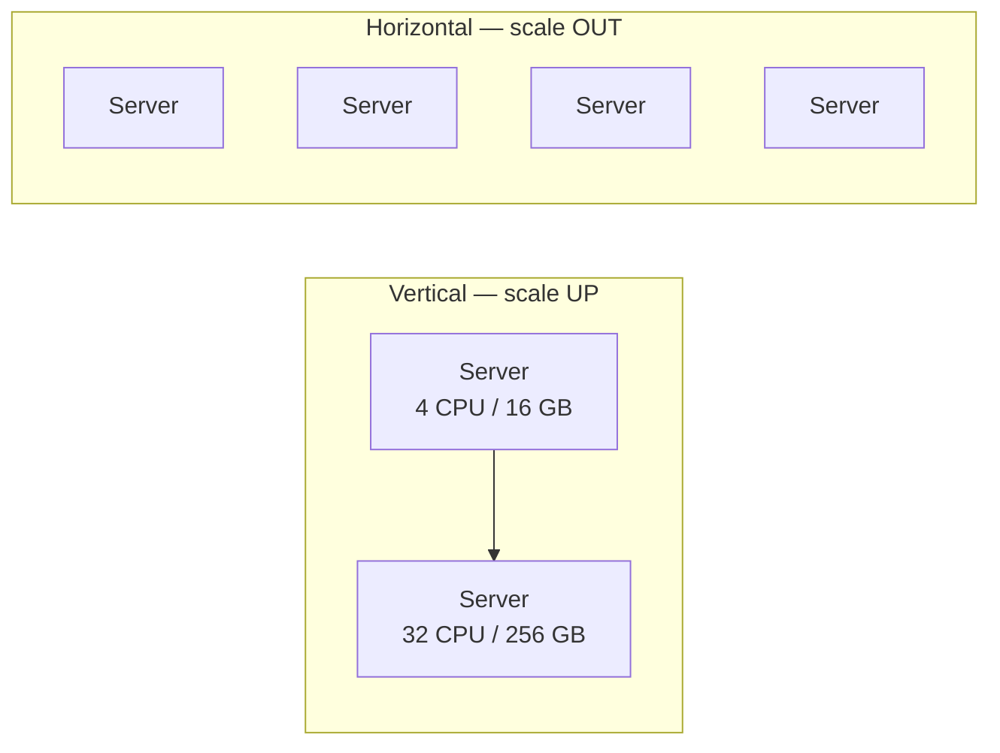

Your service is slowing down under load. You have two levers: make the **one machine bigger**
(scale *up*), or **add more machines** (scale *out*). Almost every scalability decision in an
interview starts here, and the "senior" answer is knowing *why* real systems eventually pick out.

## The two directions



- **Vertical (scale up):** replace the box with a beefier one — more CPU, RAM, faster disk.
  Same architecture, one node.
- **Horizontal (scale out):** put many commodity boxes behind a load balancer and spread the
  work across them.

## The core trade-off

| | Vertical (scale up) | Horizontal (scale out) |
|--|--|--|
| **How** | Bigger single machine | More machines behind a load balancer |
| **Ceiling** | Hard limit — biggest box you can buy | Effectively unbounded — keep adding nodes |
| **Cost curve** | Super-linear (top-end hardware is pricey) | Roughly linear (commodity hardware) |
| **Fault tolerance** | Poor — one box is a single point of failure | Good — lose a node, the rest carry on |
| **Complexity** | Low — no app changes needed | Higher — needs LB, statelessness, coordination |
| **Downtime to grow** | Usually a reboot/migration | Add nodes live, zero downtime |
| **Data consistency** | Trivial — one node, one copy | Harder — distributed state |

:::key
**Vertical is simpler; horizontal is more resilient and effectively limitless.** Vertical hits a
hard hardware ceiling and keeps the single point of failure. Horizontal is how you reach true
web scale — but only if the service can run as many identical, independent copies.
:::

## When to use each

:::tip
**Start vertical, plan horizontal.** Scaling up is the fastest fix and needs no code changes, so
it is the right *first* move. But design so you *can* scale out later — that mostly means keeping
your app servers **stateless** (see the next topics).
:::

- **Reach for vertical when:** load is modest and growing slowly; the workload is hard to
  distribute (e.g. a single relational primary that needs one consistent view); you need a quick
  win with no re-architecture.
- **Reach for horizontal when:** you need high availability (no single box you can't afford to
  lose); traffic exceeds any single machine; or you want to scale cheaply on commodity hardware.

:::senior
The real reason large systems go horizontal is **availability, not just throughput.** A single
maxed-out server is still one power supply, one kernel panic away from a full outage. Ten smaller
servers behind a load balancer survive losing one. "Scale out" is as much a reliability decision
as a performance one.
:::

:::gotcha
Horizontal scaling only works if requests don't depend on *which* node handles them. A server that
stores session data in local memory **cannot** be safely scaled out — the next request may land on
a different node that has never seen the user. Statelessness is the prerequisite.
:::

## Check yourself

```quiz
title: Scaling direction check
questions:
  - q: 'What is the fundamental limitation of vertical scaling?'
    options:
      - text: 'A hard hardware ceiling — you can only buy so big a machine'
        correct: true
      - 'It requires a load balancer'
      - 'It cannot use SSDs'
    explain: 'Vertical scaling is bounded by the largest single machine available, and cost rises super-linearly near the top. Horizontal scaling has no such ceiling.'
  - q: 'Beyond raw throughput, the biggest reason large systems scale horizontally is:'
    options:
      - 'Cheaper RAM'
      - text: 'Availability — surviving the loss of any single node'
        correct: true
      - 'Simpler code'
    explain: 'Many independent nodes behind a load balancer tolerate a node failure; one big box is a single point of failure.'
  - q: 'What must be true of an app server before you can safely scale it out horizontally?'
    options:
      - 'It must use a relational database'
      - text: 'It must be stateless — no request should depend on which node handles it'
        correct: true
      - 'It must run on the largest available instance'
    explain: 'If a server keeps per-user state in local memory, a follow-up request routed to a different node breaks. Statelessness is the prerequisite for scaling out.'
```
