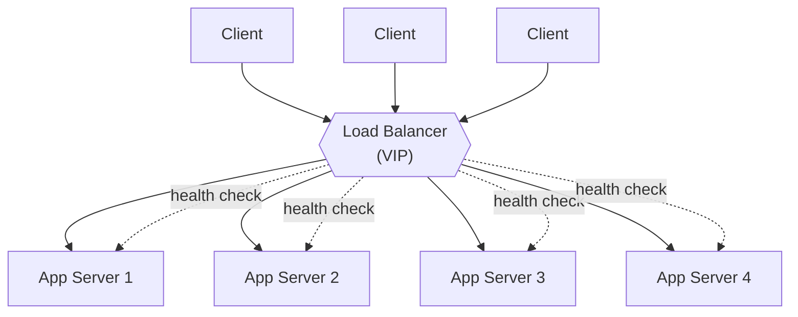
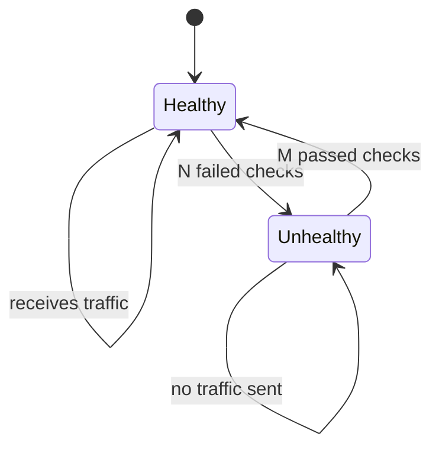
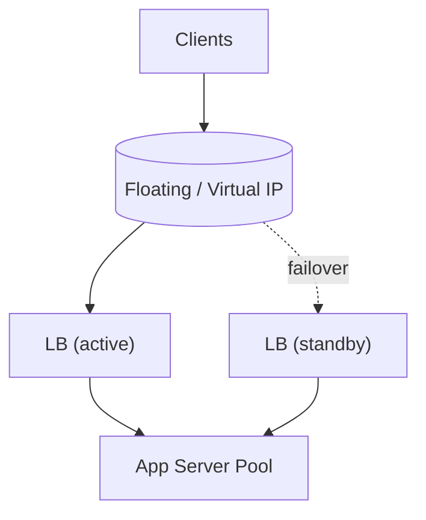

The moment you scale **out** (many app servers), something has to decide *which* server each
request goes to. That's the **load balancer (LB)** — the traffic cop that spreads requests,
routes around dead nodes, and gives clients a single stable endpoint.

## Where it sits



Clients hit one virtual IP (VIP); the LB fans the traffic across a **pool** of identical backends
and continuously **health-checks** each one, pulling failures out of rotation.

## L4 vs L7

The key distinction interviewers probe: **what does the balancer look at to route?**

| | L4 — transport | L7 — application |
|--|--|--|
| **Sees** | IP + TCP/UDP port | Full HTTP: URL path, headers, cookies |
| **Decides on** | Connection tuple | Content — `/api/*` vs `/images/*`, host, cookie |
| **Speed** | Very fast, low overhead | Slightly heavier (parses the request) |
| **Features** | Raw forwarding | TLS termination, path routing, sticky cookies, compression |
| **Example use** | Balance raw TCP to a DB proxy | Route microservices by URL path |

:::note
L4 balances **connections** without understanding them — fast but blind. L7 understands **HTTP**,
so it can route by path/host/cookie and terminate TLS, at a small CPU cost. Modern web stacks lean
L7 (e.g. NGINX, Envoy, ALB); L4 shines for raw throughput (e.g. NLB).
:::

## Balancing algorithms

| Algorithm | How it picks | Best when |
|--|--|--|
| **Round robin** | Next server in order, cycling | Backends are uniform and requests are cheap/equal |
| **Weighted round robin** | Round robin biased by server capacity | Mixed instance sizes |
| **Least connections** | Server with the fewest active connections | Long-lived or uneven request durations |
| **Least response time** | Fewest connections + lowest latency | Latency-sensitive, heterogeneous load |
| **IP hash / consistent hashing** | Hash the client (or key) → a server | You want the same client/key to stick to the same node (cache affinity) |

:::senior
**Consistent hashing** is the one to name-drop. Plain "hash mod N" remaps *almost every* key when
you add or remove a server (N changes). Consistent hashing maps servers and keys onto a ring, so
adding/removing a node only reshuffles the keys in one arc — roughly **1/N of keys move**, not all
of them. That's why it's the backbone of distributed caches and sharded stores, not just LBs.
:::

## Health checks

The LB pings each backend (e.g. `GET /healthz`) on an interval. Miss a few in a row → the node is
marked **unhealthy** and removed from rotation; pass again → it's added back. This is what makes
scale-out *self-healing*: a crashed node simply stops receiving traffic.



:::tip
Prefer a **deep** health check (`/healthz` verifies DB/cache connectivity) over a shallow one
(just "is the port open"). A shallow check keeps sending traffic to a process that's up but can't
actually serve requests.
:::

## The LB is itself a single point of failure

If all traffic flows through one LB and it dies, the whole site is down — you've just moved the
SPOF. Real deployments run the LB **redundantly**:



- **Active–passive:** a standby LB holds a *floating IP*; if the active dies, the IP fails over
  (via a heartbeat protocol like VRRP/keepalived).
- **Active–active:** multiple LBs serve simultaneously, fronted by **DNS round robin** or an
  anycast VIP, so there's no idle spare and no single choke point.

:::gotcha
"Add a load balancer for high availability" is only half an answer. A single LB is a **new single
point of failure**. Always pair it — redundant LBs with a floating IP or DNS-level distribution.
:::

## Check yourself

```quiz
title: Load balancing check
questions:
  - q: 'A layer 7 (L7) load balancer can do something an L4 balancer cannot:'
    options:
      - 'Forward TCP connections'
      - text: 'Route by HTTP content — URL path, host, or cookie — and terminate TLS'
        correct: true
      - 'Perform health checks'
    explain: 'L4 routes on IP/port only. L7 parses the HTTP request, so it can route by path/host/cookie, terminate TLS, and do sticky cookies — at a small CPU cost.'
  - q: 'Which algorithm best handles backends with long-lived or uneven request durations?'
    options:
      - 'Plain round robin'
      - text: 'Least connections'
        correct: true
      - 'IP hash'
    explain: 'Round robin ignores how busy a server already is. Least connections sends the next request to the least-loaded node, which matters when durations vary widely.'
  - q: 'Why is consistent hashing preferred over "hash mod N" for distributing keys across servers?'
    options:
      - 'It is faster to compute'
      - text: 'Adding or removing a node only remaps ~1/N of keys, not nearly all of them'
        correct: true
      - 'It guarantees a perfectly even distribution'
    explain: 'With mod N, changing N reshuffles almost every key. Consistent hashing places nodes on a ring so a change only moves the keys in one arc — critical for caches and sharded stores.'
  - q: 'You put all traffic through one load balancer "for high availability." What is wrong?'
    options:
      - 'Nothing — one LB is enough'
      - text: 'The single LB is itself a new single point of failure; it must be made redundant'
        correct: true
      - 'Load balancers reduce availability'
    explain: 'A lone LB just relocates the SPOF. Run active–passive with a floating IP, or active–active behind DNS/anycast.'
```

:::key
A load balancer fronts a pool of identical backends, health-checks them, and spreads traffic.
Know **L4 (fast, IP/port) vs L7 (content-aware HTTP)**, the algorithms (**round robin, least
connections, consistent hashing**), and that the **LB must itself be redundant** or it's just a
new single point of failure.
:::
