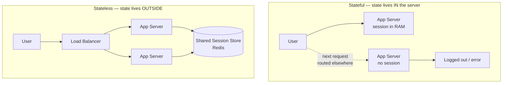
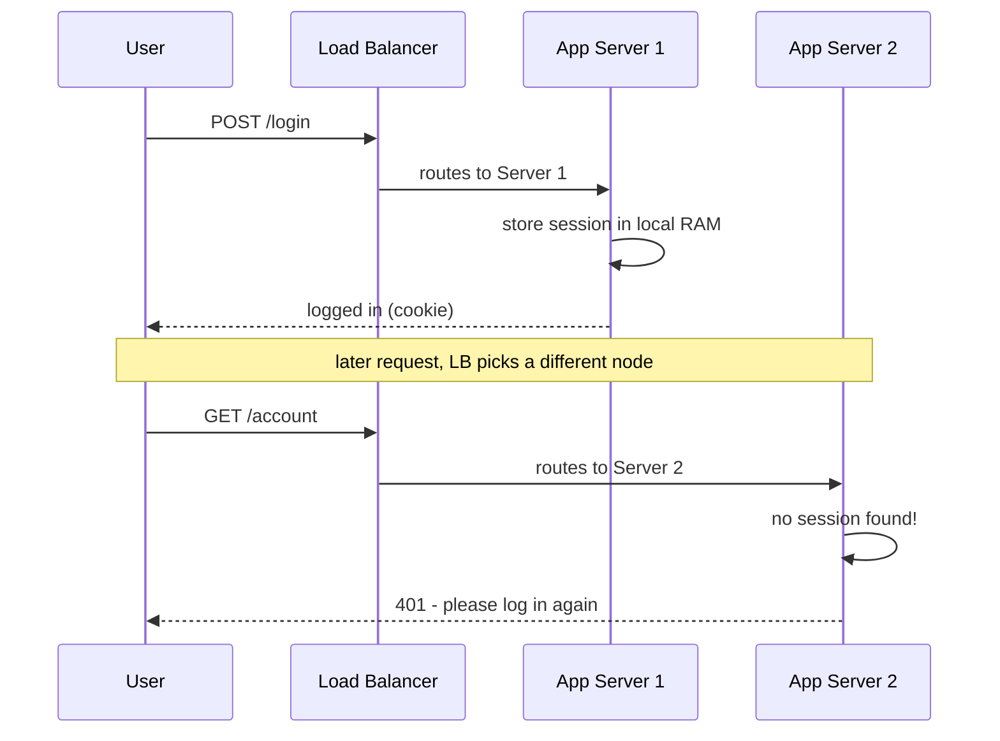

Horizontal scaling only pays off if the load balancer can send a request to **any** server and get
the same result. That's what **stateless** means: the server keeps *no client-specific state
between requests*. Get this wrong and adding servers actively breaks users.

## Stateful vs stateless



- **Stateful:** the server remembers you — session in local memory, uploaded file on local disk.
  A follow-up request that lands on a *different* node finds nothing.
- **Stateless:** every request carries what it needs (a token) or the server fetches shared state
  from an external store. Any node can serve any request → nodes are interchangeable and disposable.

| | Stateful | Stateless |
|--|--|--|
| **Session location** | Local server memory/disk | External store or the request itself |
| **Scale out** | Breaks — requests must return to "their" node | Trivial — any node serves any request |
| **Lose a node** | Users on it lose their session | No impact — state is elsewhere |
| **Deploys / autoscaling** | Painful — draining, affinity | Easy — kill and replace freely |

## The problem, concretely



## Two ways to fix it

### 1. Sticky sessions (session affinity)

The LB pins each client to the **same** backend (via a cookie or IP hash), so its state is always
there.

- **Pros:** minimal change; keeps in-memory sessions working.
- **Cons:** it's a band-aid. Load can become uneven; **losing that node loses those sessions**;
  deploys and autoscaling are awkward because you can't freely move traffic. You haven't really
  become stateless — you've *hidden* the statefulness.

### 2. Externalized session store (the real fix)

Move session state **out** of the app server into a shared, fast store (e.g. **Redis/Memcached**),
or make it stateless entirely with a **signed token (JWT)** the client sends on each request.

- **Pros:** app servers are truly stateless and interchangeable; any node serves any request;
  node loss and autoscaling are non-events.
- **Cons:** a network hop per lookup (mitigated by a fast in-memory store); the session store now
  needs its own replication/HA — but that's a well-understood, contained problem.

:::senior
The senior framing: **push state to the edges — the client or a dedicated data tier — and keep the
compute tier stateless and disposable.** Stateless app servers are what make autoscaling, rolling
deploys, and "cattle not pets" infrastructure possible. Sticky sessions are a stopgap; an
externalized store (or JWTs) is the design you actually want.
:::

:::gotcha
Sticky sessions don't make a service stateful-*safe* — they just route around the problem. The
state still dies with the node. If losing a server would log users out, you are not truly
horizontally scalable.
:::

:::note
"Stateless" means no *client session* state on the app server — it doesn't mean the *system* has no
state. The state simply lives in a purpose-built tier (session store, database, object storage)
that is designed to be replicated and durable.
:::

## Check yourself

```quiz
title: Stateless services check
questions:
  - q: 'Why does storing session data in an app server''s local memory break horizontal scaling?'
    options:
      - 'It uses too much RAM'
      - text: 'A later request routed to a different node finds no session, breaking the user'
        correct: true
      - 'Local memory is slower than disk'
    explain: 'With state pinned to one node, any request the load balancer sends elsewhere sees nothing. Nodes must be interchangeable to scale out.'
  - q: 'What is the main drawback of using sticky sessions to keep in-memory sessions working?'
    options:
      - 'They require an L4 load balancer'
      - text: 'Load can skew and, if that node dies, its users lose their sessions — the state is still stateful'
        correct: true
      - 'They are impossible with cookies'
    explain: 'Sticky sessions just route a client back to its node. The session still dies with the node, and deploys/autoscaling get awkward. It hides statefulness rather than removing it.'
  - q: 'The cleanest way to make app servers truly stateless is to:'
    options:
      - 'Enable sticky sessions on the load balancer'
      - text: 'Externalize session state to a shared store (Redis) or a signed token (JWT) on the request'
        correct: true
      - 'Store sessions on local disk instead of memory'
    explain: 'Moving state off the compute tier makes every node interchangeable, so node loss and autoscaling become non-events. That is the real fix.'
```

:::key
Stateless app servers are the **prerequisite for horizontal scaling** — any node can serve any
request. Don't keep session state in local memory. **Sticky sessions** are a band-aid (state still
dies with the node); the real fix is an **externalized session store (Redis) or a signed token
(JWT)**, keeping the compute tier disposable.
:::
