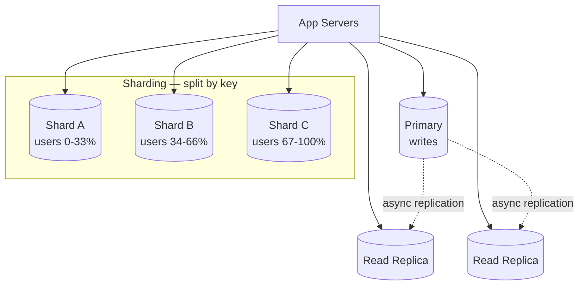
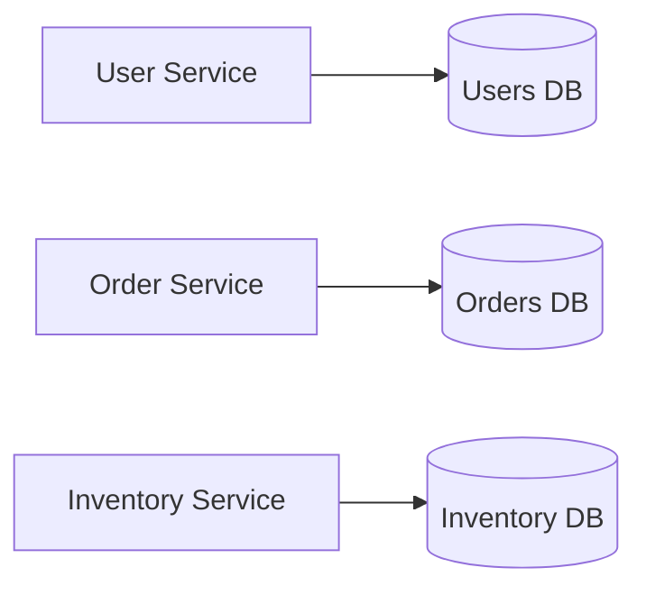

Stateless app servers scale out trivially — but they all funnel into the **database**, which holds
the state and is the usual bottleneck. You can't just "add more DBs" the way you add app servers,
because data has to stay consistent. Three moves, roughly in order of when you reach for them.

## The toolkit



## 1. Read replicas — scale reads

Point **writes at one primary**; it replicates to N **read-only replicas**; spread reads across
them. Perfect for **read-heavy** workloads (the common case — often 10:1 or 100:1 reads to writes).

- **Solves:** read throughput, and read locality (replicas near users).
- **Doesn't solve:** write throughput (all writes still hit the one primary) or total data size.

:::gotcha
**Replication lag.** Replication is usually *asynchronous*, so a replica can be milliseconds to
seconds behind. Read-your-own-writes can break: a user updates their profile (primary), then reads
a stale replica and sees the old value. Fix by reading from the primary right after a write, or by
using synchronous/semi-sync replication for those paths (at a latency cost).
:::

## 2. Sharding — scale writes and size

Split one logical dataset **horizontally** across independent DBs (shards), each holding a subset
of rows. Now writes and storage spread across many primaries.

| Shard strategy | How | Watch out for |
|--|--|--|
| **Range** | Partition by key range (A–M, N–Z) | Hot spots if ranges are uneven (e.g. time-based) |
| **Hash** | `hash(key) % N` → shard | Resharding moves almost everything — prefer consistent hashing |
| **Directory** | Lookup table maps key → shard | The lookup service is a new dependency/SPOF |

- **Solves:** write throughput, dataset too big for one node.
- **The costs:** picking a **shard key** is a one-way door; **cross-shard queries and joins** get
  hard (fan-out + merge); **transactions across shards** need distributed coordination; and
  **rebalancing** hot shards is operationally painful.

:::senior
**Only shard when you must.** It's the biggest complexity jump in this list — cross-shard joins,
distributed transactions, and rebalancing are real ongoing costs. Exhaust the cheaper options
first: vertical scaling, read replicas, and caching. In an interview, reach for sharding when
you've argued that a **single primary can no longer absorb the write volume or hold the data**.
:::

## 3. Functional partitioning — split by feature

Instead of splitting *rows*, split by *function*: give each service or domain its **own database**
(users DB, orders DB, inventory DB). This is the database side of moving toward microservices.



- **Solves:** isolates load and failure per domain; each store scales/tunes independently.
- **The cost:** you lose cross-domain joins and single-database transactions — the app (or a saga)
  now stitches data together. It's a **vertical** split (by table/domain), complementary to
  sharding's **horizontal** split (by row).

## Putting it in order

| Reach for... | When |
|--|--|
| **Vertical + caching** | First — cheapest, no re-architecture |
| **Read replicas** | Read-heavy load, writes still fit one primary |
| **Functional partitioning** | Distinct domains with independent load/scaling needs |
| **Sharding** | A single primary can't hold the writes or the data — last, most complex |

## Check yourself

```quiz
title: Scaling databases check
questions:
  - q: 'Adding read replicas primarily helps with:'
    options:
      - 'Write throughput'
      - text: 'Read throughput for read-heavy workloads'
        correct: true
      - 'Total storage capacity'
    explain: 'All writes still hit the single primary; replicas serve reads. They scale reads (and read locality), not writes or dataset size.'
  - q: 'A user updates their profile then immediately sees the old value. The likely cause is:'
    options:
      - 'A sharding hot spot'
      - text: 'Asynchronous replication lag — the read hit a replica that is behind the primary'
        correct: true
      - 'A cross-shard join'
    explain: 'Async replication means replicas trail the primary. Read-your-own-writes can fail; route post-write reads to the primary or use synchronous replication for those paths.'
  - q: 'What does sharding provide that read replicas do not?'
    options:
      - 'Lower read latency'
      - text: 'Scaling of write throughput and total dataset size across multiple primaries'
        correct: true
      - 'Simpler queries'
    explain: 'Sharding spreads writes and storage across independent shards. The cost is cross-shard joins, distributed transactions, and rebalancing.'
  - q: 'Functional partitioning splits the data by:'
    options:
      - text: 'Feature/domain — each service gets its own database'
        correct: true
      - 'Row ranges of a key'
      - 'Hash of the primary key'
    explain: 'Functional partitioning is a vertical split by domain (users DB, orders DB). Sharding is a horizontal split of rows within one dataset.'
```

:::key
The DB is the usual bottleneck. **Read replicas** scale reads (mind replication lag). **Sharding**
scales writes and size but is the biggest complexity jump — cross-shard joins, distributed txns,
resharding — so do it last. **Functional partitioning** splits by domain (a DB per service). Order
of attack: vertical + caching → replicas → functional split → shard.
:::
