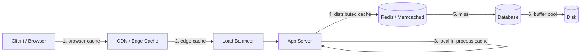

A cache is a small, fast store that holds a **copy** of data that is expensive to fetch or
compute, so the next request for it is served in microseconds instead of milliseconds. Caching
is the single highest-leverage move in system design: it trades a little memory and some
staleness for **lower latency, less load on the database, and higher throughput**.

## 1. Why cache at all?

Every layer below the cache is slower and more contended. The numbers tell the story:

| Fetch from… | Typical latency | Relative cost |
|--|--|--|
| L1/CPU cache | ~1 ns | 1× |
| RAM (in-process cache) | ~100 ns | 100× |
| Redis over the network | ~0.5 ms | 500,000× |
| SSD / local disk | ~1 ms | 1,000,000× |
| Relational DB query (with joins, disk) | ~10-50 ms | ~50,000,000× |

Reading from RAM is roughly **five orders of magnitude** faster than a disk-backed DB query.
If the same data is read many times, computing or fetching it once and remembering the answer
is almost always worth it.

:::key
Cache when data is **read far more often than it changes** and is **expensive to produce**.
That combination — high read:write ratio + costly reads — is the sweet spot.
:::

## 2. The cache layers a request passes through

Caching is not one box; it is a **series of layers**, each hoping to answer the request so the
next layer never hears about it. A request only reaches the database if *every* cache in front
of it missed.



| Layer | Where it lives | Holds | Scope |
|--|--|--|--|
| **Browser cache** | On the user's device | Static assets, prior responses | One user |
| **CDN / edge** | Geographically near the user | Static + cacheable dynamic content | All users in a region |
| **In-process cache** | Inside the app server (RAM) | Hot objects, config | One server |
| **Distributed cache** | Redis / Memcached cluster | Shared hot data, sessions | All app servers |
| **DB buffer pool** | Inside the database | Recently read pages | The DB itself |

The further **left** (closer to the user) a request is answered, the cheaper and faster it is —
and the less load hits everything downstream. A CDN hit never touches your servers at all.

:::tip
Think of it as a funnel. If your Redis layer has a 95% hit ratio, only 5% of reads reach the
database. Add a CDN in front and the database may see a fraction of a percent of total traffic.
:::

## 3. Cache hit ratio — the number that matters

The **hit ratio** is the fraction of lookups the cache can answer itself:

```text
hit ratio = cache hits / (cache hits + cache misses)
```

A hit is served from the cache; a **miss** falls through to the slower source. Effective
latency is a weighted blend of the two:

```text
avg latency = (hit ratio × cache latency) + (miss ratio × source latency)
```

With a Redis hit at 0.5 ms and a DB miss at 20 ms:

| Hit ratio | Avg latency | DB load (of original) |
|--|--|--|
| 0% (no cache) | 20 ms | 100% |
| 50% | 10.25 ms | 50% |
| 90% | 2.45 ms | 10% |
| 95% | 1.48 ms | 5% |
| 99% | 0.70 ms | 1% |

Notice the curve: going from 90% → 99% roughly **halves** average latency again and cuts DB
load by 10×. The last few percent of hit ratio are worth a lot.

:::senior
The relationship is non-linear because misses dominate the average. At a 90% hit ratio the 10%
of misses (at 20 ms) still contribute ~2 ms of the ~2.45 ms average. This is why teams obsess
over the *tail* of the hit ratio — squeezing 95% to 99% is a bigger win than it looks.
:::

## 3½. Back-of-envelope: sizing a cache in an interview

This is the arithmetic that justifies the Redis box on your whiteboard — practice it until it's automatic.

```walkthrough
title: Will a cache save this database?
code: |
  DAU = 50M, each views ~20 profiles/day
  reads/day = 50M x 20 = 1B
  avg QPS   = 1B / 86,400 ~= 12,000
  peak QPS  = ~2.5x avg  ~= 30,000
  hot set   = 20% of 50M profiles x 1 KB = 10 GB
  at 95% hit ratio -> DB sees 30k x 5% = 1,500 QPS
steps:
  - text: 'Start from users and behaviour: **50M DAU × 20 profile views/day = 1B reads/day**. Always anchor QPS in a per-user action count.'
    line: 2
  - text: 'Convert to QPS: divide by 86,400 seconds/day (round to 100k for mental math) → **~12k average QPS**.'
    line: 3
  - text: 'Traffic is not flat. Multiply by a peak factor of 2–3x → **~30k peak QPS**. A single Postgres node (~10–50k simple QPS) is already at the edge.'
    line: 4
  - text: 'Size the hot set: profile records ~1 KB, and the 80/20 rule says ~20% of profiles get ~80% of reads → **10 GB**. That fits comfortably in one Redis node''s RAM.'
    line: 5
  - text: 'Predict the effect: at a 95% hit ratio the DB sees only 5% of reads → **1,500 QPS**, well within one primary. You just justified the cache with arithmetic.'
    line: 6
```

## 4. When caching hurts

Caching is not free. It hurts when misused:

- **Write-heavy or rarely-reread data** — you pay to populate and invalidate entries that are
  seldom served from cache. Low hit ratio = pure overhead.
- **Stale reads** — a cache is a *copy*; if the source changes and the cache doesn't, users see
  old data. Every cache is a bet that staleness is acceptable for its TTL.
- **Thundering herd** — when a hot key expires, thousands of requests miss simultaneously and
  stampede the database (covered in the eviction & invalidation topic).
- **Extra moving parts** — one more system to size, monitor, secure, and reason about. A cold
  or failed cache can make a system *slower* than having none, if it adds a hop before the miss.

:::gotcha
A cache with a low hit ratio is worse than no cache: every request now does a cache lookup
**and** a DB read, plus a write to populate the cache. Always measure the hit ratio in
production — if it's low, either fix your keys/TTLs or remove the cache.
:::

## Check yourself

```quiz
title: Caching fundamentals check
questions:
  - q: 'What condition makes data an ideal caching candidate?'
    options:
      - 'It changes on every request'
      - text: 'It is read far more often than it is written, and is expensive to produce'
        correct: true
      - 'It is small enough to fit in a single row'
    explain: 'Caching pays off when the same expensive-to-fetch data is read repeatedly between changes — a high read:write ratio amortizes the cost of populating the cache.'
  - q: 'Requests are answered fastest and cheapest when a cache layer sits…'
    options:
      - text: 'Closest to the user (browser / CDN edge)'
        correct: true
      - 'Closest to the database (buffer pool)'
      - 'Inside the load balancer only'
    explain: 'The further left (nearer the user) the request is served, the less downstream load it creates. A CDN hit never even reaches your app servers.'
  - q: 'With a Redis hit at 0.5 ms and a DB miss at 20 ms, why does raising the hit ratio from 90% to 99% help so much?'
    options:
      - 'Because Redis gets faster as it fills up'
      - text: 'Because the rare misses dominate the average, so cutting them sharply drops latency and DB load'
        correct: true
      - 'Because 99% is a round number'
    explain: 'Average latency is miss-dominated: at 90% the 10% of 20 ms misses still contribute most of the average. Shrinking misses 10x roughly halves latency again and cuts DB load to 1%.'
  - q: 'When can adding a cache make a system slower?'
    options:
      - 'Never — a cache always helps'
      - text: 'When the hit ratio is low, so most requests pay for a cache lookup AND a DB read AND a cache write'
        correct: true
      - 'Only when the cache is written in a different language'
    explain: 'A low hit ratio means the cache lookup is wasted work on top of the DB read, plus the cost of populating it. Measure hit ratio in production before trusting a cache.'
```

:::key
A cache is a fast copy of expensive data. Requests funnel through layers — **browser → CDN →
in-process → distributed (Redis) → DB buffer pool** — and are cheapest when answered nearest the
user. The **hit ratio** drives everything: latency is miss-dominated, so the last few percent
matter most. Cache read-heavy, expensive, tolerably-stale data — and measure, because a
low-hit-ratio cache hurts.
:::
