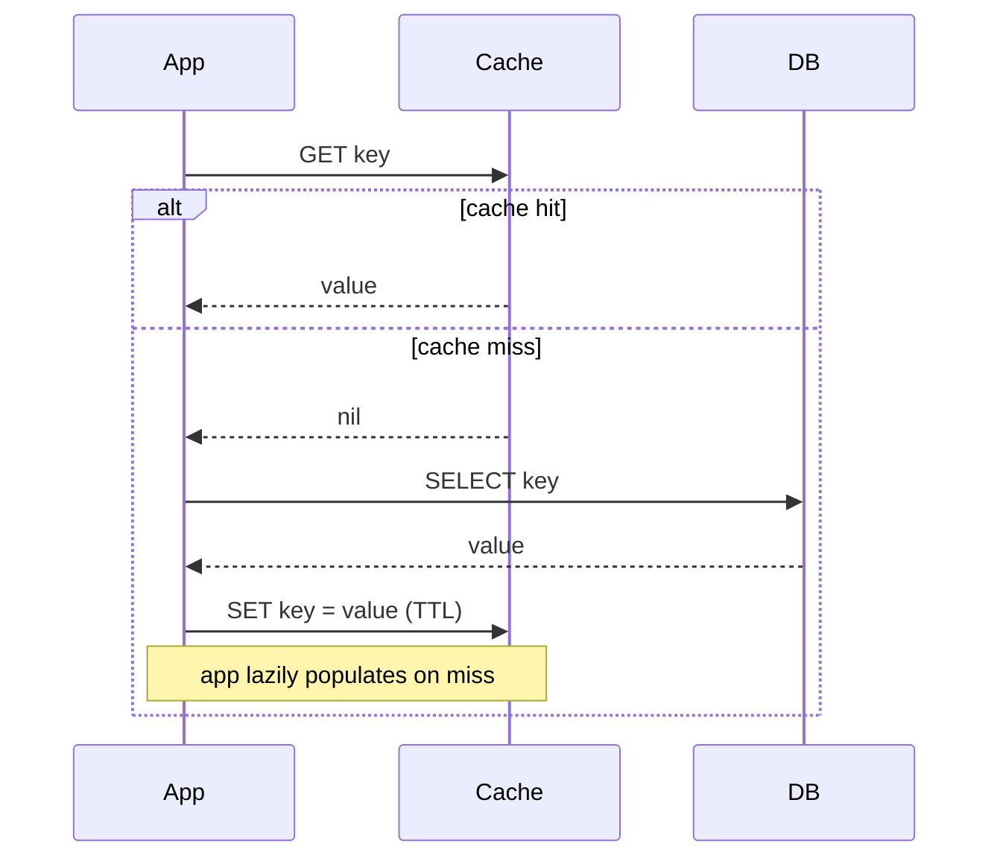
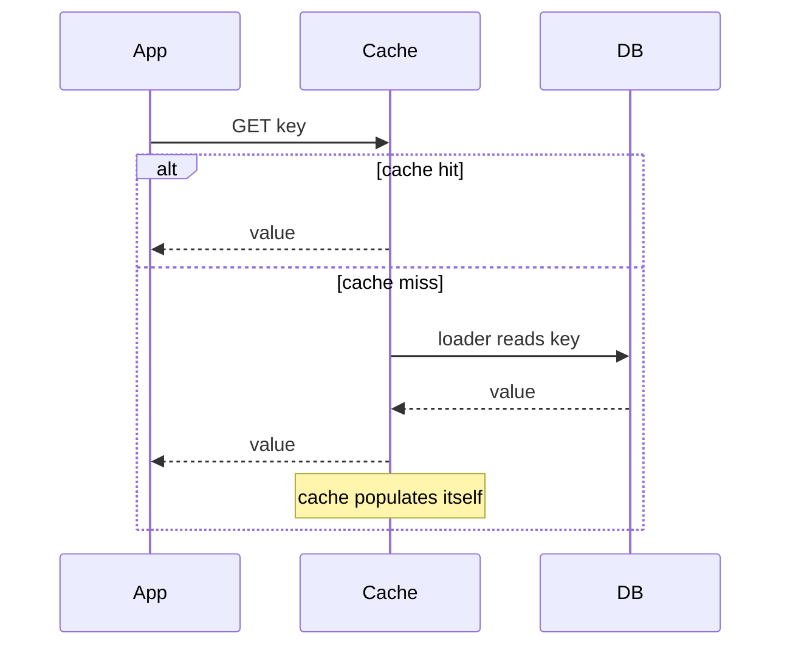
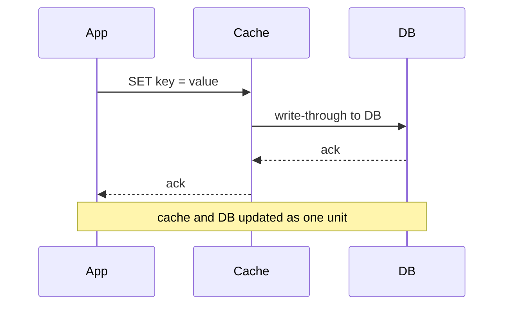
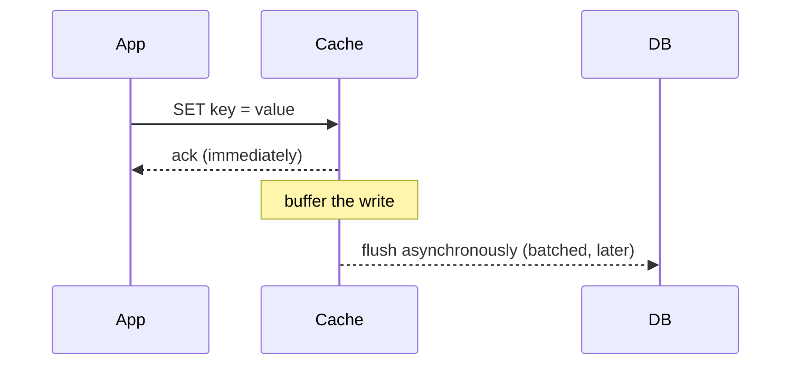

A caching **strategy** answers two questions: *who populates the cache on a read?* and *how do
writes keep the cache and database in sync?* The four canonical patterns — **cache-aside,
read-through, write-through, and write-back** — are different answers to those two questions,
each with a distinct consistency-vs-latency trade-off. This is the topic interviewers probe
hardest, so know the sequence diagrams cold.

## 1. Cache-aside (lazy loading) — the default

The application talks to **both** the cache and the DB. On a read it checks the cache first; on
a miss it loads from the DB and *populates* the cache itself. The cache stays out of the way — it
is just a key-value box the app manages ("aside").



- **Only requested data is cached** — the cache holds exactly the hot set, nothing wasted.
- **Resilient** — if the cache is down, the app still reads the DB directly (slower, but alive).
- **First read is always a miss** (a "cold" cache), and each miss costs a round trip.
- **Writes:** the app writes the DB and then **invalidates** (deletes) the cache key, so the
  next read reloads fresh. This is the standard cache-aside write path.

:::tip
Cache-aside is the most common pattern in the wild (it's what most Redis deployments do). On a
write, prefer **delete-then-write-DB** or **write-DB-then-delete** the key rather than updating
the cache in place — deleting avoids caching a value that a concurrent write might overwrite.
:::

## 2. Read-through — the cache loads for you

Same read shape as cache-aside, but the **cache library itself** fetches from the DB on a miss,
via a loader function you register. The app only ever talks to the cache.



The difference from cache-aside is **who owns the load logic**: with read-through it lives in the
cache layer (cleaner app code, centralized), with cache-aside it lives in the app (more control,
more boilerplate). Both are lazy — they populate on miss.

## 3. Write-through — write cache and DB together

On every write, the app writes the cache **and** the DB synchronously as one logical operation.
The cache is always up to date, so reads are highly consistent.



- **Consistent** — the cache never lags the DB, so no stale reads from written keys.
- **Higher write latency** — every write pays for two hops (cache + DB) before it returns.
- **Caches data that may never be read** — pairs well with read-through so writes pre-warm the
  cache for subsequent reads.

## 4. Write-back (write-behind) — write cache now, DB later

The app writes only the cache and returns immediately; the cache **asynchronously** flushes to
the DB later (batched, on a timer, or on eviction). Fastest writes, weakest durability.



- **Lowest write latency & highest throughput** — writes hit only fast memory, and batching
  coalesces many updates to a key into one DB write.
- **Data loss risk** — if the cache crashes before flushing, unpersisted writes are gone.
- **Eventual consistency** — the DB trails the cache. Great for high-volume, loss-tolerant data
  (metrics, counters, view counts); dangerous for money.

## The four side by side

````tabs
tabs:
  - label: Cache-aside
    body: |
      **App manages the cache.** Read: check cache, on miss load DB and populate. Write:
      update DB, then invalidate the cache key.
      ```text
      READ:  cache.get(k) ?? { v = db.get(k); cache.set(k, v); v }
      WRITE: db.put(k, v); cache.del(k)
      ```
      Default choice. Lazy, resilient, only caches what's used. Watch: cold-start misses and
      write-then-read races.
  - label: Read-through
    body: |
      **Cache loads on miss** via a registered loader; app only talks to the cache.
      ```text
      READ:  cache.get(k)   // cache internally calls loader → db on miss
      ```
      Cleaner app code, centralized load logic. Same laziness as cache-aside; needs cache
      library support.
  - label: Write-through
    body: |
      **Write cache + DB synchronously.** Cache is always fresh.
      ```text
      WRITE: cache.set(k, v)  // cache writes DB before returning
      ```
      Strong read consistency, higher write latency. Pair with read-through.
  - label: Write-back
    body: |
      **Write cache now, flush DB async later.** Fastest writes.
      ```text
      WRITE: cache.set(k, v)          // returns immediately
             (later) db.batchWrite(dirtyKeys)
      ```
      Best throughput, risk of data loss on crash, eventual consistency. Good for counters/metrics.
````

## Choosing between them

| Strategy | Who reads DB on miss | When DB is written | Consistency | Write latency | Best for |
|--|--|--|--|--|--|
| **Cache-aside** | App | On write (invalidate) | Good (delete on write) | Low | General read-heavy workloads |
| **Read-through** | Cache | On write (separate) | Good | Low | Same, with cleaner app code |
| **Write-through** | App/Cache | Synchronously on write | Strong | High | Read-after-write correctness |
| **Write-back** | App/Cache | Asynchronously, batched | Eventual | Lowest | High write volume, loss-tolerant |

:::senior
Reads and writes are chosen **independently**. A very common production combo is
**cache-aside for reads + write-through-style invalidation on writes**, or **read-through +
write-through** together (the cache owns both paths). "Write-back" is a write policy that can sit
on top of either read policy. Interviewers love it when you say "for reads I'd do X, for writes
I'd do Y, because…" rather than naming one pattern for everything.
:::

:::gotcha
The classic cache-aside race: two clients, one writes the DB, the other has an in-flight read
that repopulates the cache with the **old** value *after* the writer's invalidation. Mitigate
with short TTLs, versioned keys, or deleting (not updating) the key on write. There is no
lock-free way to make cache-aside perfectly consistent — you bound staleness, not eliminate it.
:::

```flashcards
title: Caching strategies — one-liners
cards:
  - front: 'Cache-aside'
    back: '**App** checks cache, loads DB on miss, populates cache. Write: update DB, **delete** the key. The production default.'
  - front: 'Read-through'
    back: 'Same lazy shape, but the **cache library** owns the DB loader — app only talks to the cache.'
  - front: 'Write-through'
    back: 'Write cache **and** DB synchronously. Strong read-after-write consistency, but every write pays two hops.'
  - front: 'Write-back (write-behind)'
    back: 'Ack from cache memory, flush to DB **async/batched**. Fastest writes; crash before flush = data loss. For counters, not money.'
  - front: 'Cache-aside write rule'
    back: '**Delete, don''t update** the cached key on write — updating in place races with concurrent writes and can pin a stale value.'
```

## Check yourself

```quiz
title: Caching strategies check
questions:
  - q: 'In cache-aside, who is responsible for loading the database on a cache miss?'
    options:
      - 'The cache, via a loader function'
      - text: 'The application code'
        correct: true
      - 'The database triggers a push'
    explain: 'Cache-aside keeps the cache "aside" — the app checks the cache, and on a miss it reads the DB and populates the cache itself. That load logic living in the cache layer is read-through instead.'
  - q: 'What is the key difference between cache-aside and read-through?'
    options:
      - 'Read-through never caches misses'
      - text: 'Who owns the load-on-miss logic — the app (cache-aside) vs the cache library (read-through)'
        correct: true
      - 'Read-through writes are synchronous'
    explain: 'Both are lazy read patterns that populate on miss; they differ only in where the loading code lives. Read-through centralizes it in the cache; cache-aside puts it in the app.'
  - q: 'Which strategy gives the strongest read-after-write consistency?'
    options:
      - 'Write-back'
      - text: 'Write-through'
        correct: true
      - 'Cache-aside with a long TTL'
    explain: 'Write-through updates the cache and DB together synchronously, so a read right after a write always sees the new value. Write-back and long-TTL cache-aside can serve stale data.'
  - q: 'Write-back (write-behind) trades away durability for what benefit?'
    options:
      - text: 'The lowest write latency and highest write throughput (writes hit memory, flush to DB later)'
        correct: true
      - 'Perfect consistency'
      - 'Guaranteed persistence'
    explain: 'Write-back acks the write from memory immediately and flushes to the DB asynchronously in batches — fast and high-throughput, but a crash before flush loses unpersisted writes.'
  - q: 'You have a view-counter that increments thousands of times per second and can tolerate losing a few counts on a crash. Which write strategy fits best?'
    options:
      - 'Write-through, for consistency'
      - text: 'Write-back, to batch many increments into few DB writes'
        correct: true
      - 'No cache at all'
    explain: 'High write volume + loss tolerance is the textbook case for write-back: coalesce thousands of in-memory increments into occasional batched DB writes, accepting eventual consistency.'
```

:::key
Two axes: **read** (cache-aside = app loads; read-through = cache loads) and **write**
(write-through = sync cache+DB, strong consistency, slow; write-back = async flush, fastest,
lossy). **Cache-aside is the default.** Choose read and write policies independently, and be
ready to name the staleness/consistency trade-off for each.
:::
