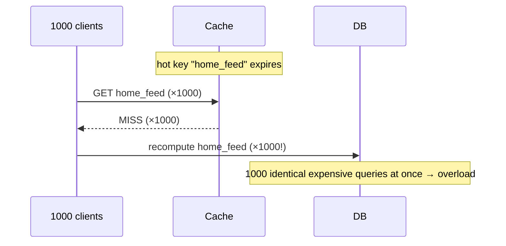

A cache has finite memory, so two things must happen: when it fills up, something must be
**evicted** to make room (which entry do we drop?), and when the underlying data changes, the
stale copy must be **invalidated** (how do we know it's out of date?). Eviction is a
capacity problem; invalidation is a correctness problem — and, as the saying goes, cache
invalidation is one of the two hard things in computer science.

## 1. Eviction policies — who gets kicked out

When the cache is full and a new entry arrives, the policy decides the victim:

| Policy | Evicts… | Assumes | Watch out for |
|--|--|--|--|
| **LRU** (Least Recently Used) | The entry untouched for the longest | Recently used → soon reused (temporal locality) | A full scan can flush the whole hot set |
| **LFU** (Least Frequently Used) | The entry with the fewest hits | Popular stays popular | Old items build up counts and never leave ("cache pollution") |
| **FIFO** (First In First Out) | The oldest inserted, regardless of use | Insertion order ≈ usefulness | Ignores access — can evict a hot item |
| **TTL** (Time To Live) | Any entry past its expiry timestamp | Data is only fresh for N seconds | Doesn't bound memory by itself; pairs with LRU |

**LRU is the default** for general workloads because temporal locality holds most of the time,
and it's cheap to implement (a hash map + doubly linked list gives O(1) get and evict). Redis's
`allkeys-lru` and its approximated-LRU/LFU policies are the production workhorses.

:::note
**TTL is orthogonal** to the others. LRU/LFU/FIFO answer "who leaves when we're full"; TTL
answers "when does an entry go stale regardless of space." Real caches use both: a TTL for
freshness *and* LRU to bound memory.
:::

## 2. LRU eviction, step by step

Capacity is **3**. The array is the cache, ordered **most-recently-used (left) → least-recently-used
(right)**. Every access moves its key to the front; when full, the item on the right is evicted.

```walkthrough
title: LRU cache — accesses A, B, C, A, D (capacity 3)
code: |
  get(key):
    if key in cache:
      move key to front (MRU)
      return value
  put(key, value):
    if cache is full:
      evict tail (LRU)
    insert key at front
steps:
  - text: 'MISS A → cache empty, insert A at the front. It is now the most-recently-used.'
    array: ['A']
    highlight: [0]
    pointers: { 0: 'MRU' }
    line: 8
  - text: 'MISS B → insert B at the front. A slides right toward the LRU end.'
    array: ['B', 'A']
    highlight: [0]
    pointers: { 0: 'MRU', 1: 'LRU' }
    line: 8
  - text: 'MISS C → insert C at the front. Cache is now full (3/3). A is the least-recently-used.'
    array: ['C', 'B', 'A']
    highlight: [0]
    pointers: { 0: 'MRU', 2: 'LRU' }
    line: 8
  - text: 'HIT A → A is already cached, so promote it to the front. Now B is the LRU.'
    array: ['A', 'C', 'B']
    highlight: [0]
    pointers: { 0: 'MRU', 2: 'LRU' }
    line: 3
  - text: 'MISS D → cache is full, so evict the tail (B, the LRU) and insert D at the front.'
    array: ['D', 'A', 'C']
    highlight: [0]
    sorted: [2]
    pointers: { 0: 'MRU', 2: 'LRU' }
    line: 7
```

The lesson: promoting **A** on its hit is what saved it — without that promotion, LRU would have
kept the older, unused entry. Recency of *use*, not of *insertion*, is what LRU tracks (that's
the FIFO difference).

## 3. The invalidation problem

Eviction removes entries to save space; **invalidation** removes (or refreshes) entries because
the source data *changed*. The whole point of a cache — holding a copy — is exactly what makes
this hard: the cache has no idea the DB moved on. Three approaches:

| Approach | How | Trade-off |
|--|--|--|
| **TTL / expiry** | Entry auto-expires after N seconds | Simple, but serves stale data up to N seconds |
| **Write invalidation** | On a DB write, delete/update the key | Fresh, but needs every writer to remember to do it |
| **Event-driven** | DB change feed / pub-sub tells caches to evict | Accurate + decoupled, but more infrastructure |

:::gotcha
The subtle failure is a **missed invalidation**: some code path writes the DB but forgets to
touch the cache, so the cache serves the old value until its TTL expires — or forever if there's
no TTL. **Always set a TTL as a safety net**, even when you invalidate explicitly. It bounds the
blast radius of any bug to "stale for at most N seconds."
:::

## 4. Thundering herd / cache stampede

A **cache stampede** happens when a hot key expires (or the cache restarts cold) and a flood of
concurrent requests all miss at once — and all hammer the database to recompute the *same* value.
The database, sized assuming the cache absorbs most reads, can fall over.



Defenses, roughly in order of preference:

- **Request coalescing / locking** — the first miss takes a lock and recomputes; the rest wait
  for that single result (Go's `singleflight`, a per-key mutex, or Redis `SETNX` lease). One DB
  query instead of a thousand.
- **Early / probabilistic recomputation** — refresh a hot key *before* it expires, so it's never
  simultaneously absent for everyone (e.g. XFetch-style jittered early expiry).
- **Stale-while-revalidate** — serve the slightly-stale cached value while one background task
  refreshes it. No one waits, the DB sees one query.
- **TTL jitter** — add a random spread to TTLs so keys inserted together don't all expire in the
  same instant (a "synchronized expiry" avalanche).

:::senior
Stampede protection is a classic senior signal. The cheapest robust answer in an interview is:
"add a small random jitter to TTLs, and use a per-key lock (or `singleflight`) so only one
request recomputes a missed hot key while the others wait." That single sentence covers the two
most common causes — synchronized expiry and duplicate recomputation.
:::

```flashcards
title: Eviction & stampede recall
cards:
  - front: 'LRU'
    back: 'Evict the entry **unused longest**. Assumes temporal locality. O(1) with hashmap + doubly linked list. The default (Redis `allkeys-lru`).'
  - front: 'LFU'
    back: 'Evict the **least-hit** entry. Assumes popularity persists. Risk: old high-count items never leave (cache pollution).'
  - front: 'FIFO'
    back: 'Evict the **oldest inserted**, ignoring use. Simple, but can evict a hot item.'
  - front: 'TTL'
    back: '**Freshness**, not capacity — expires entries after N seconds. Orthogonal to LRU/LFU; always set one as an invalidation safety net.'
  - front: 'Cache stampede — two-sentence fix'
    back: '**TTL jitter** (avoid synchronized expiry) + **per-key lock / singleflight** (one recompute, others wait). Optionally stale-while-revalidate so nobody waits.'
  - front: 'LRU weakness'
    back: 'A one-off **full scan** touches everything once and flushes the real hot set. (Fix: scan-resistant variants like LRU-K, ARC, or Redis approximated LRU.)'
```

## Check yourself

```quiz
title: Eviction & invalidation check
questions:
  - q: 'An LRU cache (capacity 3) holds [C, B, A] with A least-recently-used. You access A, then insert D. Which key is evicted?'
    options:
      - 'A, because it was inserted first'
      - text: 'B, because accessing A promoted it, leaving B as the least-recently-used'
        correct: true
      - 'C, because it is the most recently used'
    explain: 'The hit on A moves it to the front (MRU), so the order becomes [A, C, B] with B now the LRU. Inserting D evicts the tail, B. This promotion-on-use is exactly what separates LRU from FIFO.'
  - q: 'How does TTL relate to LRU/LFU/FIFO?'
    options:
      - 'It is a faster version of LRU'
      - text: 'It is orthogonal — TTL controls freshness/expiry; LRU/LFU/FIFO control who is evicted when full'
        correct: true
      - 'They are mutually exclusive; you pick one'
    explain: 'TTL answers "when does this go stale" and LRU/LFU/FIFO answer "who leaves when we run out of room." Real caches use both: a TTL for correctness plus LRU to bound memory.'
  - q: 'Why set a TTL even when you invalidate the cache explicitly on every write?'
    options:
      - 'TTLs make reads faster'
      - text: 'As a safety net — if some code path forgets to invalidate, the TTL bounds staleness to N seconds instead of forever'
        correct: true
      - 'Explicit invalidation requires a TTL to work'
    explain: 'Missed invalidations are a real bug class. A TTL guarantees any stale entry self-heals within N seconds, capping the damage of a forgotten invalidation.'
  - q: 'A popular key expires and 1000 requests all miss and hit the DB simultaneously. What is this, and the simplest fix?'
    options:
      - 'A memory leak; add more RAM'
      - text: 'A cache stampede; use per-key locking / request coalescing so only one request recomputes while the rest wait'
        correct: true
      - 'Normal behavior; do nothing'
    explain: 'This is a thundering herd / cache stampede. Coalescing the misses behind a single recomputation (plus TTL jitter to avoid synchronized expiry) collapses 1000 identical DB queries into one.'
```

:::key
**Eviction** frees space: **LRU** (default, recency, O(1)), **LFU** (frequency), **FIFO**
(insertion order), and **TTL** (freshness, orthogonal — use it alongside LRU). **Invalidation**
keeps copies correct: TTL, write-invalidation, or event-driven — and *always* keep a TTL as a
safety net. Beware the **cache stampede** when a hot key expires; defend with **per-key
locking/coalescing, TTL jitter, and stale-while-revalidate**.
:::
