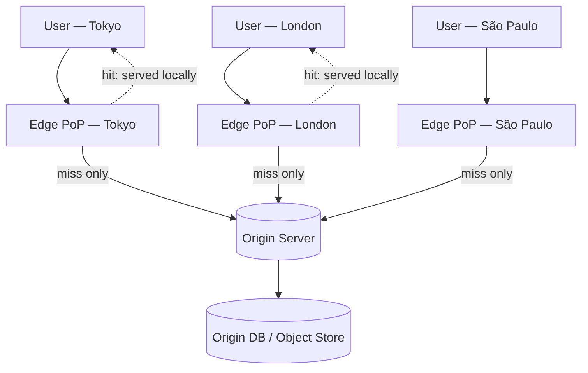
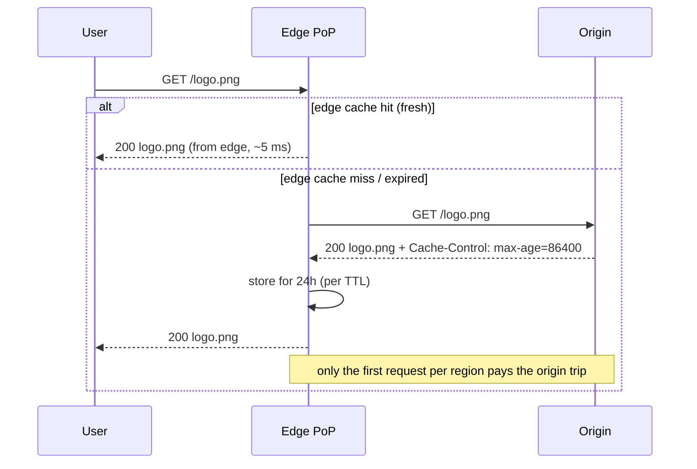

A **CDN (Content Delivery Network)** is a globally distributed fleet of cache servers — **edge**
or **PoP** (Point of Presence) nodes — placed physically close to users. It's the outermost
caching layer from the earlier funnel: a CDN hit is served from a city near the user and **never
touches your origin servers at all**. That cuts latency (no cross-continent round trip), slashes
origin load and bandwidth cost, and absorbs traffic spikes.

## 1. Edge → origin topology

Users are routed (usually by DNS / anycast) to the *nearest* edge node. The edge answers from its
local cache if it can; only a miss travels back to your **origin** (your servers or object store).



Each edge maintains its own cache, so the first user in a region "warms" the edge for everyone
after them. Best for **static and cacheable content** — images, CSS/JS bundles, video segments,
fonts — and increasingly for cacheable API responses and edge-computed HTML.

Numbers to quote: an edge hit answers in **~10–30 ms** (nearby PoP) versus **~150–300 ms** for a cross-continent origin fetch — a 10x difference users feel. Well-configured CDNs offload **90–99% of static-asset requests** from the origin, and for video (the heaviest traffic on the internet) the CDN carries essentially **all** delivery bandwidth; the origin only ever serves each segment once per region per TTL.

## 2. A CDN request: hit vs miss

The edge behaves like any cache: check locally, and on a miss fetch from origin, store it, then
serve — respecting the TTL the origin declares.



## 3. Push vs pull CDNs

How does content get onto the edge in the first place?

| | **Pull CDN** | **Push CDN** |
|--|--|--|
| **How** | Edge fetches from origin **on first miss** (lazy), then caches | You **upload/publish** content to the CDN ahead of time |
| **Who manages** | CDN, automatically | You, explicitly on every change |
| **First request** | Slow (a miss → origin fetch) | Fast (already at the edge) |
| **Best for** | Large catalogs, frequently-changing content, most websites | Large static files, infrequent updates, predictable big launches |
| **Origin traffic** | Repeated on each TTL expiry | One upload per change |

**Pull is the common default** (Cloudflare, Fastly, CloudFront in pull mode) — set it and forget
it. **Push** shines when files are huge and rarely change (video libraries, game assets), so
you'd rather pay one deliberate upload than repeated origin pulls.

## 4. Cache-Control headers & TTL

The origin controls edge (and browser) caching through HTTP response headers — chiefly
`Cache-Control`. This is how you set the CDN's TTL:

```text
Cache-Control: public, max-age=3600, s-maxage=86400
```

| Directive | Meaning |
|--|--|
| `max-age=N` | Fresh for N seconds in **any** cache (including the browser) |
| `s-maxage=N` | Overrides `max-age` for **shared** caches (the CDN) specifically |
| `public` | Any cache may store it |
| `private` | Only the browser may cache it — CDNs must not (per-user data) |
| `no-cache` | May store, but must **revalidate** with the origin before serving |
| `no-store` | Never cache anywhere (secrets, sensitive data) |
| `stale-while-revalidate=N` | Serve stale for up to N s while refreshing in the background |
| `ETag` / `If-None-Match` | Validators enabling a cheap **304 Not Modified** revalidation |

:::tip
**Cache-busting** solves the "long TTL vs fresh deploys" tension: give assets a content hash in
the filename (`app.9f3c2.js`) and cache them for a year (`max-age=31536000, immutable`). When the
content changes, the filename changes, so it's a brand-new URL — no invalidation needed. Only the
HTML that references them needs a short TTL.
:::

:::senior
Prefer expiring content with `s-maxage` + `stale-while-revalidate` over manually **purging** the
CDN. Purges are global, can take seconds to propagate across all PoPs, and stampede the origin as
every edge refetches at once. Versioned URLs (cache-busting) sidestep purging entirely — the gold
standard for static assets.
:::

## Check yourself

```quiz
title: CDN & edge caching check
questions:
  - q: 'What is the primary latency benefit of a CDN?'
    options:
      - 'It compresses the database'
      - text: 'Content is served from an edge node physically near the user, avoiding a round trip to a distant origin'
        correct: true
      - 'It replaces the need for a load balancer'
    explain: 'CDNs place caches at the network edge close to users. A hit is served locally in a few milliseconds and never reaches the origin, cutting both latency and origin load.'
  - q: 'The key difference between a pull CDN and a push CDN is…'
    options:
      - text: 'A pull CDN lazily fetches from origin on the first miss; a push CDN has content uploaded to it ahead of time'
        correct: true
      - 'A pull CDN is faster on every request'
      - 'A push CDN cannot cache images'
    explain: 'Pull is lazy (populate on first miss) and self-managing — the common default. Push means you publish content to the CDN in advance, which is ideal for large, rarely-changing files.'
  - q: 'Which Cache-Control directive sets the TTL for shared caches (the CDN) specifically, overriding max-age?'
    options:
      - 'no-store'
      - text: 's-maxage'
        correct: true
      - 'private'
    explain: 's-maxage applies only to shared caches like a CDN and overrides max-age there, letting you cache longer at the edge than in the browser. private forbids CDN caching; no-store forbids all caching.'
  - q: 'How does content-hash cache-busting (app.9f3c2.js, max-age=1 year) avoid stale assets?'
    options:
      - 'It disables caching for JS files'
      - text: 'Changing the content changes the filename, so it becomes a new URL — the old cached copy is simply never requested again'
        correct: true
      - 'It forces a CDN purge on every deploy'
    explain: 'A new content hash means a new URL, so browsers and edges fetch the new file fresh while old URLs (safely) stay cached. No invalidation or purge needed — only the referencing HTML needs a short TTL.'
```

:::key
A **CDN** caches content on **edge/PoP nodes** near users; a hit skips the origin entirely,
cutting latency and load. **Pull** CDNs populate lazily on first miss (the default); **push**
CDNs are pre-loaded (big, static files). The origin governs edge TTL via **Cache-Control**
(`max-age`, `s-maxage`, `no-store`, `stale-while-revalidate`). Prefer **versioned/cache-busted
URLs** over purging for static assets.
:::
