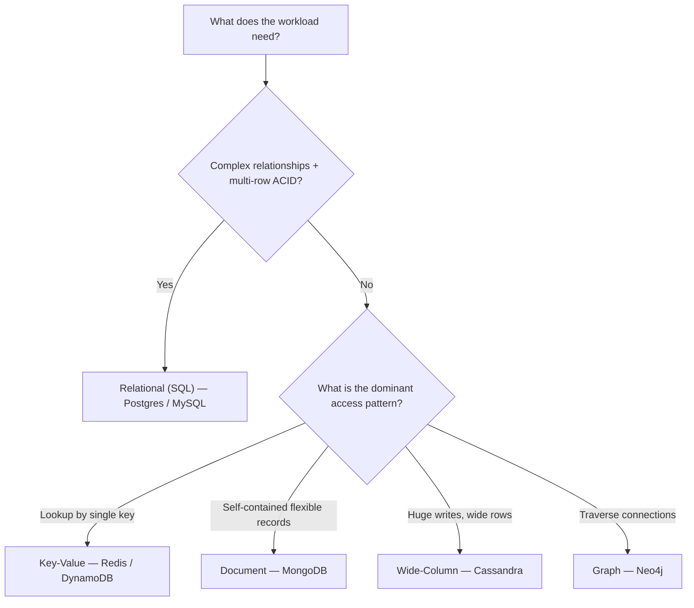
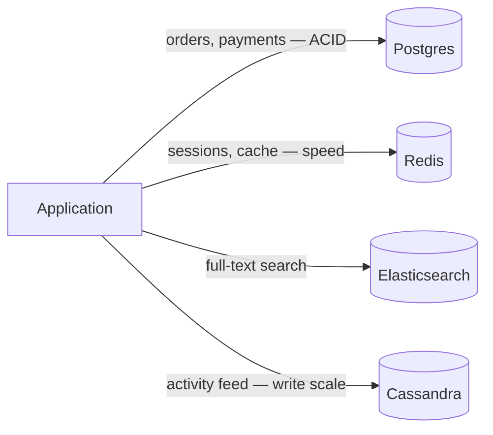

In an interview, "SQL or NoSQL?" is never about syntax. It is about **access patterns, scale, and consistency needs**. Pick the store that matches how the data is *read and written*, then justify it. The relational database is the sensible default — reach for NoSQL when a specific pressure forces you off it.

## 1. The one question that decides most designs

Before naming any product, characterise the workload. The answer to *"do I know my queries in advance, and do I need cross-entity transactions?"* separates the two worlds.

| Dimension | Relational (SQL) | NoSQL |
|--|--|--|
| **Schema** | Fixed, enforced up front | Flexible / schema-on-read |
| **Query flexibility** | Ad-hoc joins, aggregations | Query the way you shaped the data |
| **Transactions** | ACID, multi-row / multi-table | Often single-key; some multi-doc |
| **Scaling model** | Scale **up** (then read replicas) | Scale **out** horizontally by design |
| **Consistency** | Strong by default | Tunable — often eventual |
| **Best when** | Relationships + integrity matter | Huge scale, simple access patterns |

:::key
The relational database is the **default choice**. It gives you joins, transactions, and mature tooling for free. Only move to NoSQL when a concrete requirement — scale, write throughput, a data shape, or flexible schema — makes SQL the wrong tool.
:::

## 2. A decision flowchart



## 3. The four NoSQL families

Each family exists to serve one shape of data extremely well. Match the family to the shape.

````tabs
tabs:
  - label: Key-Value
    body: |
      A giant distributed hash map — `get(key)` / `put(key, value)`. The value is opaque to the store.
      ```text
      "session:8a2f"  ->  { userId: 42, exp: 1699999999 }
      "cart:42"       ->  [ "sku-1", "sku-9" ]
      ```
      **Fits:** sessions, caches, feature flags, rate-limit counters.
      **Avoid when:** you need to query *inside* the value or across keys.
      **Examples:** Redis, DynamoDB, Riak.
  - label: Document
    body: |
      Stores self-describing JSON/BSON documents; you can index and query fields inside them.
      ```json
      { "_id": 42, "name": "Ada",
        "orders": [ { "id": 1, "total": 30 } ] }
      ```
      **Fits:** catalogs, user profiles, content — data that varies per record and is read as a whole.
      **Avoid when:** you need heavy cross-document joins or multi-document ACID everywhere.
      **Examples:** MongoDB, Couchbase, Firestore.
  - label: Wide-Column
    body: |
      Rows keyed by a partition key; each row can hold millions of dynamic columns. Optimised for massive write throughput.
      ```text
      Row key: sensor#17
        2026-07-01T10:00 -> 21.4
        2026-07-01T10:01 -> 21.5   (columns grow over time)
      ```
      **Fits:** time-series, event logs, IoT, messaging at scale.
      **Avoid when:** access patterns are unknown up front (you design tables per query).
      **Examples:** Cassandra, ScyllaDB, HBase, Bigtable.
  - label: Graph
    body: |
      First-class **nodes and edges**; traversals ("friends of friends") are cheap instead of exploding into N-way joins.
      ```text
      (Ada)-[:FOLLOWS]->(Bob)-[:FOLLOWS]->(Cy)
      ```
      **Fits:** social graphs, recommendations, fraud rings, knowledge graphs.
      **Avoid when:** data is tabular and relationships are shallow — a join is simpler.
      **Examples:** Neo4j, Neptune, JanusGraph.
````

:::gotcha
"NoSQL scales better" is only half a sentence. NoSQL scales *for the access pattern you designed the schema around*. Ask a NoSQL store a query it wasn't modeled for and you get full scans or expensive fan-out — often **worse** than a properly indexed SQL query.
:::

:::senior
The real trade-off is **query flexibility vs. horizontal scale**. SQL keeps queries flexible by keeping data normalized in one place — which is exactly what makes it hard to shard. NoSQL denormalizes and co-locates data by access pattern, which is what lets it scale out — at the cost of duplicating data and locking in your query shapes.
:::

## 4. Polyglot persistence

Mature systems rarely pick one. A single product often uses **several** stores, each for what it does best:



This is **polyglot persistence** — orders need ACID (Postgres), sessions need speed (Redis), search needs an inverted index (Elasticsearch), the feed needs write scale (Cassandra). Saying this in an interview signals maturity.

## Flashcards

```flashcards
title: Storage family recall
cards:
  - front: 'Store that is a distributed hash map, opaque values'
    back: '**Key-Value** (Redis, DynamoDB) — fast `get`/`put` by single key.'
  - front: 'Store for self-contained JSON records with indexable fields'
    back: '**Document** (MongoDB) — good for profiles, catalogs, content.'
  - front: 'Store optimized for massive write throughput on wide rows'
    back: '**Wide-Column** (Cassandra) — time-series, logs, model per query.'
  - front: 'Store where friend-of-friend traversals are cheap'
    back: '**Graph** (Neo4j) — social, recommendations, fraud detection.'
  - front: 'Using multiple specialized datastores in one system'
    back: '**Polyglot persistence** — right tool per access pattern.'
```

## Check yourself

```quiz
title: SQL vs NoSQL check
questions:
  - q: 'You need multi-row transactions and ad-hoc reporting queries with joins. Which fits best?'
    options:
      - text: 'A relational (SQL) database'
        correct: true
      - 'A key-value store'
      - 'A wide-column store'
    explain: 'ACID transactions across rows and flexible ad-hoc joins are exactly what relational databases are built for. It should be your default until a scaling pressure forces otherwise.'
  - q: 'A social network needs cheap "friends of friends of friends" lookups. Best family?'
    options:
      - 'Document'
      - text: 'Graph'
        correct: true
      - 'Key-value'
    explain: 'Multi-hop relationship traversals explode into expensive N-way joins in tabular stores. A graph database makes edges first-class so traversals stay cheap.'
  - q: 'What is the biggest catch behind "NoSQL scales better"?'
    options:
      - 'It only works on cloud providers'
      - text: 'It scales for the access pattern you modeled — off-pattern queries are costly'
        correct: true
      - 'It cannot store more than a few GB'
    explain: 'NoSQL earns its scale by shaping data around known queries. Ask it something it was not modeled for and you get scans or fan-out that can be worse than indexed SQL.'
  - q: 'Which is the best fit for user sessions and rate-limit counters?'
    options:
      - text: 'Key-value store (e.g. Redis)'
        correct: true
      - 'Graph database'
      - 'Relational database'
    explain: 'Sessions and counters are simple lookups by a single key with high throughput and TTLs — the textbook key-value use case.'
```

:::key
Start with **relational** — it is flexible and mature. Move to NoSQL when a real pressure demands it, and pick the **family by data shape**: key-value (lookups), document (self-contained records), wide-column (write-heavy, query-shaped), graph (relationships). Big systems mix stores — that is **polyglot persistence**.
:::
