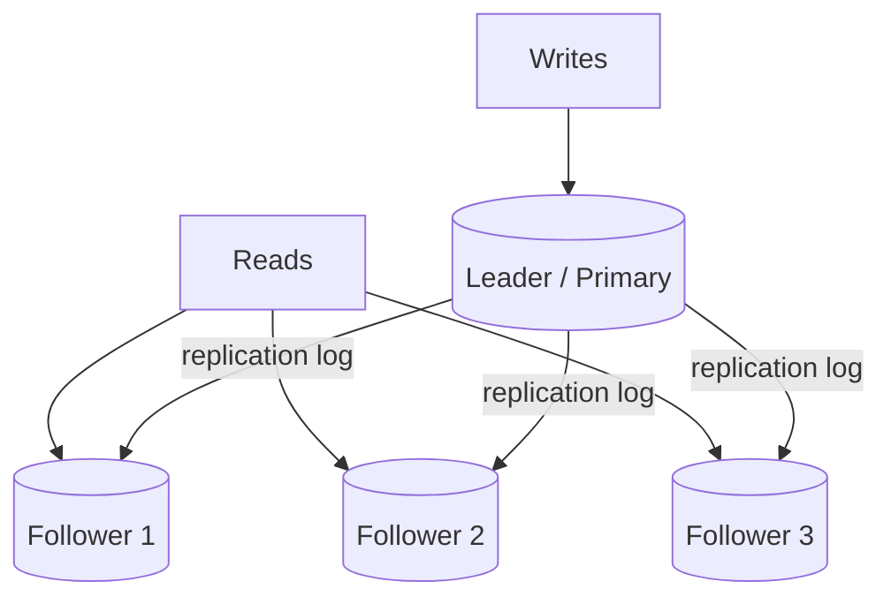
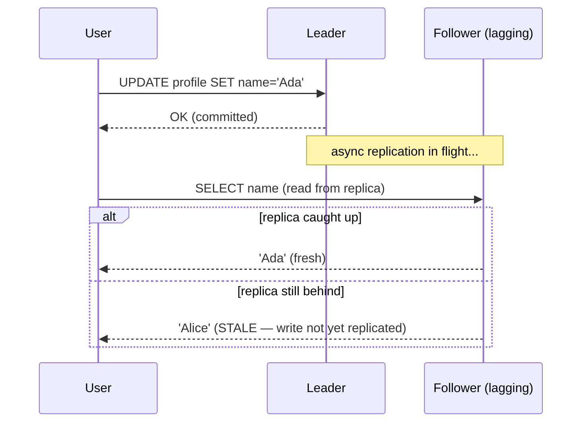
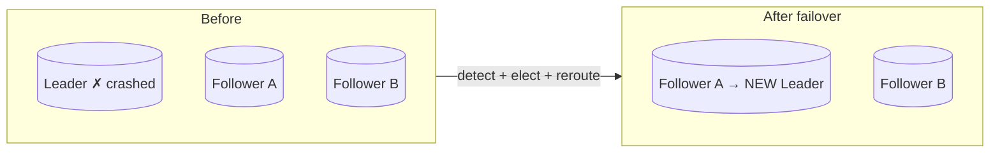

**Replication** = keeping a copy of the same data on multiple machines. You do it for three reasons: **availability** (survive a node dying), **read scalability** (serve reads from many copies), and **locality** (put data near users). The hard part is not making copies — it is keeping them consistent while the world keeps writing.

## 1. Leader-follower topology

The dominant model: one node is the **leader** (primary). All writes go to it; it streams its change log to **followers** (replicas), which serve reads.



This directly serves a **read-heavy** workload: add followers to add read capacity. Writes stay bottlenecked on the single leader — replication scales reads, **not writes** (that is what sharding is for).

## 2. Synchronous vs asynchronous

*When* does the leader tell the client "committed" — before or after followers have the write? This single choice trades durability against latency.

| | **Synchronous** | **Asynchronous** |
|--|--|--|
| Leader waits for follower ack? | Yes (≥1 follower) | No |
| Write latency | Higher (network round-trip) | Low (local commit) |
| Data loss on leader crash | None (a follower has it) | Possible (in-flight writes lost) |
| Followers can serve fresh reads | Yes | May be **stale** (lag) |
| Availability | Blocks if follower is down | Keeps accepting writes |

Most real systems use **semi-synchronous**: one synchronous follower (durability safety net) and the rest asynchronous (so a slow follower cannot stall all writes).

Put numbers on the choice: a same-DC sync ack adds **~0.5–1 ms** per write — usually fine. A cross-region sync ack adds **~50–150 ms** per write — usually not, which is why cross-region replication is almost always async. Healthy async lag is **sub-second**; under write bursts or bulk loads it stretches to **seconds or minutes**, which is exactly when stale reads start biting.

:::note
There is no free lunch. Fully synchronous replication means one slow or dead follower can freeze **every** write. Fully asynchronous means a leader crash can silently lose the last few writes. Semi-sync is the pragmatic middle.
:::

## 3. Replication lag → stale reads

With async replication, a follower is always a little behind. If a user **writes to the leader** and then **reads from a lagging follower**, they can see *old data* — even their own change vanishing.



This breaks the intuition "I just saved it, why is it gone?" The fix is **read-your-writes consistency**: after a write, route that user's reads to the leader (or to a replica known to have caught up) for a short window.

:::gotcha
**Replication lag is not a bug — it is physics.** Under load, lag grows (bigger backlog to ship). Never assume a read replica is current. Design for staleness: route critical reads to the leader, or track the write position and wait for the replica to reach it.
:::

## 4. Failover — promoting a new leader

When the leader dies, a follower must be **promoted**. This is the riskiest moment in a replicated system.



Failover has three failure modes an interviewer loves:

- **Lost writes** — with async replication, writes the old leader had but never shipped are gone when a follower is promoted.
- **Split-brain** — the old leader comes back and *also* thinks it is leader; two nodes accept conflicting writes. Fencing (STONITH) prevents this.
- **Bad timeout tuning** — too short → needless failovers on a blip; too long → extended downtime.

:::senior
Automatic failover is a distributed-consensus problem in disguise. You need reliable **failure detection** (is the leader dead or just slow?), a **leader election** that can't pick two winners, and **fencing** so the deposed leader can't corrupt data. This is why systems lean on Raft/Paxos or an external coordinator (ZooKeeper, etcd) rather than hand-rolling it.
:::

## 5. Multi-leader & leaderless (brief)

- **Multi-leader** — more than one node accepts writes (e.g. one per datacenter). Great for write locality and offline apps, but introduces **write conflicts** you must resolve (last-write-wins, CRDTs, app logic).
- **Leaderless** (Dynamo-style, e.g. Cassandra) — any node accepts writes; clients read/write to several nodes and use **quorums** (R + W > N) for consistency. Covered more under CAP & consistency.

## Check yourself

```quiz
title: Replication check
questions:
  - q: 'Adding read replicas primarily helps you scale what?'
    options:
      - text: 'Read throughput'
        correct: true
      - 'Write throughput'
      - 'Storage capacity per node'
    explain: 'All writes still funnel through the single leader, so replication scales reads, not writes. Scaling writes is what sharding addresses.'
  - q: 'A user updates their name, immediately reloads, and sees the OLD name. Most likely cause?'
    options:
      - 'The write failed silently'
      - text: 'The reload hit a lagging async replica (replication lag)'
        correct: true
      - 'The database is corrupt'
    explain: 'Async followers trail the leader. Reading from one right after writing to the leader can return stale data — the classic read-your-writes problem.'
  - q: 'What is the main risk of fully synchronous replication?'
    options:
      - text: 'One slow or dead follower can stall all writes'
        correct: true
      - 'It silently loses recent writes on failover'
      - 'It cannot serve reads from replicas'
    explain: 'If the leader must wait for a follower ack and that follower is down or slow, writes block. This availability cost is why semi-synchronous is common.'
  - q: 'During failover, "split-brain" refers to:'
    options:
      - 'Replicas disagreeing on schema'
      - text: 'Two nodes both believing they are leader and accepting conflicting writes'
        correct: true
      - 'The cache and database diverging'
    explain: 'If the old leader returns and still acts as leader alongside the newly promoted one, both accept writes and diverge. Fencing (STONITH) prevents this.'
```

:::key
**Replication** = copies for availability, read scale, and locality. Leader-follower funnels writes to one node and fans reads across followers. **Sync** = durable but slow and blockable; **async** = fast but risks stale reads and lost writes. **Replication lag** causes stale reads (fix with read-your-writes). **Failover** is the danger zone — watch for lost writes and split-brain.
:::
