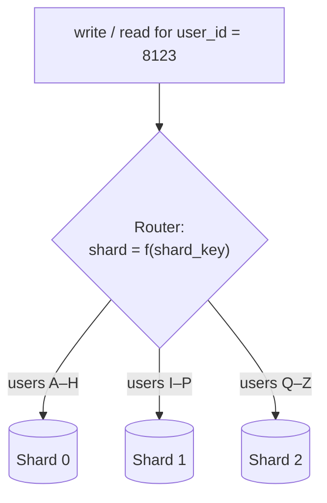
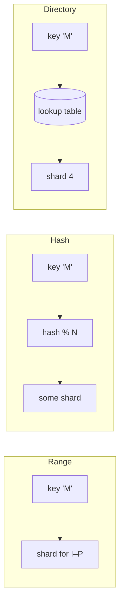
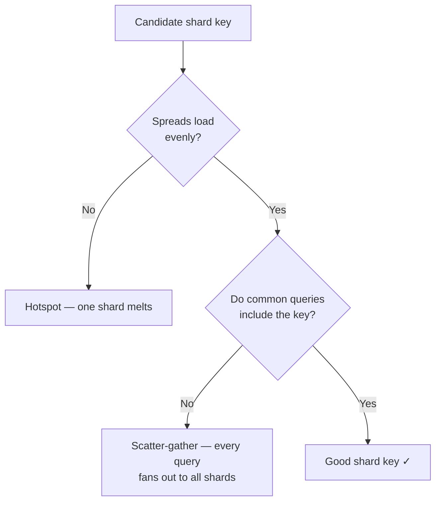

Replication makes **copies** of the whole dataset — great for reads, useless for write scale or for data that no longer fits on one machine. **Sharding** (horizontal partitioning) splits the dataset into disjoint pieces (**shards**), each on its own node. Now writes and storage scale out. The entire game is choosing **what to split on** — the *shard key*.

## 1. Routing rows to shards by key

A router (client library, proxy, or coordinator) maps each row to a shard using the shard key.



Every shard is its own independent database (often itself replicated). The router's job is to send each request to exactly the shard that owns that key.

## 2. Partitioning strategies

The mapping function `f(shard_key)` defines your strategy — and your failure modes.

| Strategy | How it maps | Range queries? | Hotspot risk | Notes |
|--|--|--|--|--|
| **Range** | Contiguous key ranges (A–H, I–P…) | **Yes** — efficient scans | **High** — sequential keys pile on one shard | Great for time-series *reads*, bad for time-ordered *writes* |
| **Hash** | `hash(key) % N` spreads keys | No (scattered) | **Low** — even spread | Default for uniform load; kills range scans |
| **Geo** | By region/location | Within region | Uneven if regions differ in size | Data locality, latency, and residency/compliance |
| **Directory** | A lookup table maps key → shard | Depends | Low (you rebalance freely) | Max flexibility; the lookup service is a dependency + SPOF risk |



## 3. Choosing the shard key — the whole ballgame

The shard key determines whether your system scales gracefully or falls over. A good key has two properties:

- **High cardinality + even distribution** → load spreads across shards.
- **Aligns with the query pattern** → most queries hit **one** shard, not all of them.



:::gotcha
**Sharding by a low-cardinality or skewed key creates a hotspot.** Shard a social app by `country` and one shard holds half your users. Shard events by `timestamp` and *every* new write lands on the newest shard while the rest sit idle. Prefer a high-cardinality key (like `user_id`), or add a prefix/hash to spread hot keys.
:::

## 4. Two operations that get painful

**Cross-shard queries.** Anything that isn't keyed by the shard key becomes a **scatter-gather**: query all shards, merge results. JOINs across shards and global aggregates are slow and complex — this is the tax you pay for horizontal scale.

**Resharding.** When shards fill up you must add nodes and move data. Naïve `hash(key) % N` is a trap: change `N` and **almost every key remaps**, forcing a near-total data reshuffle.

````tabs
tabs:
  - label: Modulo hashing (the trap)
    body: |
      `shard = hash(key) % N`. Simple — until you add a node.
      ```text
      N = 4  -> key 'x' on shard 2
      N = 5  -> key 'x' on shard 0   (moved!)
      ```
      Going from 4 → 5 shards remaps **~80% of keys**. Every add triggers a massive migration.
  - label: Consistent hashing (the fix)
    body: |
      Place shards and keys on a hash ring; a key belongs to the next shard clockwise. Adding a shard only moves the keys in **one arc**.
      ```text
      add a node  ->  only ~1/N of keys move
      ```
      Used by Cassandra, DynamoDB, and many caches. Virtual nodes smooth out the distribution.
````

:::senior
Sharding is a **one-way door** — reversing or rebalancing a poorly-chosen shard key on a live, huge dataset is one of the most painful migrations in engineering. Delay it: exhaust vertical scaling, read replicas, and caching first. When you must shard, invest heavily in picking the key, because you will live with it for years.
:::

:::note
Sharding and replication are **complementary, not either/or**. The standard production topology is *both*: each shard is a replicated leader-follower group. Sharding scales writes and storage; replication within each shard gives that shard availability.
:::

## Check yourself

```quiz
title: Sharding check
questions:
  - q: 'What problem does sharding solve that replication does not?'
    options:
      - text: 'Scaling write throughput and total storage beyond one node'
        correct: true
      - 'Serving more read traffic'
      - 'Reducing replication lag'
    explain: 'Replication copies the whole dataset (scaling reads/availability). Sharding splits it into disjoint pieces so writes and storage spread across nodes.'
  - q: 'You shard an events table by timestamp. What goes wrong?'
    options:
      - 'Range queries become impossible'
      - text: 'A write hotspot — all new inserts hit the newest shard while others idle'
        correct: true
      - 'Keys become non-unique'
    explain: 'Monotonically increasing keys concentrate every current write on one shard. High-cardinality, evenly-distributed keys (or hashing) avoid this.'
  - q: 'Why is plain `hash(key) % N` a poor choice for resharding?'
    options:
      - 'It cannot handle string keys'
      - text: 'Changing N remaps almost every key, forcing a huge data migration'
        correct: true
      - 'It always creates hotspots'
    explain: 'Modulo hashing ties placement to N. Add one node and most keys move. Consistent hashing limits movement to about 1/N of keys.'
  - q: 'A query that does not include the shard key must be run as a:'
    options:
      - 'Single-shard lookup'
      - text: 'Scatter-gather across all shards, then merge'
        correct: true
      - 'Replication event'
    explain: 'Without the shard key the router cannot target one shard, so it fans the query out to every shard and merges — slow and a reason to align the key with your queries.'
```

:::key
**Sharding** splits data across nodes to scale **writes and storage**. Strategies: **range** (scannable, hotspot-prone), **hash** (even, no ranges), **geo** (locality), **directory** (flexible, adds a lookup dependency). The **shard key is everything** — high cardinality, even spread, aligned to queries. Beware **hotspots** and **resharding**; use **consistent hashing** to minimize data movement. Real systems shard **and** replicate.
:::
