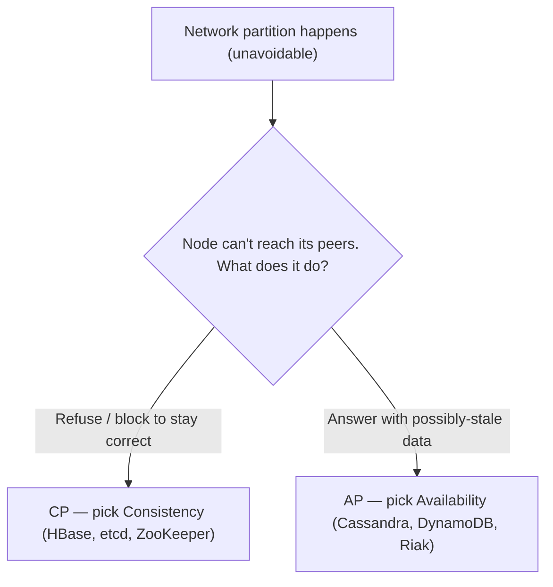
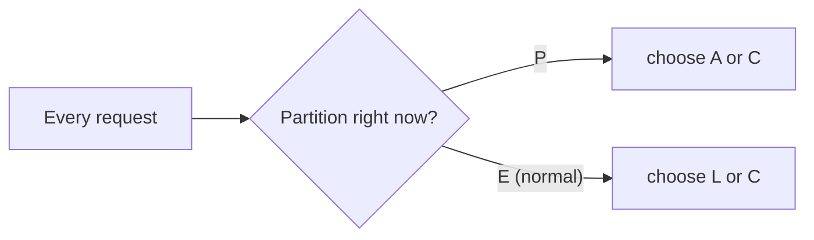

Once data lives on more than one node, physics imposes a tax. **CAP** names the trade-off you cannot escape, **PACELC** completes it, and **consistency models** are the concrete guarantees you offer applications. Interviewers use this to check you understand *why* distributed systems feel "inconsistent" — and that it is a deliberate choice.

## 1. The CAP theorem

In a distributed system you want three things:

- **C — Consistency:** every read sees the most recent write (one logical copy).
- **A — Availability:** every request gets a non-error response.
- **P — Partition tolerance:** the system keeps working when the network drops messages between nodes.

CAP says: **during a network partition you can keep only two — and since partitions are inevitable, P is not optional.** So the real choice, *when a partition happens*, is **C or A**.



:::gotcha
CAP is **not** "pick 2 of 3" as a permanent property. Partitions are not something you *choose* — they happen. CAP only forces a choice **during** a partition: refuse the request (CP) or serve possibly-stale data (AP). When the network is healthy, you can have both C and A.
:::

## 2. PACELC — the part CAP forgets

CAP only describes behaviour *during* a partition. But nodes make trade-offs even when the network is **fine**. **PACELC** completes the picture:

> **If Partition (P): trade Availability (A) vs Consistency (C).
> Else (E): trade Latency (L) vs Consistency (C).**



The insight: **strong consistency costs latency even on a good day**, because a node must coordinate with peers before answering. That is why "eventually consistent" stores feel fast — they skip the coordination.

| System | Partition (P) | Else / normal (E) | Classification |
|--|--|--|--|
| Cassandra / DynamoDB | Availability | Latency | **PA / EL** |
| HBase / Bigtable | Consistency | Consistency | **PC / EC** |
| MongoDB (default) | Consistency | Consistency | **PC / EC** |
| Fully ACID SQL (single node) | — | Consistency | **EC** |

## 3. Consistency models — the spectrum

"Consistency" is not binary; it is a dial from strongest (and slowest) to weakest (and fastest).

| Model | Guarantee | Cost | Example |
|--|--|--|--|
| **Strong / Linearizable** | Every read sees the latest write, always | Highest latency; less available under partition | Spanner, etcd |
| **Read-your-writes** | You always see *your own* writes (others may lag) | Route your reads to leader/updated replica | Session guarantees |
| **Quorum** | Overlapping read/write sets guarantee freshness | Tunable latency vs consistency | Cassandra, DynamoDB |
| **Eventual** | All replicas converge *if writes stop* | Lowest latency; may read stale | DNS, Cassandra (low levels) |

:::note
**Read-your-writes** is the pragmatic sweet spot for user-facing apps. Global strong consistency is expensive, but users only really notice staleness on *their own* actions ("I posted it, where is it?"). Guarantee they see their own writes and route everyone else's reads to fast replicas.
:::

## 4. Quorums — tuning consistency with a formula

Leaderless stores (Dynamo-style) let you dial consistency per operation with three numbers:

- **N** — replicas per item
- **W** — replicas that must ack a **write**
- **R** — replicas contacted for a **read**

The magic rule: **if `W + R > N`, read and write sets overlap, so a read is guaranteed to see the latest write** (strong-ish consistency).

````tabs
tabs:
  - label: Strong (W + R > N)
    body: |
      With `N = 3`, choose `W = 2`, `R = 2`. `2 + 2 = 4 > 3` → the read set and write set always share a node, so you never miss the newest write.
      ```text
      N=3  W=2  R=2   ->  W + R = 4 > 3   (consistent)
      ```
      Cost: higher latency and lower availability (need more nodes reachable).
  - label: Fast / eventual (W + R ≤ N)
    body: |
      Choose `W = 1`, `R = 1`. `1 + 1 = 2 ≤ 3` → sets may not overlap, so a read can miss a recent write.
      ```text
      N=3  W=1  R=1   ->  W + R = 2 ≤ 3   (eventual)
      ```
      Cost: possible stale reads. Benefit: lowest latency, stays up if most nodes are down.
````

:::senior
There is no globally "correct" consistency level — it is **per-operation**. A bank balance display might read at quorum; a "last seen" timestamp is fine eventually consistent. Senior engineers pick the *weakest* model that still satisfies the business requirement, because every step toward strong consistency costs latency and availability. State the requirement first, then choose the model.
:::

```flashcards
title: Consistency models — one-liners
cards:
  - front: 'Strong / linearizable'
    back: 'Every read sees the **latest** write, system-wide — as if one copy. Costs coordination latency; less available under partition. (Spanner, etcd)'
  - front: 'Read-your-writes'
    back: 'You always see **your own** writes; others may lag. Implement by pinning post-write reads to the leader. The user-facing sweet spot.'
  - front: 'Monotonic reads'
    back: 'Time never goes **backwards** for one reader — once you''ve seen a value, you never see an older one. Pin a session to one replica.'
  - front: 'Quorum (W + R > N)'
    back: 'Read and write sets **overlap** on at least one node, so reads see the newest write. Tunable per operation. (Cassandra, DynamoDB)'
  - front: 'Eventual consistency'
    back: 'Replicas **converge if writes stop**. No promise when. Fastest and most available. (DNS is the canonical example)'
  - front: 'CAP in one line'
    back: 'During a **partition**: consistency or availability, pick one. No partition: you can have both.'
  - front: 'PACELC in one line'
    back: 'If **P**artition: A vs C. **E**lse: **L**atency vs **C**onsistency — strong consistency costs latency even on a healthy network.'
```

## Check yourself

```quiz
title: CAP & consistency check
questions:
  - q: 'The CAP theorem forces a real choice between C and A only when:'
    options:
      - 'The system starts up'
      - text: 'A network partition is occurring'
        correct: true
      - 'Two clients write at once'
    explain: 'When the network is healthy you can have both C and A. CAP only forces the choice during a partition: refuse (CP) or serve stale (AP).'
  - q: 'What does PACELC add on top of CAP?'
    options:
      - 'A fourth guarantee called Persistence'
      - text: 'Even with no partition (Else), you trade Latency vs Consistency'
        correct: true
      - 'That partitions can be avoided entirely'
    explain: 'PACELC notes that strong consistency costs coordination latency even during normal operation — the "ELC" half CAP ignores.'
  - q: 'With N=3 replicas, which quorum setting guarantees a read sees the latest write?'
    options:
      - 'W=1, R=1'
      - text: 'W=2, R=2 (because W + R > N)'
        correct: true
      - 'W=1, R=2'
    explain: 'W + R > N (here 2 + 2 = 4 > 3) forces the read and write sets to overlap on at least one node, which holds the newest write. W=1,R=2 gives 3 which is not > 3.'
  - q: 'Which consistency model is the practical sweet spot for user-facing apps?'
    options:
      - text: 'Read-your-writes — you always see your own changes'
        correct: true
      - 'Global linearizable everywhere'
      - 'Purely eventual for all reads'
    explain: 'Users mainly notice staleness on their own actions. Guaranteeing read-your-writes avoids the "where did my post go?" problem without paying for global strong consistency.'
```

:::key
**CAP**: during a partition, pick Consistency (CP) or Availability (AP) — P is mandatory. **PACELC**: even without a partition, you trade Latency vs Consistency. Consistency is a **spectrum** — strong → read-your-writes → quorum → eventual — weaker is faster and more available. In leaderless stores, **W + R > N** gives strong reads. Pick the **weakest model that meets the requirement**.
:::
