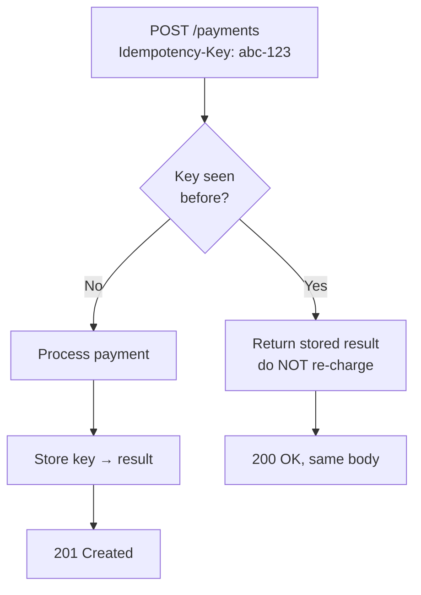

An API is a **contract**. Clients you will never meet write code against it, so the design goals are **predictability** and **stability**: same shapes, same verbs, same error language everywhere. REST gets you most of the way by mapping HTTP onto **resources** (nouns) and **methods** (verbs).

## 1. Resources are nouns; methods are verbs

The single most common beginner mistake is putting the action in the URL. Don't. The URL names a **thing**; the HTTP method says what you're doing to it.

| Do (resource + verb) | Don't (verb in path) |
|--|--|
| `GET /users/42` | `GET /getUser?id=42` |
| `POST /users` | `POST /createUser` |
| `DELETE /users/42` | `POST /deleteUser` |
| `GET /users/42/orders` | `GET /getOrdersForUser?id=42` |

Rules of thumb: **plural nouns** for collections (`/users`, not `/user`), **nest** to show ownership (`/users/42/orders`), keep **hierarchy shallow** (avoid `/a/1/b/2/c/3` — link instead), and use **kebab-case** for multi-word paths (`/shipping-addresses`).

## 2. Methods, safety, and idempotency

Two properties drive correctness. **Safe** = doesn't change state. **Idempotent** = doing it N times lands in the same state as doing it once (crucial, because clients *will* retry on timeouts).

| Method | Purpose | Safe? | Idempotent? |
|--|--|--|--|
| `GET` | Read a resource | Yes | Yes |
| `POST` | Create / non-idempotent action | No | **No** |
| `PUT` | Replace resource wholesale | No | Yes |
| `PATCH` | Partial update | No | No (usually) |
| `DELETE` | Remove a resource | No | Yes |

:::key
`POST` is **not** idempotent — a retried `POST /payments` can charge twice. This is why idempotency keys (§5) exist.
:::

## 3. Status codes that actually mean something

Return the code that lets a client branch **without parsing the body**. The families: `2xx` success, `3xx` redirect, `4xx` *you* messed up (client), `5xx` *we* messed up (server).

| Code | Meaning | Use when |
|--|--|--|
| `200 OK` | Success + body | `GET`, updated resource |
| `201 Created` | Resource created | `POST` created a row (+`Location` header) |
| `202 Accepted` | Queued, not done | async work handed to a queue |
| `204 No Content` | Success, empty body | `DELETE`, or `PUT` with nothing to return |
| `400 Bad Request` | Malformed input | validation failed |
| `401 Unauthorized` | Not authenticated | missing/invalid credentials |
| `403 Forbidden` | Authenticated, not allowed | valid user, wrong permissions |
| `404 Not Found` | No such resource | unknown id |
| `409 Conflict` | State clash | duplicate, version mismatch |
| `429 Too Many Requests` | Rate limited | client over quota |
| `500 / 503` | Server fault | bug / dependency down or overloaded |

:::gotcha
`401` vs `403` trips everyone up. **401** = "I don't know who you are" (authentication). **403** = "I know who you are and you can't do this" (authorization).
:::

## 4. Pagination — never return an unbounded list

`GET /events` on a table with 10M rows must not dump 10M rows. Two strategies:

| | **Offset / limit** | **Cursor (keyset)** |
|--|--|--|
| Request | `?limit=20&offset=40` | `?limit=20&cursor=eyJpZCI6MTIzfQ` |
| How | `OFFSET 40 LIMIT 20` in SQL | `WHERE id > :cursor LIMIT 20` |
| Deep pages | **Slow** — DB scans + skips offset rows | **Fast** — indexed seek, constant cost |
| Jump to page N | Easy (`offset = N × size`) | Not supported (only next/prev) |
| Live data | **Buggy** — inserts shift rows, causing dupes/skips | **Stable** — anchored to a real row |
| Best for | Small sets, admin tables, "page 5 of 12" UIs | Infinite scroll, large/high-write feeds |

:::senior
For any large or actively-written dataset, prefer **cursor pagination**. Offset's cost grows with the offset (the DB still reads and discards the skipped rows), and concurrent inserts make offset pages drift — users see duplicates or miss items. Return the next cursor in the response so clients never construct it.
:::

## 5. Idempotency keys — safe retries for `POST`

A client sends `POST /payments`, the response is lost to a timeout, the client retries. Without protection: **two charges**. The fix: the client sends a unique `Idempotency-Key` header; the server records it and returns the *original* result on any replay.



The key is client-generated (a UUID), stored server-side with its result and a TTL, and scoped to the operation. `GET`/`PUT`/`DELETE` don't need it — they're already idempotent.

## 6. Versioning — evolve without breaking clients

You cannot ask every client to upgrade at once, so **breaking changes need a new version**. Removing a field, renaming one, or changing a type is breaking; *adding* an optional field is not.

| Strategy | Example | Note |
|--|--|--|
| **URI path** | `GET /v1/users` | Most common, most visible, cache-friendly |
| **Header** | `Accept: application/vnd.api.v2+json` | Cleaner URLs, harder to test in a browser |
| **Query param** | `GET /users?version=2` | Easy, but easy to forget |

URI versioning wins in interviews for being explicit. Whatever you pick: **additive changes don't bump the version**; only breaking ones do.

## Check yourself

```quiz
title: API design check
questions:
  - q: 'Which endpoint is the most RESTful way to delete user 42?'
    options:
      - 'POST /deleteUser?id=42'
      - text: 'DELETE /users/42'
        correct: true
      - 'GET /users/42/delete'
    explain: 'The URL names the resource (a plural collection + id) and the HTTP method expresses the action. Verbs like delete belong in the method, not the path.'
  - q: 'A payment client times out and retries the same POST. What prevents a double charge?'
    options:
      - 'Using PUT instead of POST'
      - text: 'An idempotency key stored server-side that returns the original result on replay'
        correct: true
      - 'A 429 status code'
    explain: 'POST is not idempotent. A client-supplied Idempotency-Key lets the server recognize the retry and return the stored result instead of processing the charge again.'
  - q: 'You have a high-write feed of 10M rows and users scroll infinitely. Which pagination fits best?'
    options:
      - 'Offset/limit, because you can jump to any page'
      - text: 'Cursor (keyset) pagination — constant cost and stable under inserts'
        correct: true
      - 'Return everything and paginate on the client'
    explain: 'Offset gets slower the deeper you page and drifts when rows are inserted. Cursor pagination seeks an indexed anchor row, so cost is constant and pages stay stable.'
  - q: 'A request arrives with valid credentials, but the user lacks permission for this action. Which status?'
    options:
      - '401 Unauthorized'
      - text: '403 Forbidden'
        correct: true
      - '400 Bad Request'
    explain: '401 means not authenticated (we do not know who you are). 403 means authenticated but not authorized (we know you, and you may not do this).'
```

:::key
REST = **resources (nouns) + HTTP methods (verbs)**. Return **meaningful status codes** (know 401 vs 403, 200 vs 201 vs 204). **Always paginate** — prefer **cursor** for large/live data. Make retries safe with **idempotency keys** on `POST`. **Version** only on breaking changes; additive changes are free.
:::
