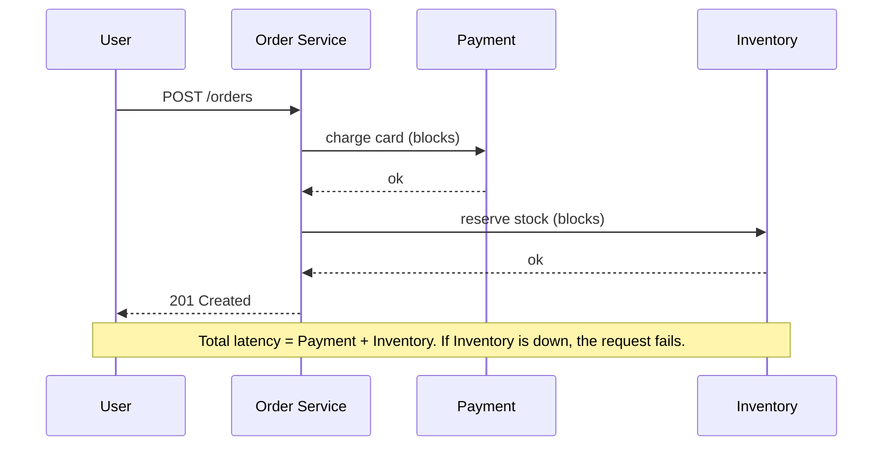
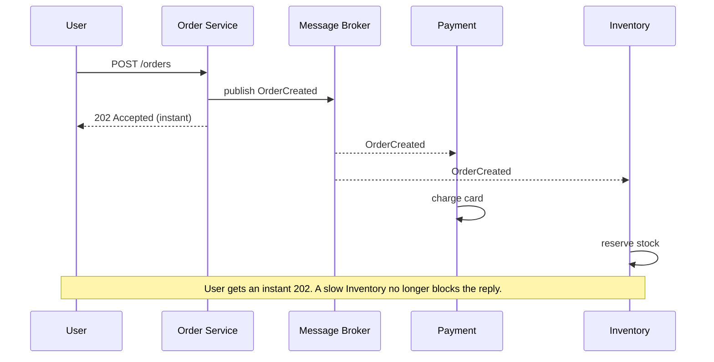

Every time service A talks to service B you make one decision: **wait for the answer, or don't**. That single choice ripples through your latency, your failure modes, and how tightly the two services are bound together.

- **Synchronous** — A calls B and **blocks** until B replies. Simple, immediate, but A's fate is tied to B's.
- **Asynchronous** — A hands a message to a broker and **moves on**. B processes it later. Decoupled and resilient, but eventually-consistent and harder to trace.

## The synchronous flow

A places an order. It must call Payment and Inventory and wait for both before it can respond to the user. The user stares at a spinner the whole time.



The user's wait is the **sum** of every downstream call, and any one failure fails the request. This is fine when the caller genuinely needs the result *now* (you can't confirm an order without knowing the card cleared).

## The asynchronous flow

Now the Order Service only does the critical bit synchronously (or nothing at all) and **publishes an event**. Payment and Inventory consume it on their own schedule.



The user gets an instant `202 Accepted`. Payment and Inventory scale and fail **independently** — if Inventory is down, its messages simply wait in the queue and are processed when it recovers. The cost: the order isn't *truly* done when the user is told "accepted," so the UI must handle **eventual consistency** (e.g. "processing…" then a push/poll for the final state).

## Head to head

| | **Synchronous** | **Asynchronous** |
|--|--|--|
| Caller | **Blocks** for the response | Fire-and-forget, continues |
| Coupling | **Tight** — needs B up *now* | **Loose** — B can be down/slow |
| Latency (perceived) | Sum of all downstream calls | Instant ack; work happens later |
| Failure of B | Fails the whole request | Message waits in queue, retried |
| Consistency | Strong / immediate | **Eventual** |
| Load spikes | B must absorb them live | **Queue buffers** the spike |
| Debugging | Easy — one call stack | Harder — traces span services |
| Fits | Reads, "I need the answer now" | Notifications, pipelines, fan-out, slow jobs |

## When to go async

Reach for async when the caller **doesn't need the result immediately** and you want the system to survive load and partial failure:

- **Slow or heavy work** — video transcoding, report generation, sending email. Ack instantly, do it in the background.
- **Fan-out** — one event (`OrderPlaced`) triggers many independent reactions (email, analytics, warehouse, loyalty points) without the producer knowing about any of them.
- **Load smoothing** — a traffic spike fills a queue instead of knocking over a downstream service.
- **Decoupling teams/services** — producers and consumers deploy and scale independently.

Stay **synchronous** when the caller truly needs the answer to proceed (an auth check, reading a user's profile, confirming a payment before showing "success"), or when strong consistency is required and the extra moving parts of a broker aren't worth it.

:::senior
The senior move is a **hybrid**: do the minimum synchronously to give the user a trustworthy answer, then publish an event for everything else. Checkout charges the card sync (the user must know it worked), then emits `OrderPlaced` so email, analytics, and fulfillment run async. Don't make the user wait on things they don't care about.
:::

:::gotcha
Async isn't free. You inherit a **broker to operate**, **eventual consistency** the UI must handle, **duplicate deliveries** to make idempotent, and **distributed traces** to debug. Don't reach for it when a plain function call would do.
:::

## Check yourself

```quiz
title: Sync vs async check
questions:
  - q: 'In the synchronous order flow, what is the user-perceived latency?'
    options:
      - 'The slowest single downstream call'
      - text: 'The sum of all downstream calls (Payment + Inventory)'
        correct: true
      - 'Zero — it returns immediately'
    explain: 'Synchronous calls block and run in sequence here, so the user waits for the total of every downstream call, and any one failure fails the whole request.'
  - q: 'A traffic spike hits your system. How does an async/queue-based design help?'
    options:
      - 'It processes messages faster than sync'
      - text: 'The queue buffers the spike so downstream services drain it at their own pace'
        correct: true
      - 'It removes the need for downstream services'
    explain: 'The broker absorbs the burst as a backlog. Consumers process at a steady rate instead of being overwhelmed, trading immediate completion for stability.'
  - q: 'Which task is the best candidate to move OFF the synchronous request path?'
    options:
      - 'Checking whether the user is authenticated'
      - text: 'Generating and emailing a large PDF report'
        correct: true
      - 'Reading the user profile to render the page'
    explain: 'The user does not need to block on a slow report/email. Ack instantly (202) and do it in the background. Auth and profile reads are needed to proceed, so they stay synchronous.'
  - q: 'What NEW problem does going asynchronous typically introduce?'
    options:
      - 'Tighter coupling between services'
      - text: 'Eventual consistency the UI/clients must account for'
        correct: true
      - 'Higher perceived latency for the caller'
    explain: 'The caller is acked before the work completes, so state is only eventually consistent. Coupling loosens and perceived latency drops — but you must design the client for "not done yet."'
```

:::key
**Sync** = block for the answer: simple, strongly consistent, tightly coupled, latency is the sum of calls. **Async** = publish and move on: loosely coupled, spike-tolerant, but eventually consistent and harder to trace. Go async for **slow work, fan-out, and load smoothing**; stay sync when the caller **needs the answer to proceed**. Best real systems are **hybrid**.
:::
