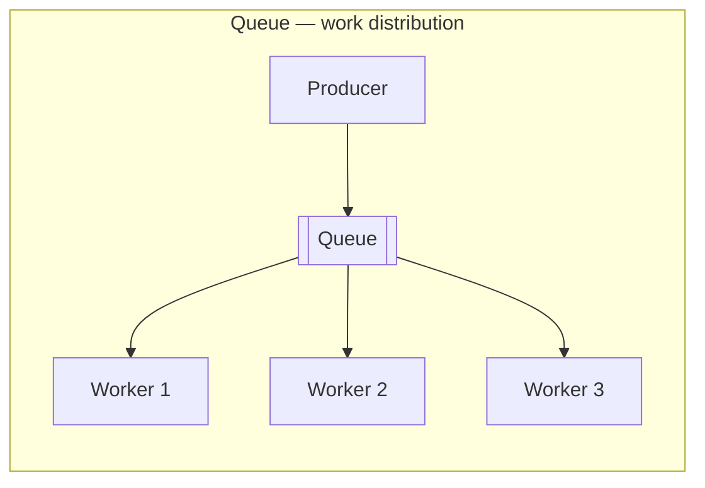
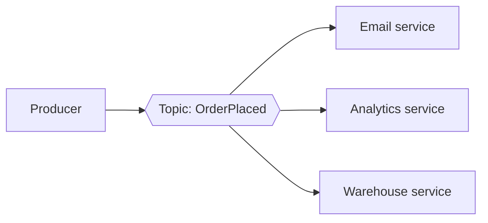
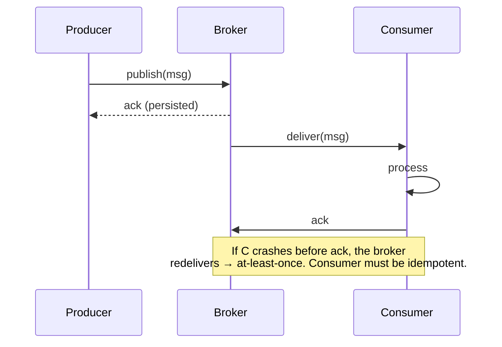

A **message broker** sits between producers and consumers so they never talk directly. The producer drops a message and forgets it; the broker holds it durably until a consumer is ready. This is the backbone of async and event-driven systems — it buys **decoupling**, **buffering**, and **retries**.

## Two delivery models

The first fork: does each message go to **one** worker, or to **everyone** who's interested?



**Queue (point-to-point):** each message is consumed by exactly **one** worker. Add workers to process the backlog faster — this is how you parallelize a task ("send these 10,000 emails"). The message is gone once acked.



**Pub/Sub (publish-subscribe):** each message is delivered to **every** subscriber. One `OrderPlaced` event fans out to email, analytics, and warehouse — the producer doesn't know or care who's listening. This is how you decouple many reactions from one event.

## Kafka vs RabbitMQ

Both are brokers, but they were built for different jobs. The core difference: RabbitMQ **pushes and deletes** messages; Kafka is a **durable, replayable log** consumers read from at their own offset.

| | **RabbitMQ** (message broker) | **Apache Kafka** (event log / stream) |
|--|--|--|
| Model | Smart broker routes to queues; consumers ack | Append-only partitioned log; consumers track their **offset** |
| After consumption | Message **deleted** on ack | **Retained** (by time/size); can be **replayed** |
| Ordering | Per-queue | Per-**partition** (strong within a partition) |
| Throughput | High | **Very high** (millions/sec, sequential disk) |
| Routing | Rich (exchanges, topic/fanout/direct) | Simple — publish to a topic, partition by key |
| Replay history | No (once gone, it's gone) | **Yes** — rewind offset, reprocess |
| Best for | Task queues, complex routing, RPC-style work | Event streaming, log/metrics pipelines, event sourcing, high fan-out |

:::senior
The interview one-liner: **RabbitMQ is a smart broker with dumb consumers; Kafka is a dumb broker (a log) with smart consumers.** RabbitMQ decides routing and deletes on ack. Kafka just appends to partitions and each consumer group tracks its own offset — which is exactly what makes **replay** and multiple independent readers of the same stream possible.
:::

## Event-driven architecture

Pub/sub scales into an **event-driven** style: services emit events about facts that happened (`PaymentCaptured`, `UserSignedUp`) and other services react. No service calls another directly, so you can add a new consumer (say, a fraud checker) **without touching the producer**. The trade-off is the usual async tax — eventual consistency and harder end-to-end tracing.



That redelivery is the crux of the next section.

## Delivery guarantees

What happens when a consumer crashes *after* processing but *before* acking? The answer defines your guarantee — and whether your consumers **must be idempotent**.

| Guarantee | Meaning | Risk | How | Use for |
|--|--|--|--|--|
| **At-most-once** | 0 or 1 delivery | **Lost** messages | ack *before* processing (fire & forget) | metrics, logs — where a drop is fine |
| **At-least-once** | 1 or more deliveries | **Duplicate** messages | ack *after* processing; redeliver on no-ack | the common default — payments, orders |
| **Exactly-once** | Precisely 1 effect | none (in theory) | dedup + transactional offsets; costly | financial ledgers, strict counting |

:::key
**At-least-once is the practical default**, which means **duplicates will happen**. The fix is not "achieve exactly-once transport" — it's making your consumer **idempotent**: dedupe on a message id or use an idempotency key so reprocessing the same message twice is harmless. "Exactly-once" in real systems is almost always *at-least-once delivery + idempotent processing*, not magic transport.
:::

:::gotcha
True end-to-end exactly-once is very hard and expensive (distributed transactions / dedup stores). If someone claims "exactly-once," ask *where* — Kafka offers exactly-once **within Kafka** (transactions across topics + offset commit), but the moment you write to an external system, you're back to needing idempotency.
:::

## Check yourself

```quiz
title: Message queues check
questions:
  - q: 'You need one OrderPlaced event to trigger email, analytics, AND warehouse — each independently. Which model?'
    options:
      - 'A queue (point-to-point)'
      - text: 'Pub/Sub — each subscriber gets its own copy'
        correct: true
      - 'A synchronous REST call to each'
    explain: 'A queue delivers each message to only one consumer. Pub/sub fans the event out to every subscriber, so all three services react independently without the producer knowing them.'
  - q: 'Which broker lets a brand-new consumer replay events from the past?'
    options:
      - 'RabbitMQ, because it deletes on ack'
      - text: 'Kafka — it retains an append-only log and consumers track their own offset'
        correct: true
      - 'Neither can replay'
    explain: 'Kafka keeps messages (by time/size) as a durable log; a consumer can rewind its offset and reprocess. RabbitMQ deletes messages once acked, so replay is not available.'
  - q: 'Your broker gives at-least-once delivery. What MUST your consumer be?'
    options:
      - 'Faster than the producer'
      - text: 'Idempotent — safe to process the same message more than once'
        correct: true
      - 'Single-threaded'
    explain: 'At-least-once means duplicates are guaranteed to occur (e.g. a crash after processing but before ack). Idempotent processing (dedupe on message id) makes reprocessing harmless.'
  - q: 'Which guarantee risks LOSING messages, and where is that acceptable?'
    options:
      - 'At-least-once; acceptable for payments'
      - text: 'At-most-once; acceptable for metrics/logs where a dropped sample is fine'
        correct: true
      - 'Exactly-once; acceptable for ledgers'
    explain: 'At-most-once acks before processing, so a crash loses the message. That is fine for high-volume telemetry where one lost data point does not matter, but never for payments.'
```

:::key
A broker **decouples** producers from consumers and **buffers** load. **Queue** = one consumer per message (parallelize work); **pub/sub** = every subscriber gets it (fan-out). **RabbitMQ** = smart routing, deletes on ack; **Kafka** = durable replayable log, consumers own their offset. Delivery is realistically **at-least-once**, so **make consumers idempotent**.
:::
