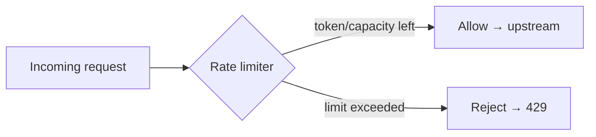

A rate limiter caps how many requests a client may make in a window. It protects you from **abuse** (scrapers, credential-stuffing), **accidental floods** (a retry storm), and **noisy neighbors** hogging a shared service. Over the limit, you return **`429 Too Many Requests`** — ideally with a `Retry-After` header so well-behaved clients back off.

The whole field is really four algorithms. The one you'll be asked to explain is the **token bucket** — so let's animate it.

## The token bucket, step by step

Picture a bucket with a fixed **capacity** of tokens. It **refills** at a steady rate over time. Every request must **take one token to proceed**; if the bucket is empty, the request is **rejected**. This is what lets it absorb short **bursts** (spend saved-up tokens) while enforcing a steady **average** rate (the refill).

```walkthrough
title: Token bucket — bursts, rejection, and refill
code: |
  tokens = min(capacity, tokens + rate * elapsed)   // 1. refill over time
  if tokens >= 1:                                    // 2. is a token available?
      tokens -= 1                                    // 3. take one → allow
      allow()
  else:
      reject_429()                                   // 6. empty → reject
steps:
  - text: 'Bucket starts full: capacity 4, so 4 tokens available (1 = token, 0 = empty slot).'
    array: [1, 1, 1, 1]
    line: 1
  - text: 'Request A arrives. tokens >= 1, so take one token → ALLOWED. 3 left.'
    array: [1, 1, 1, 0]
    highlight: [3]
    pointers: { 3: 'A' }
    line: 3
  - text: 'A burst: B, C, D arrive back-to-back. Each spends a saved-up token → all ALLOWED. Bucket now empty.'
    array: [0, 0, 0, 0]
    highlight: [0, 1, 2]
    line: 3
  - text: 'Request E arrives, but the bucket is empty (tokens = 0). REJECTED → 429 Too Many Requests.'
    array: [0, 0, 0, 0]
    pointers: { 0: 'E?' }
    line: 6
  - text: 'Time passes. Refill adds tokens at the fixed rate (here, +1). Capacity caps it, so it never overflows.'
    array: [1, 0, 0, 0]
    highlight: [0]
    pointers: { 0: 'refill' }
    line: 1
  - text: 'Request F arrives now that a token exists → take it → ALLOWED again. Steady rate enforced.'
    array: [0, 0, 0, 0]
    highlight: [0]
    pointers: { 0: 'F' }
    line: 3
```

Two knobs define behavior: **capacity** sets the maximum burst; **refill rate** sets the sustained throughput. A capacity of 4 with a refill of 1/sec means "sustain ~1 req/s, but tolerate a burst of up to 4."

:::tip
This is why the token bucket is the interview favorite: **one algorithm gives you both a burst allowance and an average-rate cap**, and it's cheap — just a token count and a last-refill timestamp per client (two numbers in Redis).
:::

## The four algorithms



| Algorithm | How it works | Bursts | Memory | Watch out for |
|--|--|--|--|--|
| **Token bucket** | Tokens refill at a rate; each request spends one | **Allows** bursts up to capacity | Tiny (count + timestamp) | Tuning capacity vs rate |
| **Leaky bucket** | Requests queue and drain at a fixed rate | **Smooths** — steady output, no bursts | Queue size | Adds latency; queue can drop when full |
| **Fixed window** | Count per fixed clock window (e.g. per minute) | Simplest | Tiny (one counter) | **Boundary spike** — 2× at the window edge |
| **Sliding window** | Rolling window (log of timestamps, or weighted) | Accurate, smooth | Higher (log) or medium (counter) | Log memory; counter is an approximation |

**Token vs leaky bucket** is the classic pairing: the token bucket *allows* bursts (spend saved tokens), while the leaky bucket *forbids* them (output drains at a constant rate no matter how spiky the input). Choose token bucket for APIs that should tolerate bursty-but-bounded traffic; choose leaky bucket when a downstream system needs a perfectly smooth, constant feed.

:::gotcha
**Fixed window's boundary problem:** with a limit of 100/min, a client can send 100 requests at `12:00:59` and another 100 at `12:01:00` — **200 requests in one second**, straddling two windows, while never breaking the per-window rule. The **sliding window** fixes this by counting over the last 60 seconds continuously rather than resetting on the clock.
:::

:::senior
In a distributed system the limiter must be **shared** across instances, or a client just spreads traffic over N servers to get Nx the limit. The standard answer: keep the counter in a **central store like Redis** (atomic `INCR`/Lua script), accepting one network hop per request. When that hop is too costly, use approximate approaches — per-node local buckets sized to `global_limit / N`, or a token-bucket Lua script running server-side in Redis.
:::

## Check yourself

```quiz
title: Rate limiting check
questions:
  - q: 'What makes the token bucket able to absorb a short burst while still capping the average rate?'
    options:
      - 'It queues excess requests and drains them slowly'
      - text: 'Unused tokens accumulate up to capacity, so a burst can spend them; the refill rate caps the long-run average'
        correct: true
      - 'It resets its counter every minute'
    explain: 'Capacity sets the burst allowance (saved-up tokens) and the refill rate sets sustained throughput. Together they permit bursts up to capacity while enforcing an average rate.'
  - q: 'A limit is 100 requests/minute using a FIXED window. How can a client legitimately push ~200 in a moment?'
    options:
      - 'By using a smaller window'
      - text: 'Send 100 at the end of one window and 100 at the start of the next — a boundary spike'
        correct: true
      - 'Fixed windows cannot be exceeded'
    explain: 'Counts reset on the clock boundary. Requests clustered on either side of the reset straddle two windows, allowing up to 2x the limit in a short span. Sliding window fixes this.'
  - q: 'You need a downstream service fed at a perfectly constant, smooth rate — no bursts. Which algorithm?'
    options:
      - text: 'Leaky bucket — output drains at a fixed rate regardless of input spikiness'
        correct: true
      - 'Token bucket — because it allows bursts'
      - 'Fixed window'
    explain: 'The leaky bucket queues incoming requests and releases them at a constant rate, smoothing spiky input into a steady stream. The token bucket, by contrast, deliberately allows bursts.'
  - q: 'Why does a per-instance in-memory limiter fail once you run many app servers?'
    options:
      - 'In-memory counters are too slow'
      - text: 'Each instance limits independently, so a client spread across N servers gets roughly N times the intended limit'
        correct: true
      - 'It returns the wrong status code'
    explain: 'Limits must be enforced on shared state (e.g. a central Redis counter). Independent per-node counters let a client multiply its effective quota by the number of servers.'
```

:::key
Rate limiting protects against **abuse, floods, and noisy neighbors**; over the limit, return **429** (+ `Retry-After`). **Token bucket** (allows bursts, caps average) is the go-to and the one to be able to draw. **Leaky bucket** smooths to a constant rate. **Fixed window** is simplest but has a **boundary-spike** bug that **sliding window** fixes. Distributed limits need **shared state (Redis)**.
:::
