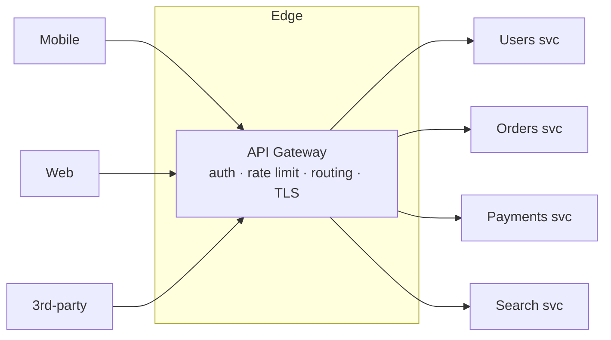
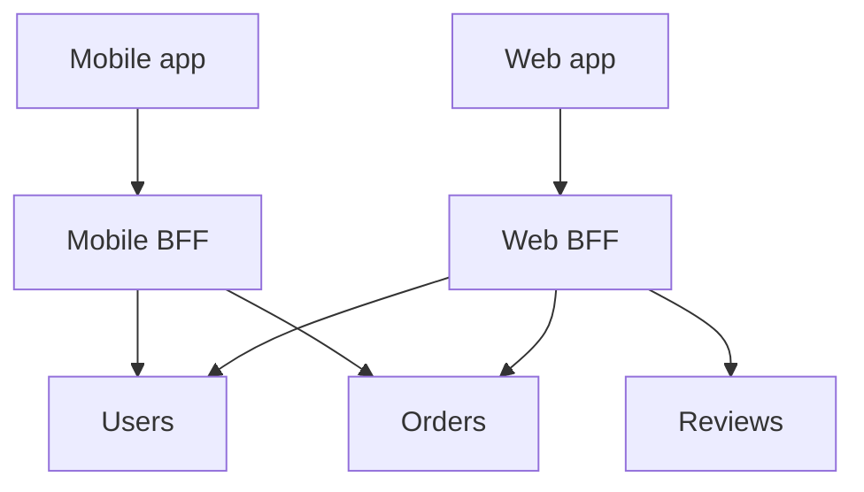

Once you split a monolith into microservices, clients face a mess: dozens of services, each with its own host, auth, and versioning. You do **not** want a mobile app calling 12 services directly. The fix is a **single front door** — the **API gateway** — that clients talk to, which then routes to the right service behind it.

## What the gateway does

The gateway is a **reverse proxy at the edge** that owns the concerns every service would otherwise reimplement. Pull them up to one layer and each service stays focused on business logic.



Typical responsibilities:

- **Routing** — map `/orders/*` to the Orders service, `/users/*` to Users.
- **Authentication / authorization** — validate the token **once** at the edge; services trust the gateway.
- **Rate limiting & throttling** — enforce quotas before traffic reaches your services.
- **TLS termination** — decrypt HTTPS at the edge.
- **Aggregation** — fan one client request out to several services and combine the responses (fewer round-trips for mobile).
- **Cross-cutting glue** — request logging, metrics, caching, and protocol translation (e.g. REST in front, gRPC behind).

:::gotcha
Don't let the gateway grow business logic. It handles **cross-cutting** concerns (auth, routing, limits). The moment it starts making domain decisions ("if the order total > \$100, apply a discount") it becomes a **distributed monolith** — a single deploy bottleneck every team must coordinate through. Keep it thin.
:::

## Gateway vs service mesh

Both route traffic, but on **different axes**. The gateway handles **north-south** traffic (clients → your system, at the edge). A **service mesh** handles **east-west** traffic (service → service, *inside* your system) via sidecar proxies deployed next to each service.

| | **API Gateway** | **Service Mesh** |
|--|--|--|
| Traffic | North-south (client ↔ system) | East-west (service ↔ service) |
| Sits | At the edge, one front door | Beside every service (sidecar proxy) |
| Main job | Auth, routing, rate limit, aggregation | mTLS, retries, timeouts, load balancing, observability |
| Audience | External clients | Internal services |
| Example | Kong, AWS API Gateway, NGINX | Istio, Linkerd |

They're **complementary**, not either/or: the gateway guards the front door while the mesh secures and observes the chatter between services behind it.

## Backend-for-Frontend (BFF)

One gateway serving wildly different clients tends to bloat — a mobile app wants small, battery-friendly payloads; a desktop web app wants rich, denormalized data. The **BFF pattern** gives **each client type its own gateway**, tailored to its needs.



The Mobile BFF returns lean responses and aggregates aggressively to save round-trips; the Web BFF returns richer payloads. Each is owned by the team that owns that frontend, so they evolve independently without a shared gateway becoming a coordination chokepoint.

:::senior
Use a plain gateway when clients have **similar** needs. Reach for **BFF** when client requirements **diverge** enough that one API forces awkward compromises — over-fetching on mobile, or extra client-side calls to stitch data. The cost is more services to run and some duplicated aggregation logic, so don't split per-client until the divergence is real.
:::

## Check yourself

```quiz
title: API gateway check
questions:
  - q: 'Which concern is a GOOD fit to handle in the API gateway rather than in each service?'
    options:
      - 'Deciding order discounts based on cart total'
      - text: 'Authenticating the request token once at the edge'
        correct: true
      - 'Computing a user recommendation ranking'
    explain: 'Auth is a cross-cutting concern handled once at the edge so services can trust the gateway. Domain decisions (discounts, rankings) belong in the services, or the gateway becomes a distributed monolith.'
  - q: 'A service mesh primarily manages which traffic?'
    options:
      - 'North-south — external clients into the system'
      - text: 'East-west — service-to-service calls inside the system'
        correct: true
      - 'Only database traffic'
    explain: 'The mesh runs sidecar proxies beside each service to handle internal service-to-service concerns (mTLS, retries, timeouts, observability). The gateway handles north-south edge traffic.'
  - q: 'When does the Backend-for-Frontend (BFF) pattern earn its complexity?'
    options:
      - 'Always — every service should have its own gateway'
      - text: 'When client types (e.g. mobile vs web) have divergent data/shape needs that one API cannot serve cleanly'
        correct: true
      - 'Only when you have a single client type'
    explain: 'BFF gives each client its own tailored gateway. It pays off when needs diverge (lean mobile payloads vs rich web data). With similar clients, one gateway is simpler.'
  - q: 'What is the risk of piling business logic into the API gateway?'
    options:
      - 'It becomes too fast'
      - text: 'It turns into a distributed-monolith bottleneck every team must coordinate through'
        correct: true
      - 'Clients can no longer authenticate'
    explain: 'A gateway thick with domain logic becomes a single shared deploy chokepoint, undermining the independence that microservices are meant to provide. Keep it to cross-cutting concerns.'
```

:::key
An **API gateway** is the single **front door** for **north-south** traffic: routing, auth, rate limiting, TLS, and aggregation — kept **thin** (no business logic). A **service mesh** handles **east-west** service-to-service traffic via sidecars (mTLS, retries, observability); the two are **complementary**. **BFF** gives each client type its own tailored gateway when their needs **diverge**.
:::
