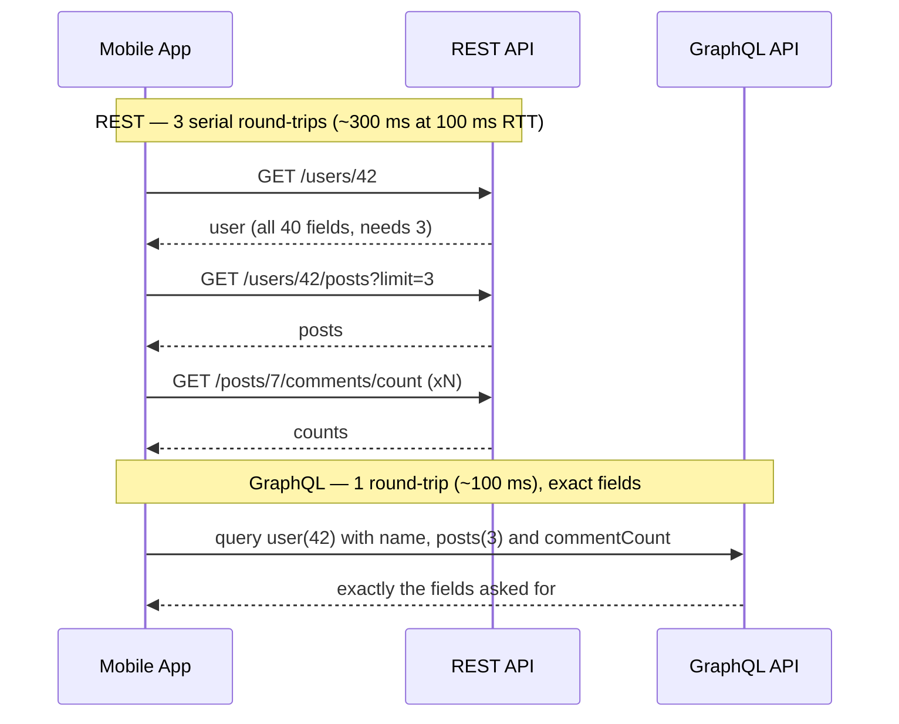

[REST](/system-design/topic/communication/api-design) is the default, but three other styles win in specific situations. Interviewers want you to **name the fit**, not to declare a favorite.

## gRPC — fast, typed, internal

**gRPC** is RPC over **HTTP/2** with **Protocol Buffers** (a compact binary IDL). You define services and messages in a `.proto`; codegen produces typed clients/servers in every language.

```protobuf
service OrderService {
  rpc GetOrder(GetOrderRequest) returns (Order);
  rpc WatchOrders(WatchRequest) returns (stream Order);  // server streaming
}
```

- **Wins:** small/fast binary payloads, HTTP/2 multiplexing, **streaming** (unary, server-, client-, bidirectional), a strict contract. Ideal for **east-west** (service-to-service) traffic.
- **Costs:** not human-readable, limited native browser support (needs a proxy/gRPC-Web), more tooling.

## GraphQL — the client picks the shape

A single endpoint where the **client specifies exactly which fields** it wants, so one round-trip returns precisely the data a screen needs.

- **Wins:** kills **over-fetching** (REST returns fixed shapes) and **under-fetching** (REST needs many calls); great for aggregating several backends behind one graph; a strongly-typed schema.
- **Costs:** **caching is harder** (one URL, POST bodies) vs REST's per-resource URLs; a naive resolver hits the **[N+1 problem](/java/topic/frameworks/jpa-and-hibernate)** (use DataLoader batching); a deep/expensive query is a **DoS vector** unless you add depth/complexity limits.

The round-trip argument, drawn. A profile screen needs a user, their 3 latest posts, and each post's comment count. On mobile (say ~100 ms RTT), REST's serial chain costs ~300 ms before rendering; GraphQL collapses it to one trip:



The server didn't get faster — the **client stopped paying serial RTTs**, and the payload shrank from three full resources to the ~dozen fields the screen renders. This is why Facebook built GraphQL for its mobile apps, and why GitHub's v4 API is GraphQL.

## Real-time — pushing to the client

HTTP is request-response; for server-initiated updates pick by directionality:

| Technique | Direction | Use when |
|--|--|--|
| **Long polling** | client pulls, held open | a simple fallback, low update rate |
| **SSE** (Server-Sent Events) | server → client (one-way) | feeds, notifications, live scores |
| **WebSockets** | full-duplex (both ways) | chat, multiplayer, collaborative editing |

## The numbers that justify each choice

| Claim | Number to quote |
|--|--|
| Protobuf beats JSON on size | Binary payloads are typically **2–10x smaller** than equivalent JSON, and cheaper to parse (no text scanning) |
| HTTP/2 multiplexing | **One TCP connection** carries many concurrent streams — no per-request connection setup, no HTTP/1.1 head-of-line queuing |
| GraphQL saves round-trips | Each avoided serial call saves **one RTT** — ~1 ms in-DC, but **50–150 ms** on mobile networks, per call |
| WebSocket memory cost | ~**tens of KB per idle connection** (buffers + TLS state) → 1M concurrent connections is on the order of **tens of GB of RAM** across your gateway fleet — a fleet-sizing input, not a rounding error |

## What breaks at scale — the follow-up questions

- **gRPC behind a load balancer:** HTTP/2 connections are long-lived, and an L4 LB balances *connections*, not requests — so one heavy client pins one backend while others idle. Real deployments use **L7/gRPC-aware balancing** (Envoy, Linkerd) or client-side load balancing with service discovery. This is a favorite senior probe.
- **GraphQL in production:** unbounded queries (`friends { friends { friends } }`) are a self-inflicted DoS — you need **depth limits, cost analysis, and persisted queries**. And each resolver hitting the DB per item is the N+1 trap; DataLoader-style batching is non-negotiable.
- **WebSockets at fleet scale:** connections are **stateful** — a deploy or scale-down disconnects everyone on that node (reconnect storms), and pushing to a user means finding *which* gateway holds their socket (a session registry + pub/sub backbone). Slack and Discord run dedicated gateway tiers for exactly this; Discord holds **millions of concurrent WebSockets** per region.
- **Where each runs in the wild:** Google's internal RPC (Stubby) became gRPC — virtually all Google-internal service calls are RPC; Netflix and Uber use gRPC for east-west traffic; Facebook and GitHub expose GraphQL at the edge; chat/collab products (Slack, Discord, Figma) live on WebSockets.

:::gotcha
"gRPC is faster, so use it everywhere" ignores the operational edges: browsers can't speak native gRPC (you need gRPC-Web or a proxy), L4 load balancers mishandle its long-lived connections, and binary payloads are opaque to curl/grep debugging. Fit, not fashion.
:::

:::senior
Decide by traffic shape: **gRPC** for internal microservice calls where latency and a tight contract matter; **GraphQL** at the edge for varied clients (mobile vs web) that need different field sets; **REST** for public, cacheable, resource-oriented APIs. For push, **SSE** if the server only needs to *send* (simpler, rides plain HTTP and auto-reconnects); **WebSockets** when the client must send too (chat, games). Naming the *cost* of each (GraphQL caching, gRPC browser story, WebSocket statefulness at the load balancer) is what signals seniority.
:::

## Check yourself

```quiz
title: API paradigms check
questions:
  - q: 'Which problem does GraphQL most directly solve versus REST?'
    options:
      - text: 'Over-fetching and under-fetching — the client requests exactly the fields it needs in one round-trip'
        correct: true
      - 'It makes responses cacheable by URL automatically'
      - 'It removes the need for a schema'
    explain: 'GraphQL lets clients specify the exact shape, avoiding fixed over/under-fetching REST responses. The trade-off is harder HTTP caching and resolver N+1 risk.'
  - q: 'Where does gRPC fit best?'
    options:
      - text: 'Internal service-to-service calls needing low latency, streaming, and a strict typed contract'
        correct: true
      - 'A public API consumed directly by browsers with no proxy'
      - 'Serving cacheable static resources'
    explain: 'gRPC (HTTP/2 + Protobuf) excels at fast, typed east-west traffic with streaming; browsers need gRPC-Web/a proxy, so it is less suited to direct public consumption.'
  - q: 'You need the server to push notifications one-way to browsers with minimal complexity. Which fits?'
    options:
      - 'WebSockets'
      - text: 'Server-Sent Events (SSE)'
        correct: true
      - 'Long polling only'
    explain: 'SSE is a one-way server→client stream over plain HTTP with automatic reconnection — simpler than WebSockets when the client does not need to send messages back.'
```

:::key
Pick the protocol by shape: **gRPC** (HTTP/2 + Protobuf) for fast, typed, streaming **internal** calls; **GraphQL** for client-driven queries that end over/under-fetching (watch caching + resolver N+1); **REST** for public cacheable resources. For server push: **SSE** one-way, **WebSockets** full-duplex, long polling as a fallback.
:::
