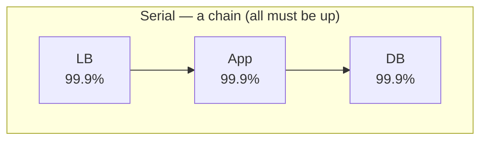
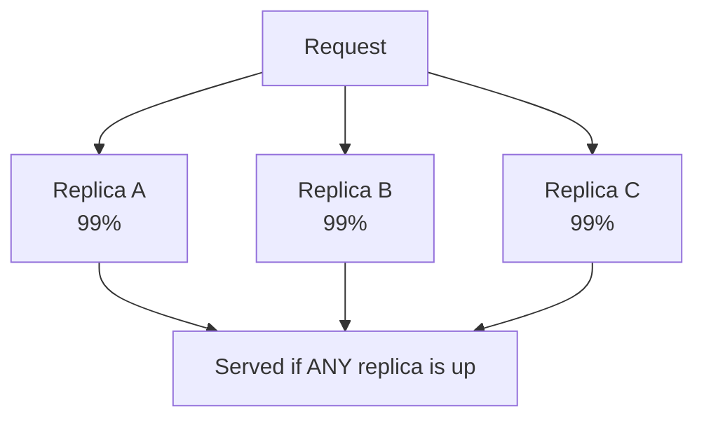

Availability is the headline number every distributed system is measured by, and the one interviewers probe first. It is simply the fraction of time a system is able to serve requests — but the way you *express* it (the "nines"), *promise* it (the SLA), and *engineer* it (redundancy) are three separate skills.

## The "nines" — what they actually cost

Availability is usually quoted as a percentage of uptime. The trap is that each extra nine is **10× harder** and buys you an order of magnitude less downtime. Memorize this table — it comes up constantly.

| Availability | Nickname | Downtime / year | Downtime / month | Downtime / day |
|--|--|--|--|--|
| 99% | "two nines" | ~3.65 days | ~7.2 hours | ~14.4 min |
| 99.9% | "three nines" | ~8.77 hours | ~43.8 min | ~1.44 min |
| 99.99% | "four nines" | ~52.6 min | ~4.38 min | ~8.6 sec |
| 99.999% | "five nines" | ~5.26 min | ~26 sec | ~0.86 sec |

:::key
Quick mental math: **99.9% ≈ 8.7 hours/year**, and every added nine divides downtime by 10. Five nines (~5 min/year) is so tight that a single bad deploy can blow the *entire annual budget* — which is exactly why manual response is impossible at that tier.
:::

The formula is just:

```text
Availability = uptime / (uptime + downtime)
             = MTBF / (MTBF + MTTR)
```

where **MTBF** = mean time between failures and **MTTR** = mean time to recovery. This reveals the key lever: you improve availability either by failing less often (raise MTBF) **or** by recovering faster (lower MTTR). In practice, **lowering MTTR is usually cheaper and more achievable** — automated failover and fast rollbacks beat chasing a perfectly bug-free system.

## SLA vs SLO vs SLI — the hierarchy

These three get used interchangeably in casual talk, but an interviewer wants the precise distinction.

| Term | Full name | What it is | Audience | Example |
|--|--|--|--|--|
| **SLI** | Service Level *Indicator* | A measured number | Engineers | "99.95% of requests succeeded this month" |
| **SLO** | Service Level *Objective* | An internal target for an SLI | Engineers / PM | "99.9% of requests succeed, measured monthly" |
| **SLA** | Service Level *Agreement* | A contract with consequences | Customers / Legal | "99.9% or we refund 10% of your bill" |

The mental model: **you measure an SLI, aim at an SLO, and promise an SLA.**

:::senior
**Always set your SLO stricter than your SLA.** If you contractually promise 99.9% (SLA) but only target 99.9% internally (SLO), you have zero buffer — the first breach costs you money. Teams typically run the SLO a fraction of a nine tighter (target 99.95%, promise 99.9%) so alerts fire *before* the contract is violated.
:::

The gap between "100%" and your SLO is your **error budget** — the amount of unreliability you are *allowed* to spend. A 99.9% SLO grants a budget of 0.1% of requests to fail. This turns an emotional argument ("ship fast" vs "stay stable") into arithmetic: budget remaining → ship features; budget exhausted → freeze and stabilize.

## Redundancy math: serial vs parallel

Here is where candidates stumble. Availability composes differently depending on whether components are in **series** (all must work) or in **parallel** (any one working suffices).



**Serial (dependency chain):** availabilities **multiply**, so the whole is *worse* than any part.

```text
A_total = A1 × A2 × A3 = 0.999 × 0.999 × 0.999 ≈ 0.997  (99.7%)
```

Three "three-nines" components in a chain drop you to 99.7% — roughly *a full day* of extra downtime per year. **More dependencies in the request path = lower availability.**



**Parallel (redundant replicas):** the system fails only if *all* replicas fail, so you multiply the **unavailabilities**:

```text
A_total = 1 − (1 − A)ⁿ
        = 1 − (1 − 0.99)³
        = 1 − (0.01)³ = 1 − 0.000001 = 0.999999  (six nines!)
```

Three cheap 99% replicas in parallel yield **six nines**. This is the single most important insight in reliability engineering: **redundancy turns mediocre components into a highly available system.**

:::gotcha
The parallel math only holds if failures are **independent**. Three replicas in the *same rack*, on the *same power supply*, or behind the *same load balancer* share a fault domain — a correlated failure takes them all down at once and the tidy `1 − (1−A)ⁿ` formula lies to you. Real redundancy spreads across availability zones and regions (next topics).
:::

## Recall

```flashcards
title: Availability essentials
cards:
  - front: 'Downtime per year at 99.9%?'
    back: '**~8.77 hours/year** (about 43 min/month).'
  - front: 'Downtime per year at 99.99%?'
    back: '**~52.6 minutes/year** (about 4.4 min/month).'
  - front: 'SLI vs SLO vs SLA?'
    back: '**SLI** = the measured number. **SLO** = the internal target. **SLA** = the customer contract with penalties.'
  - front: 'Availability formula in terms of MTBF/MTTR?'
    back: 'A = MTBF / (MTBF + MTTR). Lower MTTR (recover faster) is usually the cheapest lever.'
  - front: 'Serial availability of three 99.9% components?'
    back: 'Multiply: 0.999³ ≈ **99.7%** — worse than any single part.'
  - front: 'Parallel availability of three 99% replicas?'
    back: '1 − (1−0.99)³ = **99.9999%** — redundancy multiplies unavailabilities away.'
  - front: 'What is an error budget?'
    back: '100% − SLO. The allowed amount of failure; when spent, freeze features and stabilize.'
```

```quiz
title: Availability & SLAs check
questions:
  - q: 'A service promises **99.99%** availability. Roughly how much downtime per year is that?'
    options:
      - 'About 8.7 hours'
      - text: 'About 52 minutes'
        correct: true
      - 'About 5 minutes'
      - 'About 3.65 days'
    explain: '99.99% ("four nines") allows ~52.6 minutes of downtime per year. 8.7 hours is 99.9%, and ~5 minutes is 99.999%.'
  - q: 'Which statement correctly orders the hierarchy?'
    options:
      - 'You measure an SLA, aim at an SLI, and promise an SLO'
      - text: 'You measure an SLI, aim at an SLO, and promise an SLA'
        correct: true
      - 'SLO is the contract; SLA is the internal target'
    explain: 'SLI = Indicator (measured), SLO = Objective (internal target), SLA = Agreement (external contract with penalties).'
  - q: 'Three components each at 99.9% sit in a **serial** dependency chain. The combined availability is:'
    options:
      - 'Still 99.9% — the weakest link'
      - text: 'About 99.7% — availabilities multiply, so it drops'
        correct: true
      - 'About 99.9999% — redundancy improves it'
    explain: 'In series all must be up, so availabilities multiply: 0.999³ ≈ 0.997. Every extra dependency in the path lowers availability.'
  - q: 'Why can three replicas each at only 99% reach six nines when placed in parallel?'
    options:
      - 'Because availabilities add up'
      - text: 'The system fails only if all fail, so unavailabilities multiply: 1 − (0.01)³'
        correct: true
      - 'Because load balancers guarantee 100% uptime'
    explain: 'Parallel redundancy means all replicas must fail simultaneously. 1 − (1−0.99)³ = 0.999999 — but only if failures are independent.'
  - q: 'You have an SLA of 99.9%. What is the safest way to set your internal SLO?'
    options:
      - 'Set the SLO equal to the SLA (99.9%)'
      - text: 'Set the SLO stricter than the SLA (e.g. 99.95%) for buffer'
        correct: true
      - 'Set the SLO looser than the SLA (e.g. 99.5%)'
    explain: 'A stricter internal SLO gives you an early-warning buffer so alerts fire before the contractual SLA is breached and penalties apply.'
```

:::key
Availability = MTBF / (MTBF + MTTR). Know the nines cold (**99.9% ≈ 8.8 h/yr, 99.99% ≈ 52 min/yr**). **SLI** measured → **SLO** targeted → **SLA** promised, with the SLO set stricter for buffer and the leftover being your **error budget**. Serial dependencies **multiply availabilities** (worse); parallel replicas **multiply unavailabilities** (much better) — but only if fault domains are independent.
:::
