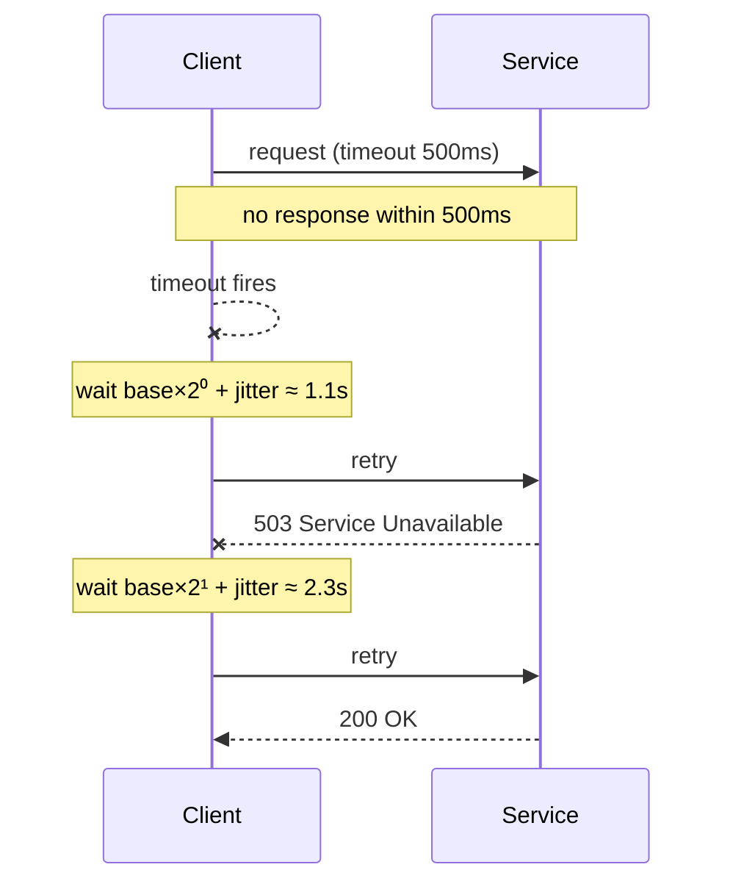
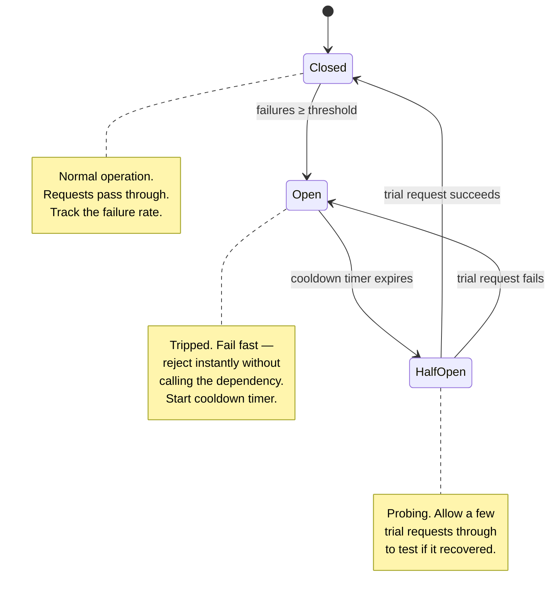
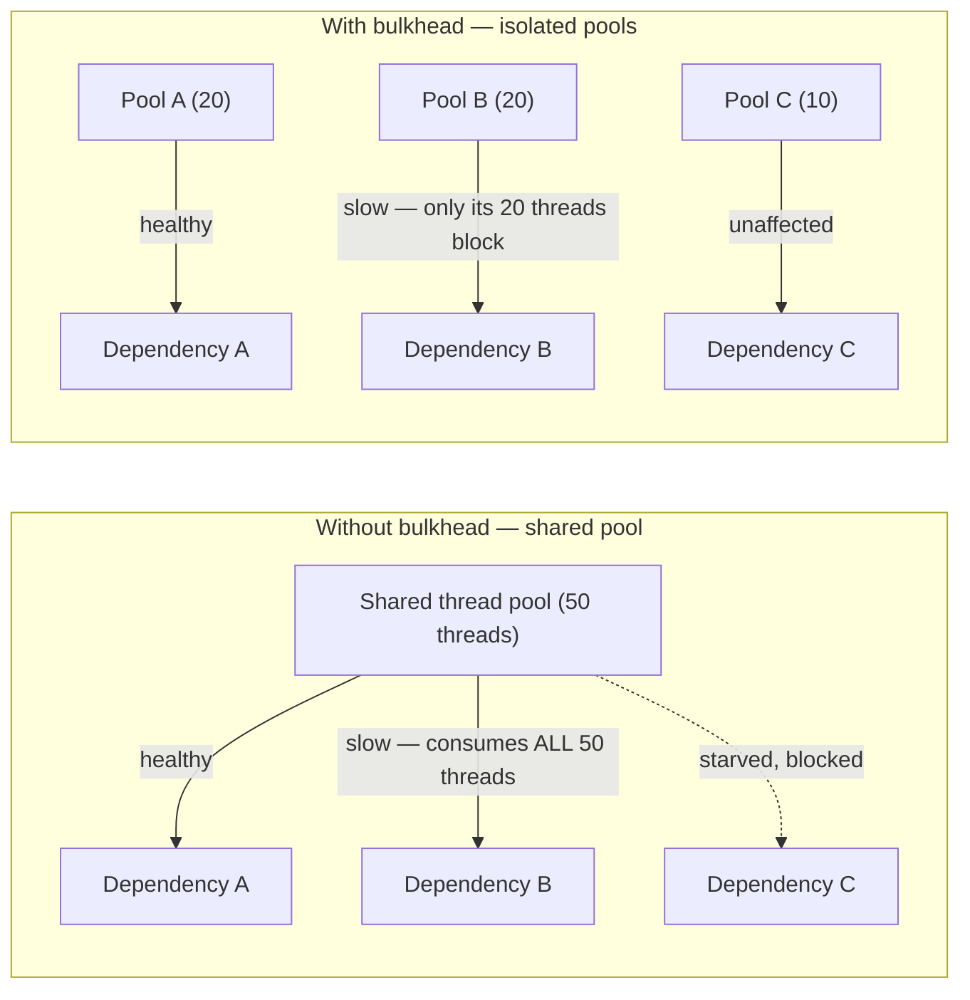

In a distributed system, dependencies *will* fail — the question is whether one failing dependency stays contained or cascades into a full outage. Fault tolerance is the set of **client-side patterns** that keep a caller healthy when a callee is sick. The circuit breaker is the centerpiece, but it only works alongside timeouts, smart retries, bulkheads, and fallbacks.

## Timeouts — the foundation

Every remote call **must** have a timeout. Without one, a hung dependency causes callers to block indefinitely, threads pile up waiting, the thread pool exhausts, and the caller dies too — an outage propagating *upstream*.

:::gotcha
The most common production incident is not a crash — it is a dependency that got **slow, not down**. Threads block on the slow call, connection pools drain, and healthy services fall over one by one. A missing or too-generous timeout is the fuse. Set timeouts based on the dependency's p99 latency, not a round guess like "30 seconds."
:::

## Retries with exponential backoff + jitter

Transient failures (a blip, a brief network hiccup) deserve a retry. But naive retries are dangerous: they *amplify* load exactly when a service is already struggling.

- **Exponential backoff** — wait longer between each attempt: `1s, 2s, 4s, 8s…`. This gives the struggling dependency room to recover instead of hammering it.
- **Jitter** — add randomness to each delay. Without jitter, all clients that failed at the same instant retry at the same instant, creating a **thundering herd** of synchronized spikes.

```text
attempt n delay  =  random(0, base × 2ⁿ)      // "full jitter"
```



:::warning
Only retry **idempotent** operations, or operations protected by an idempotency key. Blindly retrying a non-idempotent `POST /charge` can double-charge a customer. Also cap retries (e.g. 3 attempts) and pair them with a circuit breaker — otherwise retries keep pounding a dead dependency.
:::

## The circuit breaker — the centerpiece

Retries help with *transient* faults. But when a dependency is genuinely down, continuing to send (and retry) requests is pointless: every call wastes a timeout, ties up a thread, and delays the caller. The **circuit breaker** wraps the call and, after enough failures, "trips" — it stops calling the dependency entirely and **fails fast** for a cooldown period, giving the dependency time to recover.

It is a three-state machine, modeled exactly on an electrical breaker:



| State | Behavior | Transition |
|--|--|--|
| **CLOSED** | Requests flow normally; failures are counted | → OPEN when failure rate crosses the threshold |
| **OPEN** | Reject *instantly* (fail fast); do not call the dependency | → HALF-OPEN after the cooldown timer expires |
| **HALF-OPEN** | Let a limited number of trial requests through | → CLOSED if they succeed, → OPEN if any fail |

Why this matters: in the OPEN state the caller returns an error (or a fallback) in **microseconds** instead of waiting for a timeout on every request. This **protects the caller's threads** and gives the dependency breathing room — the breaker prevents a slow dependency from becoming *your* outage.

:::senior
The circuit breaker's real job is **latency insulation**, not just error handling. When a downstream is timing out, the expensive part is the *wait*. By tripping OPEN and failing fast, you convert slow timeouts (500ms each, threads held) into instant rejections (microseconds, threads freed). The HALF-OPEN state is the clever bit — it auto-recovers with a single probe rather than blindly slamming the recovering service with full traffic.
:::

## Bulkheads — isolate the blast radius

Named after a ship's watertight compartments: if one floods, the others keep the ship afloat. In software, you give each dependency its **own** resource pool (thread pool or connection pool) so that one saturated dependency cannot consume *all* the caller's threads.



Without bulkheads, slow Dependency B can grab every thread in the shared pool and starve A and C. With bulkheads, B can only exhaust *its own* compartment.

## Fallbacks — degrade, don't fail

When a call fails (or the breaker is open), a **fallback** returns a degraded-but-useful response instead of an error: a cached/stale value, a default, an empty result, or a simplified feature. A product page that shows "recommendations unavailable" is far better than a 500 for the whole page. (Explored fully in *Graceful Degradation*.)

## How they compose

These patterns are layers, not alternatives — a robust remote call uses them together:

```text
Bulkhead  →  Circuit Breaker  →  Timeout  →  Retry(backoff+jitter)  →  Fallback
(isolate)    (fail fast)         (bound)      (survive transients)      (degrade)
```

```quiz
title: Fault tolerance check
questions:
  - q: 'A circuit breaker is in the **OPEN** state. What does a new request do?'
    options:
      - 'Wait for the normal timeout, then return the error'
      - text: 'Fail fast immediately without calling the dependency'
        correct: true
      - 'Retry with exponential backoff until it succeeds'
    explain: 'OPEN means the breaker has tripped: it rejects instantly (fails fast) without touching the dependency, protecting the caller''s threads and giving the dependency time to recover.'
  - q: 'What is the purpose of the **HALF-OPEN** state?'
    options:
      - 'To count failures during normal operation'
      - text: 'To let a few trial requests through to test whether the dependency recovered'
        correct: true
      - 'To permanently disable the failing dependency'
    explain: 'After the cooldown, HALF-OPEN allows limited probe traffic. Success → CLOSED (resume normal), failure → back to OPEN (keep waiting).'
  - q: 'Why add **jitter** to exponential backoff?'
    options:
      - 'To make retries happen faster'
      - text: 'To desynchronize clients so they do not all retry at the same instant (thundering herd)'
        correct: true
      - 'To guarantee the request eventually succeeds'
    explain: 'Without jitter, clients that failed together retry together, creating synchronized load spikes. Randomizing the delay spreads retries out.'
  - q: 'Why must every remote call have a **timeout**?'
    options:
      - 'To reduce network bandwidth'
      - text: 'A dependency that hangs (slow, not down) blocks threads until the pool exhausts and the caller fails too'
        correct: true
      - 'Because HTTP requires it'
    explain: 'The classic cascading failure: a slow dependency holds threads, the pool drains, and the outage propagates upstream. A timeout bounds the wait and is the fuse that prevents this.'
  - q: 'What problem does the **bulkhead** pattern solve?'
    options:
      - 'It encrypts traffic between services'
      - text: 'It isolates each dependency in its own resource pool so one slow dependency cannot starve the others'
        correct: true
      - 'It retries failed requests automatically'
    explain: 'Like watertight ship compartments, per-dependency pools cap the blast radius: a saturated dependency exhausts only its own pool, not the shared one.'
  - q: 'Which operations are safe to retry automatically?'
    options:
      - 'Any operation — retries never cause harm'
      - text: 'Idempotent operations (or those guarded by an idempotency key)'
        correct: true
      - 'Only read operations, never anything else'
    explain: 'Retrying a non-idempotent write (e.g. a charge) can duplicate the effect. Retry only idempotent operations or those protected by an idempotency key.'
```

:::key
Compose the layers: **timeouts** bound every call, **retries with exponential backoff + jitter** survive transient blips (idempotent only), the **circuit breaker** (CLOSED → OPEN → HALF-OPEN) fails fast when a dependency is truly down to insulate the caller from latency, **bulkheads** cap the blast radius with isolated pools, and **fallbacks** degrade gracefully instead of erroring. The circuit breaker is the centerpiece — know its three states cold.
:::
