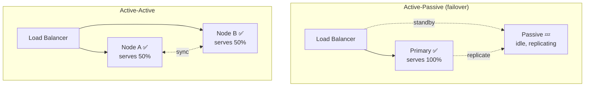
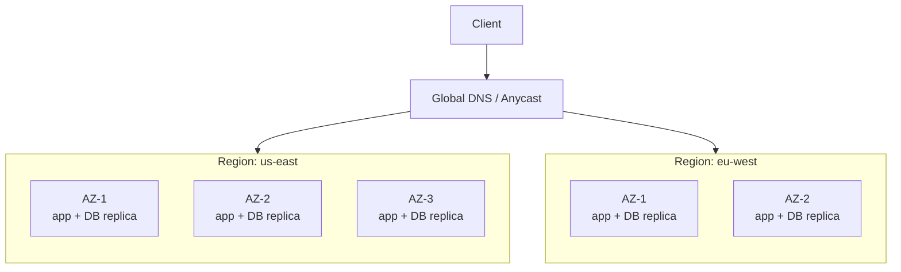
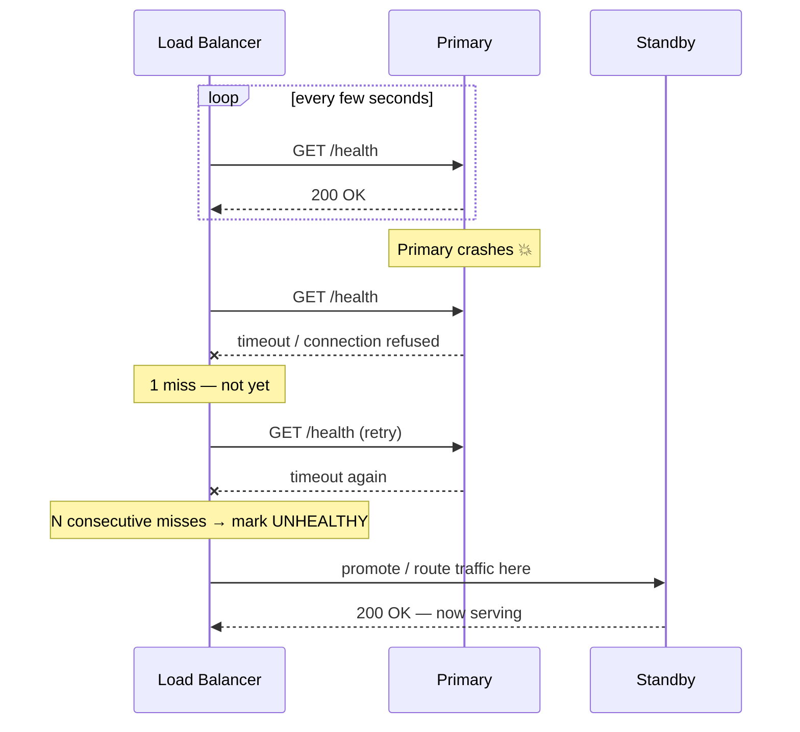

The previous topics covered *client-side* resilience. Redundancy is the *infrastructure* side: run more than one of everything so the failure of any single component is survivable. But "add a replica" hides real trade-offs — how the standby is kept warm, how failure is *detected*, and how big a fault domain you protect against.

## Active-Passive vs Active-Active

The two fundamental redundancy topologies differ in whether the backup serves traffic.



| Dimension | Active-Passive | Active-Active |
|--|--|--|
| Standby role | Idle, on hot/warm standby | Also serving live traffic |
| Resource use | ~50% wasted (passive idle) | Full utilization of all nodes |
| Failover | Promote passive → primary (some delay) | Just stop routing to the dead node |
| Capacity after failure | Full (standby was unused) | **Reduced** — survivors absorb the load |
| Complexity | Simpler; one writer avoids conflicts | Harder — concurrent writes risk conflicts |
| Typical use | Relational primaries, stateful stores | Stateless web/app tiers, global reads |

:::senior
The subtle active-active trap is **capacity planning**. If two active nodes each run at 60% and one dies, the survivor needs to handle 120% — and falls over, cascading. Active-active must be provisioned so that **N−1 nodes can carry 100% of peak load** (the "N+1" rule). Active-passive sidesteps this because the standby was always spare capacity.
:::

## Fault domains: multi-AZ and multi-region

Redundancy only helps against failures the replicas *don't share*. The scope of protection is the **fault domain** you span.



| Scope | Protects against | Cost | Latency between |
|--|--|--|--|
| **Multi-AZ** (zones in one region) | Rack, power, cooling, single-datacenter loss | Low — synchronous replication is feasible | ~1–2 ms; can replicate synchronously |
| **Multi-region** (geographically apart) | Whole-region outage, natural disaster | High — data gravity, cross-region latency | ~tens–hundreds of ms; usually async |

The critical wrinkle: **cross-region replication is asynchronous** because synchronous replication over 100 ms would cripple write latency. That async gap means a region failover can **lose the last few seconds of writes** (a non-zero RPO) — an availability/consistency trade-off you must call out.

:::note
Two failover metrics quantify the goal. **RTO** (Recovery Time Objective) = how long recovery may take. **RPO** (Recovery Point Objective) = how much *data* you may lose (measured in time). Multi-AZ with sync replication → near-zero RPO. Multi-region with async replication → RPO of seconds. Active-active multi-region → near-zero RTO because both sides are already live.
:::

## Health checks drive automatic failover

Redundancy is useless if nothing *detects* the failure and reroutes. Health checks are the sensor; the load balancer or DNS is the actuator.



Key design points that interviewers reward:

- **Shallow vs deep checks.** A shallow check (`/health` returns 200) proves the process is alive. A **deep check** verifies dependencies (DB reachable, disk not full). Deep checks catch more, but be careful — a flaky dependency can mark *every* node unhealthy at once and take down the whole fleet.
- **Failure threshold + hysteresis.** Require **N consecutive** failures before ejecting a node (and M successes before re-adding it). This avoids flapping — thrashing a node in and out on a single blip.
- **Avoid the "split-brain" trap.** In active-passive, if the passive wrongly believes the primary is dead and *both* start accepting writes, you corrupt data. A **quorum / consensus** mechanism (or a fencing token / STONITH) ensures exactly one primary.

:::gotcha
Automatic failover can be *worse* than the failure it fixes if it flaps or splits the brain. A too-sensitive health check + auto-promotion can ping-pong the primary role and corrupt data. Real systems pair health checks with a consensus store (etcd, ZooKeeper) to elect a single leader, and add a threshold so transient blips don't trigger a failover.
:::

```quiz
title: Redundancy & failover check
questions:
  - q: 'In an **active-active** pair where each node normally runs at 60% CPU, what happens when one node dies?'
    options:
      - 'Nothing — the survivor easily absorbs it'
      - text: 'The survivor must handle ~120% and can be overwhelmed unless provisioned for N−1'
        correct: true
      - 'The system automatically spins up two new nodes instantly'
    explain: 'Active-active must be capacity-planned so N−1 nodes carry full peak load. Two nodes at 60% each means 120% lands on one survivor — a cascade risk.'
  - q: 'What is the main reason cross-**region** replication is usually asynchronous?'
    options:
      - 'Regulations forbid synchronous replication'
      - text: 'Synchronous replication over ~100 ms of latency would cripple write performance'
        correct: true
      - 'Async replication guarantees zero data loss'
    explain: 'Waiting for an ack across the globe adds huge latency to every write, so cross-region replication is async — which means a region failover can lose the last few seconds (non-zero RPO).'
  - q: 'Why require **N consecutive** health-check failures before ejecting a node?'
    options:
      - 'To save bandwidth on health checks'
      - text: 'To avoid flapping — thrashing a node in and out on a single transient blip'
        correct: true
      - 'Because one check is not allowed by TCP'
    explain: 'A threshold (with hysteresis on recovery) prevents a momentary blip from repeatedly ejecting and re-adding a healthy node.'
  - q: 'Which pair correctly matches the metric to its meaning?'
    options:
      - 'RTO = data you can lose; RPO = time to recover'
      - text: 'RTO = time to recover; RPO = data (in time) you can lose'
        correct: true
      - 'RTO and RPO both measure request latency'
    explain: 'RTO (Recovery Time Objective) bounds downtime; RPO (Recovery Point Objective) bounds data loss, expressed as a span of time (e.g. "up to 5 seconds of writes").'
  - q: 'What is "split-brain" and why is it dangerous in active-passive failover?'
    options:
      - 'The load balancer runs out of memory'
      - text: 'Both primary and passive believe they are the leader and accept writes, corrupting data'
        correct: true
      - 'A health check returns 200 when the service is actually down'
    explain: 'If the passive wrongly promotes itself while the primary is still alive, two writers diverge and corrupt data. A quorum/consensus or fencing mechanism ensures exactly one leader.'
```

:::key
**Active-passive** = simple, standby idle, full capacity after failover (great for stateful primaries). **Active-active** = full utilization but must be provisioned for **N−1** to survive a node loss. Span the right **fault domain**: multi-AZ (cheap, sync, near-zero RPO) vs multi-region (survives whole-region loss, async, seconds of RPO). **Health checks + a failure threshold + consensus** drive automatic failover while avoiding flapping and split-brain.
:::
