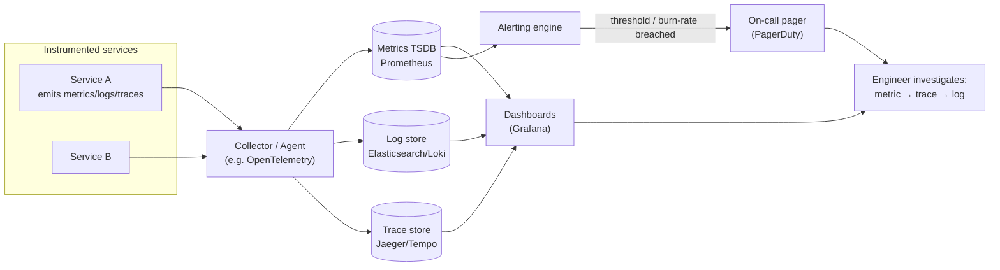
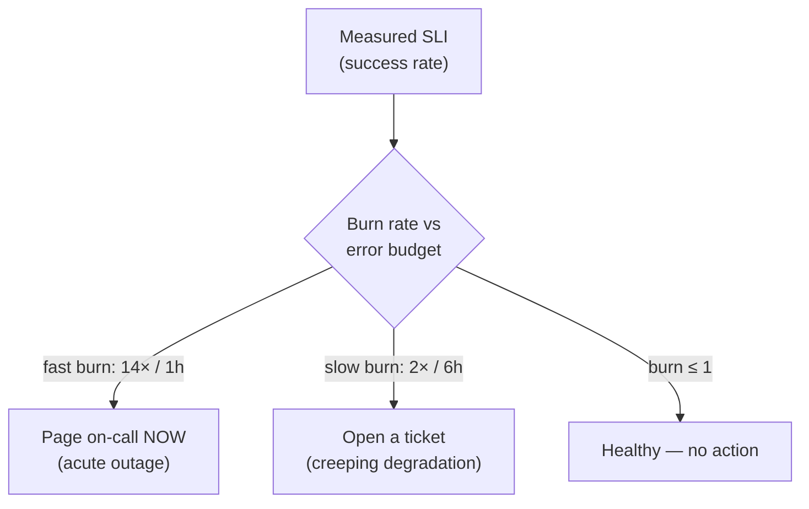

You cannot operate what you cannot see. **Monitoring** tells you *whether* the system is healthy (known questions, predefined dashboards). **Observability** is the stronger property: enough signal to ask *new* questions and debug problems you didn't anticipate. In interviews, "how would you know it's broken, and how would you debug it?" is the observability question — and the answer is built on three pillars.

## The three pillars

| Pillar | Answers | Data shape | Cost / cardinality | Example |
|--|--|--|--|--|
| **Metrics** | *Is something wrong?* | Numeric time-series, aggregated | Cheap, low cardinality | `http_requests_total`, p99 latency, CPU% |
| **Logs** | *What exactly happened?* | Timestamped discrete events | Expensive at volume | `ERROR order 123 failed: timeout` |
| **Traces** | *Where in the request path?* | Causal spans across services | Medium; sample to control cost | Request → API → auth → DB, 40 ms in DB |

The mental model of how you use them together: **metrics tell you *that* something is wrong, traces tell you *where*, and logs tell you *why*.** A latency spike (metric) → drill into a slow trace to find the guilty service → read that service's logs for the exact error.

:::note
**Cardinality** is the observability budget killer. A metric label like `user_id` explodes into millions of time-series and bankrupts your metrics backend. Keep metric labels low-cardinality (region, endpoint, status code); push high-cardinality detail (user IDs, request IDs) into **logs and traces** instead.
:::

## The observability pipeline

Signals flow from instrumented services through collection and storage to the humans (and alerts) that act on them.



A **correlation ID** (trace ID) threaded through every hop is what stitches the three pillars together — the same ID appears on the metric exemplar, the trace, and every log line, so you can pivot between them for a single request.

## Alerting: symptoms, not causes

The cardinal rule: **alert on symptoms the user feels, not on internal causes.** High CPU is not (by itself) worth waking someone — users don't feel CPU, they feel *slow* or *errors*. Google's **four golden signals** are the canonical symptom set to watch:

| Signal | Question | Typical metric |
|--|--|--|
| **Latency** | Are responses slow? | p50 / p99 request duration |
| **Traffic** | How much demand? | requests/sec, QPS |
| **Errors** | Are requests failing? | 5xx rate, error % |
| **Saturation** | How full is the system? | queue depth, CPU/mem headroom |

:::gotcha
The fastest way to make on-call quit is **alert fatigue** — a flood of noisy, non-actionable pages. Every alert should be *actionable* (a human must do something) and *symptom-based*. Alerting on causes (high CPU, a full disk that auto-rotates) generates pages nobody acts on, and real incidents get lost in the noise.
:::

## SLO burn-rate alerting

Recall the **error budget** from *Availability & SLAs* (100% − SLO). The modern approach is to alert on how *fast* you are spending it — the **burn rate** — rather than on raw thresholds.

- **Burn rate = 1** means you're consuming the budget exactly on pace to spend it all by period's end. Fine.
- **Burn rate = 10** means you'll exhaust a 30-day budget in 3 days. That is a page-now emergency.

This gives **multi-window, multi-burn-rate** alerts: a fast burn (e.g. 14× over 1 hour) pages immediately for acute outages, while a slow burn (e.g. 2× over 6 hours) opens a ticket for a creeping degradation. The payoff: alerts fire in proportion to **user-facing impact**, catching problems *before* the SLA is breached without paging on every transient blip.



```quiz
title: Observability check
questions:
  - q: 'Which pillar best answers "**where** in the request path did the slowdown happen"?'
    options:
      - 'Metrics'
      - text: 'Traces'
        correct: true
      - 'Logs'
    explain: 'Traces follow a request as causal spans across services, pinpointing which hop was slow. Metrics tell you *that* something is wrong; logs tell you *why*.'
  - q: 'Why should you avoid a metric label like `user_id`?'
    options:
      - 'It is a privacy violation in all cases'
      - text: 'It explodes cardinality — millions of time-series — and overwhelms the metrics backend'
        correct: true
      - 'Metrics cannot store strings'
    explain: 'High-cardinality labels create a separate time-series per value. Keep metrics low-cardinality; put per-user/per-request detail in logs and traces.'
  - q: 'According to the "alert on symptoms" principle, which is the **best** thing to page on?'
    options:
      - 'A single server''s CPU is at 90%'
      - text: 'User-facing 5xx error rate has spiked above the SLO'
        correct: true
      - 'A disk is 70% full (and auto-rotates)'
    explain: 'Alert on symptoms users feel (errors, latency), not internal causes. High CPU or a self-managing disk are rarely actionable and cause alert fatigue.'
  - q: 'A **burn rate of 10** against a 30-day error budget means:'
    options:
      - 'You are consuming the budget exactly on schedule'
      - text: 'You will exhaust the entire 30-day budget in about 3 days — an urgent problem'
        correct: true
      - 'Your SLO has already been met for the month'
    explain: 'Burn rate is the multiple of the normal consumption pace. 10× means a 30-day budget is gone in 3 days, warranting an immediate page.'
  - q: 'What ties a metric spike, a trace, and the relevant log lines together for one request?'
    options:
      - 'They share the same server IP'
      - text: 'A correlation / trace ID propagated through every hop'
        correct: true
      - 'They all use the same database'
    explain: 'A correlation ID threaded across all services appears on the metric exemplar, the trace, and each log line, letting you pivot between the three pillars for a single request.'
```

:::key
Three pillars: **metrics** (is it wrong? — cheap, low-cardinality), **traces** (where? — causal spans), **logs** (why? — detailed events), stitched by a **correlation ID**. Alert on **symptoms** (the four golden signals: latency, traffic, errors, saturation), never on non-actionable causes, to avoid alert fatigue. Use **SLO burn-rate** alerts (multi-window) so paging is proportional to user impact and fires before the SLA breaks.
:::
