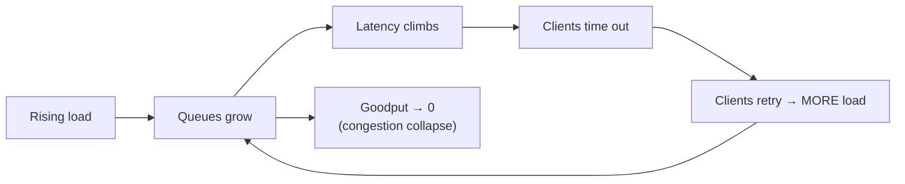

Every system has a breaking point. When demand exceeds capacity, you have two choices: collapse entirely (everyone gets errors, often after a long timeout), or **degrade gracefully** — shed the least-important work and keep the core functioning. Graceful degradation is the discipline of designing the *failure mode* so that overload produces a smaller, controlled loss instead of a total outage.

## The overload cliff — why systems collapse

Under overload, an unprotected system doesn't slow down gracefully; it falls off a cliff. Requests queue, latency climbs, timeouts fire, clients retry (adding *more* load), queues grow unbounded, memory fills — and **goodput** (useful work completed) collapses toward zero even as the system is maxed out doing useless work.



The fix is to *refuse* work you can't complete, quickly and deliberately. Three tools do this: backpressure, load shedding, and feature-flagged degradation.

## Backpressure — push back upstream

**Backpressure** is a signal that flows *against* the direction of data: a busy downstream tells its upstream "slow down, I'm full." Instead of silently buffering an unbounded queue (which just delays and amplifies the collapse), the system propagates the limit.

- **Bounded queues** — a full queue rejects (or blocks) new work rather than growing forever.
- **Explicit signals** — `HTTP 429 Too Many Requests` (with `Retry-After`), gRPC flow control, or reactive-stream request-n semantics.
- **Rate limiting** — the upstream form of backpressure: cap the request rate at the edge before it ever reaches an overloaded core.

:::senior
Backpressure vs load shedding is the key distinction. **Backpressure** asks the *sender* to slow down (cooperative, preserves the request for later). **Load shedding** *drops* the request outright at the server (unilateral, the request is gone). Backpressure is preferable when the sender can wait; load shedding is the last resort when you must protect the core *right now* regardless of what senders do.
:::

## Load shedding — drop the low-value work first

When you're past the point of politely asking, you **shed load**: proactively reject a fraction of requests so the accepted ones still succeed. The art is *what* to drop.

- **Priority-aware.** Drop low-priority work first — background jobs, prefetches, retries, analytics beacons — and protect user-facing, revenue-critical, and already-in-flight requests.
- **Fail fast.** A shed request should be rejected *instantly* (a cheap `503`), not after holding a thread through a timeout — the whole point is to free capacity.
- **Admission control.** Reject at the front door based on a health signal (queue depth, latency, CPU) so overload never reaches the expensive core.

## Graceful degradation — shed *features*, not just requests

Beyond dropping whole requests, you can serve a *reduced* response. The service stays up; the non-essential parts switch off.

```mermaid
sequenceDiagram
  participant U as User
  participant P as Product Page
  participant Rec as Recommendations svc
  participant Cat as Catalog svc (core)
  U->>P: view product
  P->>Cat: get product details
  Cat-->>P: details ✅ (core path always served)
  P->>Rec: get "you may also like"
  Note over Rec: overloaded / breaker OPEN
  Rec--xP: fails fast
  P-->>U: full page, recs section hidden/cached
  Note over U: core purchase flow intact; only the extra is gone
```

Classic degradation moves: serve **stale cache** instead of a fresh (failing) read, drop **personalization** and show generic content, disable **non-critical features** (recommendations, related items), reduce **fidelity** (lower-res images, fewer results), or return a **static fallback** page.

## Feature flags — the operational kill switch

Feature flags decouple *deploy* from *release* and give operators a runtime lever to degrade **without a deploy**. When a subsystem melts down at 3 a.m., flipping a flag to disable it is faster and safer than shipping a hotfix.

- **Kill switches** — instantly turn off an expensive or misbehaving feature under load.
- **Load-based auto-degradation** — a flag driven by a health metric that sheds features as saturation rises.
- **Gradual rollout** — ramp a risky feature to 1% → 10% → 100%, watching the golden signals, so a bad change has a tiny blast radius.

:::gotcha
Degradation must be **tested and rehearsed**, not assumed. A fallback path that has never run is itself untested code — it may throw, or hammer the very dependency it's supposed to relieve. And the stale-cache fallback only works if the cache is populated *before* the outage. Practice with load tests and chaos experiments so the degraded mode actually works when you need it.
:::

```quiz
title: Graceful degradation check
questions:
  - q: 'What is the core difference between **backpressure** and **load shedding**?'
    options:
      - 'They are two names for the same technique'
      - text: 'Backpressure asks the sender to slow down; load shedding drops the request at the server'
        correct: true
      - 'Backpressure drops requests; load shedding buffers them forever'
    explain: 'Backpressure is a cooperative "slow down" signal to the upstream (request preserved). Load shedding unilaterally drops requests at the server to protect the core.'
  - q: 'When shedding load, which requests should you drop **first**?'
    options:
      - 'Requests already in flight'
      - text: 'Low-priority work: background jobs, prefetches, retries, analytics'
        correct: true
      - 'User-facing, revenue-critical requests'
    explain: 'Shed the least valuable work first and protect user-facing/critical and in-flight requests, so accepted requests still succeed.'
  - q: 'A product page''s recommendation service is overloaded. What is graceful degradation?'
    options:
      - 'Return a 500 error for the whole page'
      - text: 'Serve the page with the core details and hide/stub the recommendations section'
        correct: true
      - 'Retry the recommendation call until it succeeds'
    explain: 'Degradation keeps the core (product details, purchase) working and drops the non-essential feature, rather than failing the whole page.'
  - q: 'Why is a shed request rejected with a cheap, immediate `503` rather than after a timeout?'
    options:
      - 'To comply with the HTTP spec'
      - text: 'Failing fast frees capacity immediately; holding a thread through a timeout defeats the purpose'
        correct: true
      - 'A 503 is retried automatically by all clients'
    explain: 'The point of shedding is to reclaim capacity. A request held for a full timeout still consumes a thread, so shed requests must fail fast.'
  - q: 'What operational advantage do **feature flags** give during an incident?'
    options:
      - 'They make the code run faster'
      - text: 'They let operators disable a misbehaving feature at runtime without a deploy'
        correct: true
      - 'They automatically fix the failing dependency'
    explain: 'Flags decouple release from deploy, so a kill switch can shed an expensive feature instantly at 3 a.m. — far faster and safer than shipping a hotfix.'
  - q: 'Why does an "unbounded queue" make overload **worse**, not better?'
    options:
      - 'Queues are always slower than direct calls'
      - text: 'It keeps accepting work it can never complete in time, so latency and memory grow until goodput collapses'
        correct: true
      - 'Queues cannot be monitored'
    explain: 'An unbounded queue delays and amplifies collapse: requests time out anyway, clients retry, and the queue grows without bound. Bounded queues + backpressure refuse excess work early.'
```

:::key
Under overload, refuse work deliberately instead of collapsing. **Backpressure** (bounded queues, `429`, rate limits) tells senders to slow down; **load shedding** drops low-priority requests fast to protect the core; **graceful degradation** serves a reduced response (stale cache, no personalization, disabled non-critical features) so the core stays alive; and **feature flags** are the runtime kill switch to degrade without a deploy. Rehearse the degraded path — an untested fallback is not a fallback.
:::
