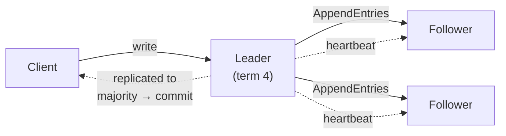
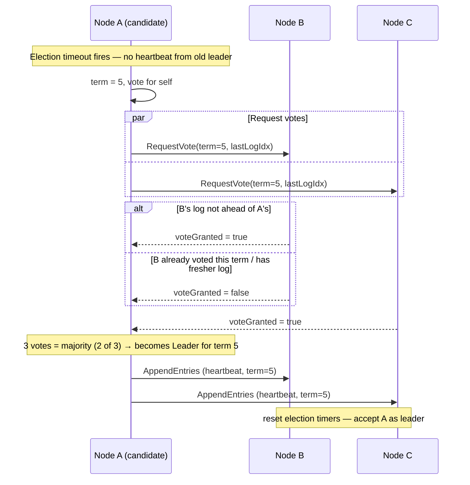
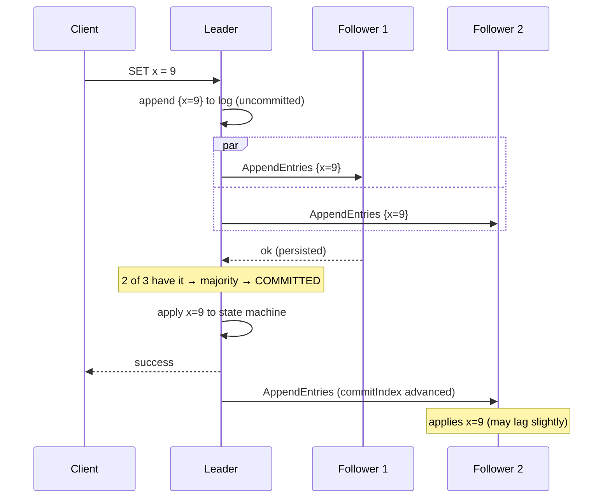

**Consensus** is the problem of getting a set of unreliable machines to agree on a single
value — the next log entry, who the leader is, whether a transaction committed. It sounds easy
until you remember the machines can crash, restart, and the network can drop, delay, or reorder
messages. Almost every "reliable" system you know (ZooKeeper, etcd, Kafka's controller,
Spanner) has a consensus algorithm at its heart.

## Why agreement is hard

In one process, "agree on X" is an assignment. Across a network it fights three enemies at once:

| Enemy | What goes wrong |
|--|--|
| **Crashes** | A node that had the answer dies before telling anyone |
| **Message loss / delay** | You cannot tell a *slow* node from a *dead* one — no timeout is ever "correct" |
| **Split brain** | A network partition leaves two halves each thinking they are in charge |

:::key
The **FLP result** proves that in a fully asynchronous network with even one crash, no algorithm
can *guarantee* consensus in bounded time. Real systems dodge this by adding **timeouts** (a
failure detector) and settling for "terminates *almost always*, is *always* correct." Safety is
never sacrificed; only liveness is best-effort.
:::

## The idea: one leader, a replicated log

Modern consensus (Raft, Multi-Paxos) reduces the problem to two jobs: **elect one leader**, then
have that leader **replicate an ordered log** to the followers. All writes flow through the
leader, so within a term there is a single source of truth.



### Leader election (Raft)

Time is divided into **terms**, each with at most one leader. A follower that stops hearing
heartbeats suspects the leader is dead, becomes a **candidate**, bumps the term, and asks for
votes. A node grants **one vote per term**, so only a candidate that reaches a **majority** wins —
which mathematically prevents two leaders in the same term.



:::note
Election timeouts are **randomized** (e.g. 150–300 ms) so nodes rarely time out at the same
instant. This breaks split votes — one node almost always goes first and wins before the others
wake up.
:::

### Log replication & commit

The leader appends a client command to its log and sends `AppendEntries` to followers. Once a
**majority** have persisted the entry, the leader marks it **committed**, applies it to its state
machine, and tells followers to do the same. A leader never commits an entry from a *previous*
term until it has committed one from its own — a subtle rule that closes a real safety hole.



## Raft vs Paxos (at a concept level)

````tabs
tabs:
  - label: Raft
    body: |
      Designed for **understandability**. One strong leader; followers are passive. State is
      explicit: `Follower → Candidate → Leader`. Log entries only ever flow **leader → follower**,
      never backwards, which makes reasoning (and debugging) tractable.

      Used by **etcd, Consul, CockroachDB, TiKV**.
  - label: Paxos
    body: |
      The original (Lamport, 1998) and provably correct, but famously hard to follow. Basic
      Paxos agrees on **one** value via *prepare/promise* then *accept/accepted* phases.
      **Multi-Paxos** adds a stable leader to agree on a *sequence* — converging on the same
      shape as Raft.

      Used (in variants) by **Google Chubby, Spanner, Cassandra's LWT**.
````

:::senior
In an interview, don't recite Raft line-by-line. Say: *"I'd use a consensus system — etcd or
ZooKeeper — for leader election and config, because it gives me linearizable, majority-committed
agreement so I never get split brain."* Naming the **guarantee** and **why** beats reciting the
protocol.
:::

## Quorums: the W + R > N rule

Quorum-based systems (Dynamo, Cassandra) skip a single leader and instead require **overlapping
majorities**. With `N` replicas, a write must be acked by `W` and a read must consult `R`. If

> **W + R > N**

then **every read set overlaps every write set by at least one node** — so a read is guaranteed
to see the latest acknowledged write.

| Config (N=3) | W | R | Guarantee | Feel |
|--|--|--|--|--|
| Strong read | 2 | 2 | `W+R=4 > 3` → strongly consistent | balanced |
| Write-optimized | 1 | 3 | overlaps, but writes fragile | fast writes, slow reads |
| Read-optimized | 3 | 1 | fast reads, but any node down blocks writes | fast reads |
| Fast & loose | 1 | 1 | `2 < 3` → **may read stale** | AP / eventual |

:::gotcha
`W + R > N` gives you *read-your-writes* overlap, **not** full linearizability — concurrent writes
can still conflict and need resolution (last-writer-wins by timestamp, or version vectors). It is
a consistency *floor*, not a total order. Also: choosing `W = N` means a **single** node failure
blocks all writes — quorums trade availability for consistency.
:::

## Check yourself

```quiz
title: Consensus check
questions:
  - q: 'In a 5-node Raft cluster, how many nodes must acknowledge a write before it is committed?'
    options:
      - 'All 5'
      - text: '3 (a majority)'
        correct: true
      - '2'
      - '1 (just the leader)'
    explain: 'Raft commits once a majority — floor(N/2)+1 = 3 of 5 — have persisted the entry. This tolerates the loss of up to 2 nodes while preserving a majority overlap.'
  - q: 'Why are Raft election timeouts randomized?'
    options:
      - 'To make the code simpler'
      - text: 'To avoid split votes — nodes rarely time out simultaneously, so one candidate usually wins first'
        correct: true
      - 'To reduce network bandwidth'
      - 'Because clocks are never synchronized'
    explain: 'If every follower timed out at once they would all become candidates and split the vote, forcing repeated elections. Randomized timeouts stagger them so one node requests votes first and reaches a majority.'
  - q: 'With N = 3 replicas and W = 2, what value of R guarantees a read sees the latest write?'
    options:
      - 'R = 1'
      - text: 'R = 2'
        correct: true
      - 'R = 0'
    explain: 'You need W + R > N, i.e. 2 + R > 3, so R must be at least 2. Then any read set of 2 overlaps any write set of 2 in at least one node.'
  - q: 'What does the FLP impossibility result tell us about consensus?'
    options:
      - 'Consensus is impossible on real networks, so systems fake it'
      - text: 'In a fully async network with even one crash, no algorithm can guarantee termination in bounded time — so real systems add timeouts and give up guaranteed liveness, never safety'
        correct: true
      - 'Consensus requires an odd number of nodes'
    explain: 'FLP is about liveness under pure asynchrony. Practical systems use timeouts (failure detectors) to make progress almost always, while never violating safety.'
```

:::key
Consensus = many unreliable nodes agreeing on one ordered history. **Raft/Paxos** elect a single
leader and replicate a log, committing once a **majority** acks — which prevents split brain.
Leaderless **quorum** systems use **W + R > N** so read and write sets overlap. Know the guarantee
(*majority overlap, no bounded-time promise*), not the pseudocode.
:::
