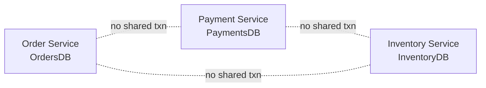
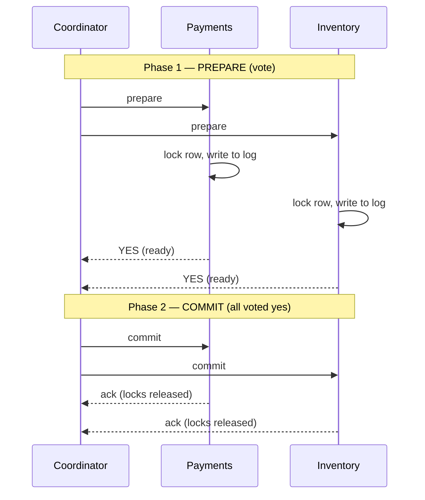
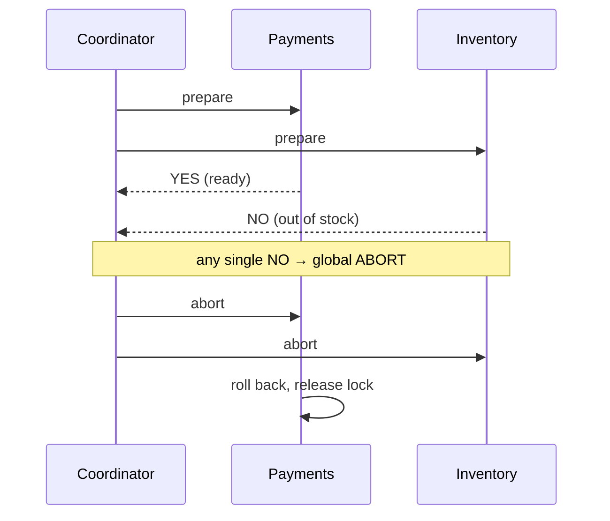
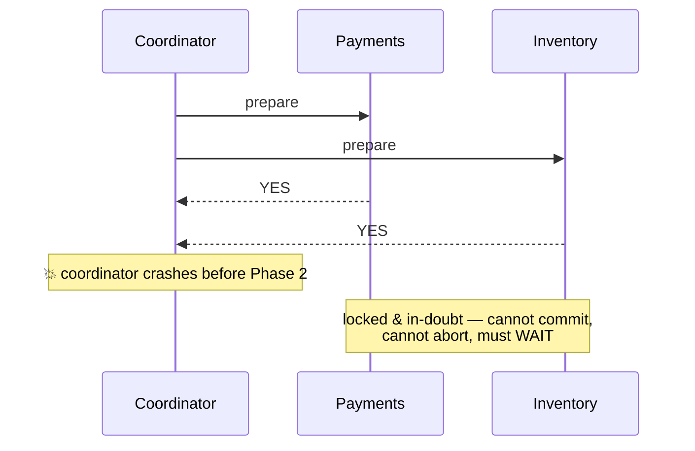
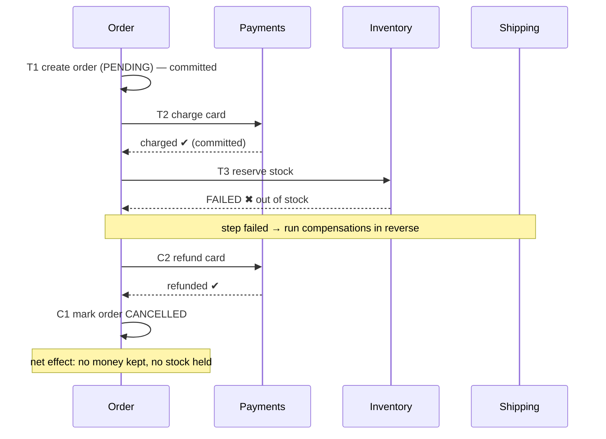

A single database gives you ACID for free — `BEGIN … COMMIT` is all-or-nothing. Split the data
across services (Orders, Payments, Inventory) and that guarantee evaporates: each service has its
own database, and there is no shared `COMMIT`. A **distributed transaction** is any attempt to
make a change atomic across those independent stores. There are two dominant answers — one that
locks for correctness (**2PC**) and one that trades atomicity for availability (**Saga**).

## The problem



You want *"charge the card **and** reserve the stock **and** create the order — all or none."*
If the charge succeeds but stock is gone, you must not keep the money. Somebody has to
coordinate.

## Two-Phase Commit (2PC)

A **coordinator** drives all participants through two rounds. **Phase 1 (prepare):** everyone
locks the rows and votes *yes* only if they are *certain* they can commit. **Phase 2
(commit/abort):** if **all** voted yes, the coordinator tells everyone to commit; a single *no*
aborts the whole thing.



If *any* participant votes no (or times out), phase 2 becomes a global **abort** and everyone
rolls back:



2PC gives you real atomicity and is common **inside** a datacenter (XA transactions, distributed
SQL). But it has a fatal flaw at scale.

:::gotcha
**2PC is a blocking protocol.** Between voting *yes* and hearing the decision, a participant holds
its **locks** and cannot proceed. If the **coordinator crashes** after prepare but before sending
the decision, participants are stuck **in doubt** — locked, unable to commit or abort, until the
coordinator recovers. One slow node stalls everyone; the coordinator is a single point of failure.
:::



## The Saga pattern

A **Saga** abandons global atomicity. Instead it is a **sequence of local transactions**, each
committing immediately in its own service. If a later step fails, the saga runs a
**compensating transaction** to *semantically undo* each completed step — there is no rollback,
only a corrective action (refund the charge, release the reservation).

:::note
A compensation is not a magic "undo." You cannot un-send an email; you send an apology. You cannot
un-charge in-place; you issue a **refund**. Design each step so a matching *compensating* step
exists.
:::

### Happy path, then a failure that compensates



### Choreography vs Orchestration

The two ways to wire a saga together:

````tabs
tabs:
  - label: Choreography
    body: |
      **No central brain.** Each service emits **events**; others react. Payments hears
      `OrderCreated` → charges → emits `PaymentCompleted` → Inventory hears it → reserves, and so on.

      ```text
      OrderCreated ─► PaymentCompleted ─► StockReserved ─► OrderConfirmed
      ```

      - ✅ Decoupled, no single point of failure, easy to add a listener.
      - ❌ Hard to see the *whole* flow; risk of **cyclic** event chains; debugging "where did it
        stall?" is painful across many services.

      Best for **simple sagas** (2–4 steps).
  - label: Orchestration
    body: |
      A central **orchestrator** (a saga coordinator) explicitly calls each step and decides what
      runs next — including firing compensations on failure.

      ```text
      Orchestrator ─► charge ─► reserve ─► ship
                   └─ on failure: refund ◄─ release
      ```

      - ✅ Flow is explicit and centralized — easy to reason about, monitor, and test.
      - ❌ The orchestrator is extra infrastructure and can become a coupling hotspot.

      Best for **complex sagas** with many steps or branching logic.
````

## 2PC vs Saga — how to choose

| | Two-Phase Commit | Saga |
|--|--|--|
| **Atomicity** | True atomic commit | *Eventual* — steps commit independently |
| **Isolation** | Yes (holds locks) | **No** — intermediate states are visible |
| **Blocking** | Blocks on coordinator failure | Non-blocking; each step is autonomous |
| **Consistency** | Strong | Eventual (compensations converge it) |
| **Coupling** | Tight (synchronous, lock-step) | Loose (async, per-service) |
| **Best for** | Few nodes, one datacenter, short txns | Microservices, long-lived business flows |

:::senior
The interview-winning line: *"I avoid 2PC across microservices because it's blocking and couples
availability to the slowest participant. I use a Saga with compensating transactions and accept
that intermediate states are visible — so I make each step **idempotent** and design the business
flow to tolerate an order being briefly `PENDING`."* That last clause shows you know Sagas trade
**isolation** for availability.
:::

:::warning
Because a Saga has **no isolation**, other transactions can read half-finished state (a "dirty
read" of a `PENDING` order). Counter it with **semantic locks** (a `PENDING` status that other
flows respect), **commutative** updates, or re-reading before compensating. Never assume a step
sees a consistent global snapshot.
:::

## Check yourself

```quiz
title: Distributed transactions check
questions:
  - q: 'What is the central weakness of two-phase commit at scale?'
    options:
      - 'It cannot guarantee atomicity'
      - text: 'It is blocking — if the coordinator crashes after prepare, participants hold locks in doubt and cannot proceed'
        correct: true
      - 'It requires every service to share one database'
      - 'It only works with NoSQL stores'
    explain: '2PC does give atomicity, but between the prepare vote and the decision, participants are locked. A coordinator crash leaves them in doubt, unable to commit or abort — a single point of failure that stalls everyone.'
  - q: 'In a Saga, how is a partially completed transaction "undone"?'
    options:
      - 'A global ROLLBACK across all services'
      - text: 'Compensating transactions — a new local transaction that semantically reverses each completed step (e.g. a refund)'
        correct: true
      - 'The coordinator releases the locks'
    explain: 'Each saga step already committed locally, so there is nothing to roll back. Instead you run compensating actions that semantically undo prior steps — refund the charge, release the reservation.'
  - q: 'What does a Saga give up compared to 2PC?'
    options:
      - 'Availability'
      - text: 'Isolation — intermediate states are visible to other transactions'
        correct: true
      - 'Durability'
    explain: 'Saga steps commit one at a time, so other readers can observe half-finished state (e.g. a PENDING order). You regain availability and non-blocking behavior at the cost of isolation.'
  - q: 'When is choreography (event-driven) preferable to an orchestrator for a saga?'
    options:
      - 'For very complex flows with many branches'
      - text: 'For simple sagas of a few steps, where decoupling matters and there is no need for a central view'
        correct: true
      - 'When you need strong isolation'
    explain: 'Choreography keeps services decoupled with no single point of failure and suits short flows. As step count and branching grow, an orchestrator makes the flow explicit and far easier to monitor and debug.'
```

:::key
No shared `COMMIT` across services means you pick a coordination strategy. **2PC** = true
atomicity but **blocking** (coordinator crash = locked, in-doubt participants); fine inside one
datacenter. **Saga** = a chain of local commits with **compensating transactions**, non-blocking
and loosely coupled, but with **no isolation** and only eventual consistency. Wire sagas via
**choreography** (simple) or **orchestration** (complex), and make every step **idempotent**.
:::
