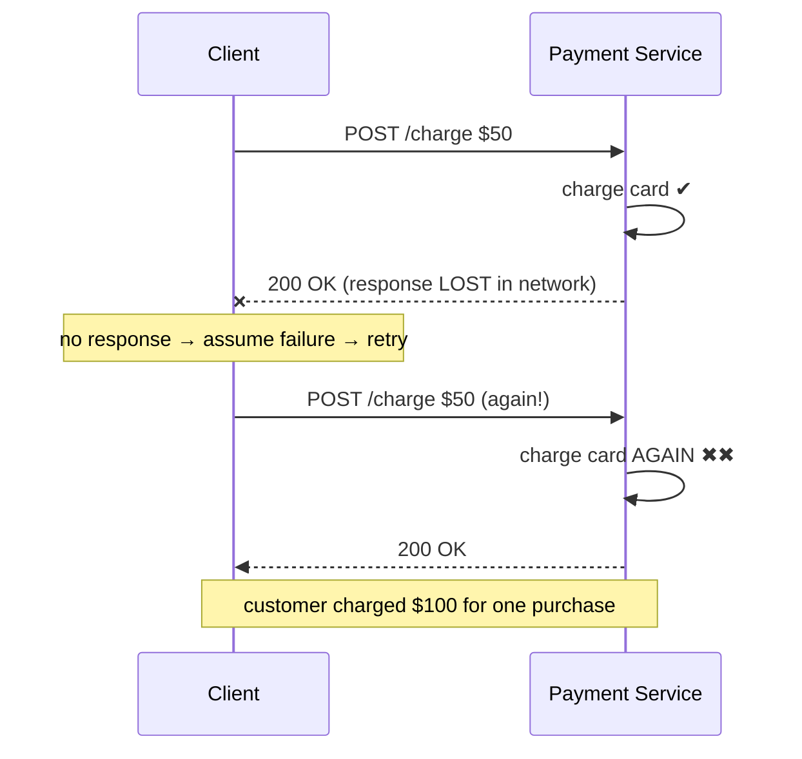
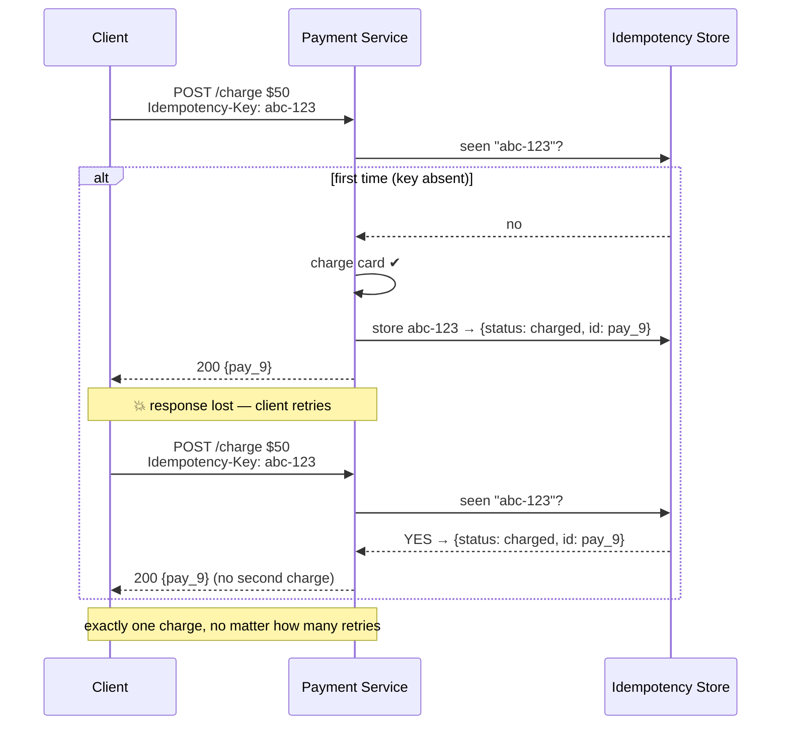

Networks lose messages, so clients **retry**. But a retry is indistinguishable from a genuine
second request — and if the first one actually *succeeded* and only the *response* was lost, a
naive retry charges the card twice. **Idempotency** is the property that doing an operation once
or many times has the **same effect**. It is the single most important safety net in any system
that handles money, orders, or messages.

## The retry trap



The client did nothing wrong — it *should* retry a lost response. The **server** must make the
duplicate harmless.

## Which operations are already safe?

| Operation | Idempotent? | Why |
|--|--|--|
| `GET /order/42` | ✅ | Reads change nothing |
| `PUT /order/42 {status: paid}` | ✅ | Sets an absolute value — same result each time |
| `DELETE /order/42` | ✅ | After the first, it is already gone |
| `POST /charge $50` | ❌ | Each call *creates* a new charge |
| `balance += 50` | ❌ | Relative update — repeats compound |

:::key
Prefer **absolute, declarative** operations (`SET status = paid`) over **relative** ones
(`balance += 50`). Absolute writes are naturally idempotent; relative ones need extra machinery to
be safe under retries.
:::

## Idempotency keys

For the `POST` that isn't naturally safe, the client generates a unique **idempotency key** (a
UUID) and sends it with the request. The server records the key with the *result* of the first
attempt. Any later request with the **same key** returns the **stored result** instead of
re-executing.



:::gotcha
**Store the key and do the work atomically.** If you charge the card, then crash *before* saving
the key, the retry re-charges. Wrap "record key + perform effect" in one transaction, or write the
key first in a `PENDING` state and flip it to `DONE` only when the effect commits — so a
concurrent retry sees `PENDING` and waits rather than double-executing.
:::

## At-least-once vs exactly-once vs at-most-once

Message systems (Kafka, SQS) describe **delivery guarantees**:

````tabs
tabs:
  - label: At-most-once
    body: |
      Fire and forget — never retry. A lost message is simply **dropped**.

      - No duplicates, but **data loss** on failure.
      - Fine for disposable telemetry; unacceptable for orders or payments.
  - label: At-least-once
    body: |
      Retry until acked. Every message **arrives**, but a lost *ack* causes **duplicates**.

      - No loss, but you **will** see the same message twice.
      - The pragmatic default — pair it with idempotent consumers.
  - label: Exactly-once
    body: |
      Each message takes effect **once** — no loss, no dupes. The ideal, and the hardest.

      - True end-to-end exactly-once *delivery* is impossible over an unreliable network (you
        can't distinguish a lost message from a lost ack).
      - What systems actually ship is **at-least-once delivery + idempotent processing** =
        *effectively* exactly-once. Kafka's "exactly-once" is dedup via producer IDs + sequence
        numbers, not magic.
````

:::senior
When an interviewer says *"we need exactly-once,"* the senior answer is: *"Exactly-once **delivery**
isn't achievable on a lossy network, so I'd use **at-least-once delivery** plus an **idempotent
consumer** — dedup on a message ID or idempotency key. That gives exactly-once **effect**, which is
what the business actually needs."* Distinguishing *delivery* from *effect* is the whole insight.
:::

## Deduplication in practice

The consumer keeps a record of processed IDs and skips repeats:

- **Dedup store:** a set/table of processed message IDs (often in Redis with a TTL, or a unique
  constraint in the DB that makes a duplicate insert fail harmlessly).
- **Natural keys:** use a business-unique value (`order_id`) as a primary key so a duplicate write
  is rejected by the database itself.
- **Sequence numbers:** track the highest sequence seen per producer; ignore anything not newer.

:::note
A dedup store can't grow forever. Use a **TTL / retention window** sized to your maximum retry
horizon (say 24–72h). Beyond that window a very-late duplicate is astronomically unlikely, and
keeping every key ever seen would cost more than it's worth.
:::

## Check yourself

```quiz
title: Idempotency check
questions:
  - q: 'Why can a network retry cause a double charge even when the client behaves correctly?'
    options:
      - 'The client sent malformed data'
      - text: 'The first request succeeded but its response was lost, so the client retries and the server executes the effect again'
        correct: true
      - 'The database was down'
    explain: 'A lost response is indistinguishable from a failed request, so a correct client retries. Without server-side idempotency, the second request runs the effect a second time.'
  - q: 'How does an idempotency key make a POST safe to retry?'
    options:
      - 'It encrypts the request'
      - text: 'The server stores the key with the first result and returns that stored result for any repeat of the same key, instead of re-executing'
        correct: true
      - 'It tells the load balancer to route retries to the same server'
    explain: 'The unique key lets the server recognize a duplicate and replay the original outcome, so the side effect happens at most once regardless of how many times the client retries.'
  - q: 'Which delivery guarantee is the practical default, and what must you pair it with?'
    options:
      - 'At-most-once, paired with retries'
      - text: 'At-least-once, paired with idempotent/deduplicating consumers to get exactly-once effect'
        correct: true
      - 'Exactly-once, which the network provides natively'
    explain: 'At-least-once guarantees no loss but allows duplicates. Combining it with idempotent processing yields exactly-once effect, which is what real systems mean by exactly-once.'
  - q: 'Which of these operations is NOT naturally idempotent?'
    options:
      - 'PUT /user/7 {name: "Ann"}'
      - 'DELETE /user/7'
      - text: 'POST that appends balance += 50'
        correct: true
      - 'GET /user/7'
    explain: 'A relative update (balance += 50) compounds with each repeat. PUT (absolute set), DELETE, and GET all produce the same state no matter how many times they run.'
```

:::key
Retries are unavoidable, so a repeated request must be **harmless**. Make writes idempotent —
prefer **absolute** updates, and for the rest use an **idempotency key** stored atomically with
the effect. True **exactly-once delivery** is a myth on a lossy network; ship **at-least-once +
dedup** for exactly-once *effect*.
:::
