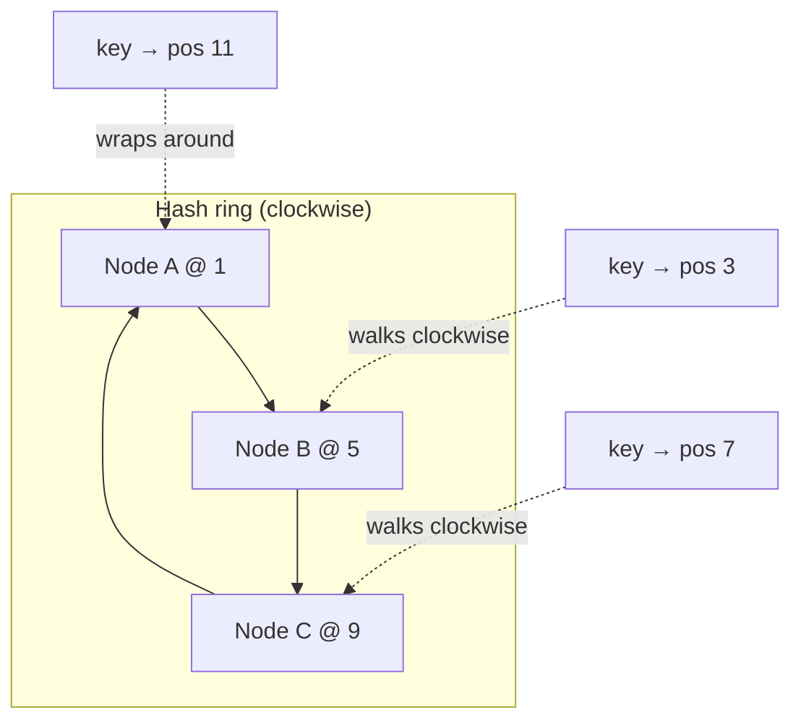
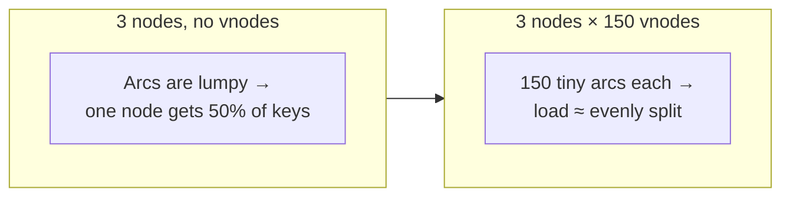

You have `N` cache servers and want to spread millions of keys across them. The obvious scheme —
`server = hash(key) % N` — works perfectly until `N` changes. Add or remove one node and the
modulus changes, so **almost every key** maps somewhere new: a cache stampede, a rehash storm,
and a thundering herd on your database. **Consistent hashing** is the technique that limits the
damage to roughly `1/N` of the keys.

## Why plain modulo is a disaster

Suppose 4 servers and `key % N`:

| key hash | `% 4` | `% 5` (added a server) |
|--|--|--|
| 10 | 2 | 0 |
| 11 | 3 | 1 |
| 12 | 0 | 2 |
| 13 | 1 | 3 |

Going from 4 → 5 servers moved **every single key**. In a cache, that means near-total misses at
once.

:::gotcha
With `hash(key) % N`, changing `N` by one remaps on the order of **N-1 / N** of all keys —
essentially everything. That is fine for a fixed-size hash table, catastrophic for a distributed
cache or shard map where nodes come and go.
:::

## The hash ring

Consistent hashing maps **both keys and nodes** onto the same circular space (say `0 … 2³² − 1`,
drawn as a ring). To find the owner of a key, hash the key to a point and walk **clockwise** to
the first node you hit. A node "owns" the arc from the previous node up to itself.

The magic: adding or removing a node only affects the **one arc** next to it. Every other key
keeps the same owner.



### Walk the ring step by step

```walkthrough
title: Consistent hashing — the ring in action
code: |
  pos  = hash(key) % RING_SIZE       // key lands somewhere on the ring
  node = firstNodeClockwiseFrom(pos) // owner = next node clockwise
  // add a node → only keys in ONE arc move
steps:
  - text: 'The ring has 12 positions (0-11). Three nodes sit at fixed points: A@1, B@5, C@9. Each node owns the arc ending at its position.'
    array: [0, 1, 2, 3, 4, 5, 6, 7, 8, 9, 10, 11]
    pointers: { 1: 'A', 5: 'B', 9: 'C' }
    line: 1
  - text: 'Key "user42" hashes to position 3. Walk clockwise from 3 → the first node is B@5. So B owns user42.'
    array: [0, 1, 2, 3, 4, 5, 6, 7, 8, 9, 10, 11]
    highlight: [3, 4, 5]
    pointers: { 1: 'A', 3: 'user42', 5: 'B owns' }
    line: 2
  - text: 'Key "cart99" hashes to position 7. Walk clockwise → the first node is C@9. C owns cart99.'
    array: [0, 1, 2, 3, 4, 5, 6, 7, 8, 9, 10, 11]
    highlight: [7, 8, 9]
    pointers: { 5: 'B', 7: 'cart99', 9: 'C owns' }
    line: 2
  - text: 'Key "img07" hashes to position 11. Nothing clockwise before the end, so it WRAPS around to A@1. A owns img07.'
    array: [0, 1, 2, 3, 4, 5, 6, 7, 8, 9, 10, 11]
    highlight: [11, 0, 1]
    pointers: { 1: 'A owns', 9: 'C', 11: 'img07' }
    line: 2
  - text: 'Now ADD node D at position 7. Only keys in the arc (5, 7] change hands — they move from C to the new D. cart99@7 now belongs to D.'
    array: [0, 1, 2, 3, 4, 5, 6, 7, 8, 9, 10, 11]
    highlight: [6, 7]
    pointers: { 1: 'A', 5: 'B', 7: 'D new', 9: 'C' }
    line: 3
  - text: 'Everything else is untouched: user42 still → B, img07 still → A, keys in (7,9] still → C. Only ~1/N of keys moved, not all of them.'
    array: [0, 1, 2, 3, 4, 5, 6, 7, 8, 9, 10, 11]
    sorted: [0, 1, 2, 3, 4, 5, 8, 9, 10, 11]
    highlight: [6, 7]
    pointers: { 1: 'A', 5: 'B', 7: 'D', 9: 'C' }
    line: 3
```

:::key
Adding node **D** only reassigns the keys in the single arc between **D** and its predecessor.
Every other key keeps its owner. That is the whole point: a membership change costs **~1/N** of
the keys, not **~all** of them.
:::

## Virtual nodes — evening out the load

With only a few real nodes, their random positions leave **uneven arcs** — one node might own a
huge slice and get hammered, another a sliver. Worse, when a node dies, its *entire* load lands on
the single next node (a hotspot).

The fix: give each physical node many **virtual nodes** — hash it to the ring under several
labels (`A#1`, `A#2`, … `A#150`). Each physical server now owns *many small arcs* scattered around
the ring.



| | Without vnodes | With vnodes |
|--|--|--|
| **Load balance** | Lumpy — arcs vary wildly | Smooth — law of large numbers evens it out |
| **Node removal** | Its whole load dumps on *one* neighbor | Its load spreads across *many* nodes |
| **Heterogeneous nodes** | Hard to weight | Give a bigger box *more* vnodes → more share |

:::senior
Real systems (Dynamo, Cassandra, Riak) use **100–256 virtual nodes per physical node**. In an
interview, mentioning vnodes unprompted signals depth: *"Consistent hashing bounds key movement to
1/N, and virtual nodes keep the load balanced and let a departing node's traffic spread across the
cluster instead of crushing one neighbor."*
:::

:::note
Consistent hashing isn't only for caches. It's how **Cassandra/DynamoDB** decide which node stores
a partition key, how **load balancers** pin sessions, and how CDNs route to origin — anywhere you
map keys to a changing set of nodes.
:::

## Check yourself

```quiz
title: Consistent hashing check
questions:
  - q: 'Why is `hash(key) % N` a poor way to assign keys to N servers?'
    options:
      - 'It is too slow to compute'
      - text: 'Changing N remaps almost every key at once, causing mass cache misses / data movement'
        correct: true
      - 'It cannot handle string keys'
      - 'It always creates hotspots'
    explain: 'The modulus depends on N, so adding or removing one node changes the result for roughly all keys — a rehash storm. Consistent hashing limits movement to about 1/N.'
  - q: 'On a hash ring, which node owns a given key?'
    options:
      - 'The node with the closest hash value in either direction'
      - text: 'The first node encountered walking clockwise from the key''s position'
        correct: true
      - 'The node with the lowest ID'
    explain: 'Each node owns the arc ending at its position; a key belongs to the next node clockwise (wrapping around the ring if needed).'
  - q: 'When you add one node to a consistent-hashing ring, which keys move?'
    options:
      - 'All keys are rehashed'
      - text: 'Only the keys in the single arc between the new node and its predecessor'
        correct: true
      - 'Half of all keys'
    explain: 'The new node inserts at one point and takes over just the arc leading up to it. Roughly 1/N of keys move; the rest keep their owner.'
  - q: 'What problem do virtual nodes solve?'
    options:
      - 'They encrypt keys on the ring'
      - text: 'They even out load and spread a failed node''s traffic across many nodes instead of one neighbor'
        correct: true
      - 'They eliminate the need for hashing'
    explain: 'With few real nodes the arcs are lumpy and a failure dumps everything on one neighbor. Many virtual nodes per server create many small arcs, balancing load and distributing a departing node''s share.'
```

:::key
`hash(key) % N` remaps everything when `N` changes — fatal for distributed caches and shards. The
**hash ring** places keys and nodes on a circle and assigns each key to the **next node
clockwise**, so a membership change moves only **~1/N** of keys. **Virtual nodes** (100–256 per
server) smooth out the load and spread a failed node's traffic across the cluster.
:::
