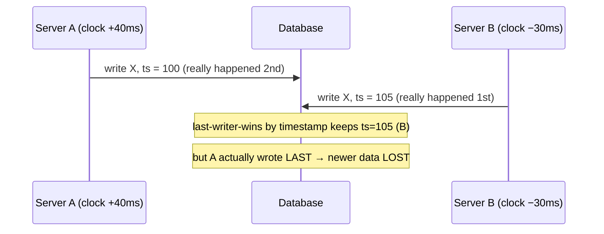
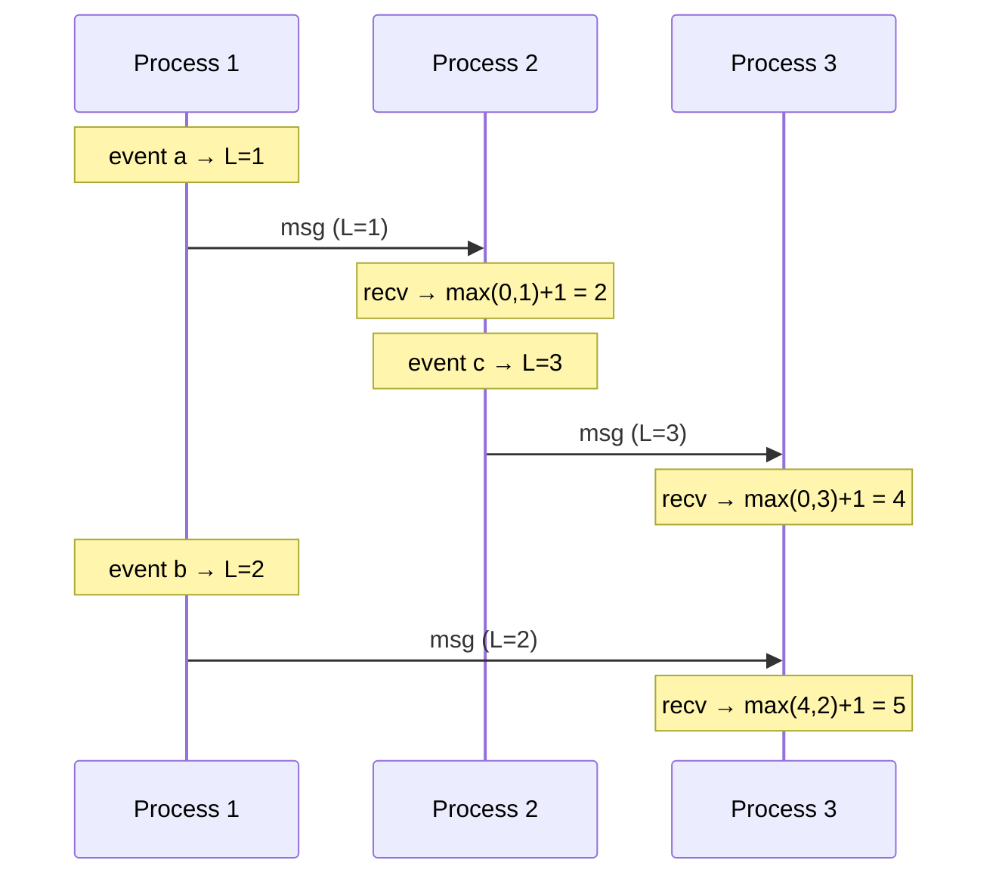
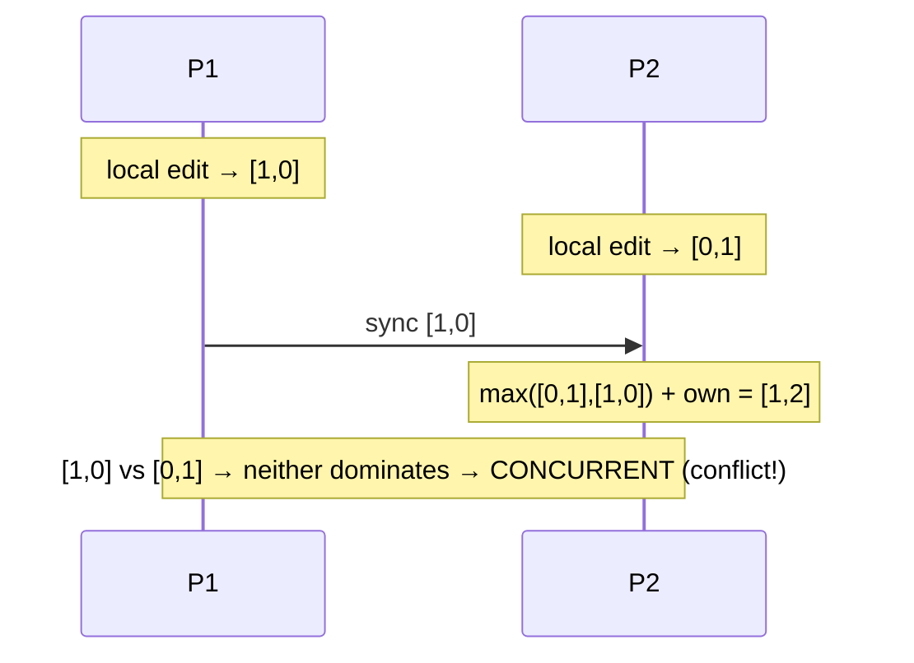

"Just use the timestamp" is the most common wrong answer in distributed systems. Two machines
never agree perfectly on the time, so ordering events by wall clock silently corrupts data. To
order events *correctly* across machines you need **logical clocks** that track **causality**, not
seconds. This is the foundation of conflict resolution, distributed logs, and databases.

## Physical clocks lie: clock skew

Every server has a quartz clock that drifts. Even with **NTP** synchronization, two machines can
disagree by **tens to hundreds of milliseconds** — and NTP can even step a clock *backwards*.



:::gotcha
**Never order events across machines by `System.currentTimeMillis()`.** Clock skew means a later
event can carry an *earlier* timestamp, so last-writer-wins can silently discard the newest data.
Wall-clock time is fine for *display*; it is unsafe for *ordering*.
:::

:::note
Google's **Spanner** attacks this with **TrueTime** — GPS + atomic clocks that expose time as an
interval `[earliest, latest]` with a bounded error (a few ms). It then *waits out* the uncertainty
before committing, buying globally-consistent ordering — at the cost of special hardware most
systems don't have.
:::

## Happens-before

Instead of "when did it happen?", ask "**did A cause B?**" Lamport's **happens-before** (`→`)
relation captures causality with three rules:

- If A and B are in the **same process** and A comes first, then `A → B`.
- If A is a **send** and B is the matching **receive**, then `A → B`.
- It's **transitive**: if `A → B` and `B → C`, then `A → C`.

If neither `A → B` nor `B → A`, the events are **concurrent** — there is no causal order, and any
tie-break is arbitrary.

## Lamport clocks

A **Lamport clock** is one integer counter per process. The rules:

1. **Increment** before every local event.
2. On **send**, attach the counter.
3. On **receive**, set `counter = max(local, received) + 1`.



This guarantees: **if `A → B` then `L(A) < L(B)`.**

:::warning
The converse is **false**: `L(A) < L(B)` does **not** mean A caused B — they might be concurrent
and just happened to get those numbers. A Lamport clock gives you a **total order** (add the
process ID as a tie-break) that is *consistent* with causality, but it **cannot detect
concurrency**. For that you need vector clocks.
:::

## Vector clocks

A **vector clock** is an array with one counter **per process**. Each process bumps its own slot
on an event and takes the element-wise `max` on receive. Now you can *compare* two events:

| Comparison | Meaning |
|--|--|
| Every element of `V(A) ≤ V(B)` (and `A ≠ B`) | `A → B` — A happened before B |
| Every element of `V(A) ≥ V(B)` | `B → A` |
| Neither dominates (some greater, some smaller) | **Concurrent** → a real conflict |



Because `[1,0]` and `[0,1]` are incomparable, the system **knows** these were concurrent edits and
can surface a conflict (Dynamo returns *both* versions as **siblings** for the app to merge) rather
than blindly picking one.

````tabs
tabs:
  - label: Lamport clock
    body: |
      One integer per process. Cheap and compact.

      - ✅ Gives a total order consistent with causality.
      - ❌ **Cannot** tell if two events were concurrent.
      - Use when you just need *a* consistent ordering (e.g. a tie-break).
  - label: Vector clock
    body: |
      One integer **per process** (an array). Bigger to store and ship.

      - ✅ **Detects** concurrency and true conflicts.
      - ❌ Grows with the number of processes (needs pruning in large systems).
      - Use when you must resolve conflicting concurrent writes (Dynamo, Riak, CRDTs).
````

:::senior
The crisp interview framing: *"Physical clocks are for humans; logical clocks are for causality. I
never order distributed events by wall time. A **Lamport clock** gives a total order consistent
with happens-before; a **vector clock** actually detects concurrent writes so I can resolve
conflicts instead of losing data to last-writer-wins."*
:::

## Check yourself

```quiz
title: Time and ordering check
questions:
  - q: 'Why is it unsafe to order events across servers using wall-clock timestamps?'
    options:
      - 'Timestamps take too many bytes'
      - text: 'Clock skew means a later event can carry an earlier timestamp, so ordering (and last-writer-wins) can be wrong and lose data'
        correct: true
      - 'Servers cannot read the system clock'
    explain: 'Even with NTP, clocks drift by milliseconds and can step backwards. A causally-later write may show an earlier timestamp, so timestamp-based ordering silently corrupts data.'
  - q: 'A Lamport clock guarantees that if A happened-before B, then L(A) < L(B). Does the reverse hold?'
    options:
      - 'Yes — L(A) < L(B) always means A caused B'
      - text: 'No — L(A) < L(B) does not imply causality; the events may be concurrent'
        correct: true
      - 'Only if they are in the same process'
    explain: 'Lamport clocks are consistent with causality one way only. A smaller counter does not prove a causal link — the events could be concurrent and just numbered that way.'
  - q: 'Two events have vector clocks [2,1] and [1,2]. What is their relationship?'
    options:
      - 'The first happened before the second'
      - text: 'Concurrent — neither vector dominates the other, so it is a genuine conflict'
        correct: true
      - 'They are the same event'
    explain: '[2,1] vs [1,2]: the first is greater in slot 1 but smaller in slot 2, so neither dominates. That incomparability means the events were concurrent — a conflict to resolve.'
  - q: 'What is the main advantage of a vector clock over a Lamport clock?'
    options:
      - 'It uses less memory'
      - text: 'It can detect whether two events were concurrent (a conflict), not just impose an order'
        correct: true
      - 'It synchronizes physical time'
    explain: 'A Lamport clock only yields a total order. A vector clock, with one counter per process, lets you compare events and detect concurrency — essential for conflict resolution in systems like Dynamo.'
```

:::key
Wall clocks disagree (**skew**), so never order distributed events by timestamp. **Happens-before**
captures causality. A **Lamport clock** (one integer) gives a total order consistent with causality
but can't spot concurrency. A **vector clock** (one integer per process) *can* — it detects
concurrent writes so you resolve conflicts instead of losing data to last-writer-wins.
:::
