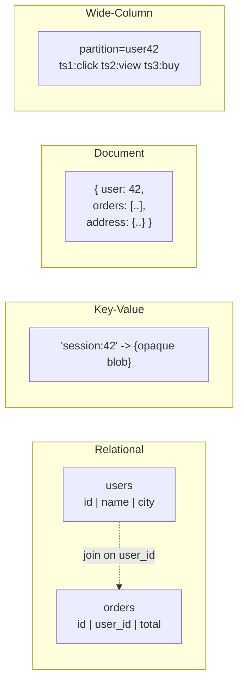
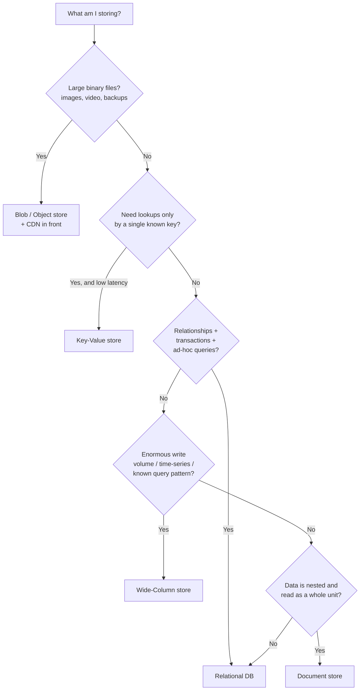
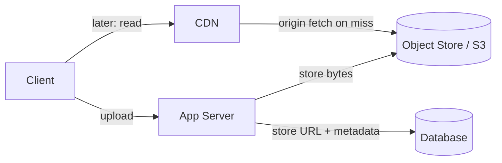

Every design eventually reaches the question **"where does the data live?"** There is no single
right answer — there is a small menu of storage *shapes*, each tuned for a different access
pattern. The senior skill is not memorizing products; it is **matching the workload to the
shape**, then naming a product that fits.

## 1. The five shapes

| Shape | Data model | Best for | Weak at | Examples |
|--|--|--|--|--|
| **Relational (SQL)** | Rows in typed tables, joins, transactions | Structured data with relationships; strong consistency | Horizontal write scale; flexible schema | PostgreSQL, MySQL |
| **Key-Value** | `key → opaque value` | Ultra-fast lookups by known key; caches, sessions | Querying by anything but the key | Redis, DynamoDB |
| **Document** | Self-contained JSON-ish docs | Nested/varying data read as a whole; fast iteration | Cross-document joins; multi-doc transactions | MongoDB, Couchbase |
| **Wide-Column** | Rows keyed by partition, sparse columns | Massive write throughput, time-series, huge datasets | Ad-hoc queries; joins | Cassandra, Bigtable, HBase |
| **Blob / Object** | Immutable files behind a key + URL | Large binaries: images, video, backups | Querying *inside* the object | S3, GCS, Azure Blob |

:::key
Relational is the **default** for OLTP with relationships and transactions. Reach for a NoSQL
shape only when a specific pressure — scale, access pattern, or data shape — makes relational
awkward. "We might need to scale someday" is not a reason; a concrete read/write pattern is.
:::

## 2. How they differ in one picture



- **Relational** normalizes: the same fact lives in one place, and joins stitch it back together.
- **Document** denormalizes the *opposite* way — the user *and* their orders live in one blob you
  read in a single hit (great reads, harder writes/consistency).
- **Wide-column** is a giant sparse, sorted map keyed by a **partition key** — built to spread
  writes across a cluster.

## 3. The decision flow

Walk this top-down in an interview and narrate your reasoning aloud.



:::senior
Notice relational is both a fast path (relationships + transactions) **and** the fallback. Most
systems are well served by Postgres; NoSQL earns its place by removing a *specific* relational
limitation, and you should be able to name which one.
:::

## 4. The trade-offs behind the shapes

- **Schema flexibility vs safety.** SQL enforces a schema (safety, but migrations cost effort);
  document/KV stores are schema-on-read (fast iteration, but garbage can creep in).
- **Joins vs denormalization.** SQL joins at read time; NoSQL asks you to **pre-join** by
  duplicating data. You trade storage and write complexity for read speed.
- **Consistency vs scale.** A single relational primary gives strong consistency but caps write
  throughput. Wide-column/KV stores scale writes horizontally by relaxing consistency (often
  eventual) — the CAP trade-off made concrete.
- **Query flexibility vs speed.** SQL answers questions you did not anticipate. NoSQL is fastest
  when you **design the store around the queries you already know**.

:::gotcha
"NoSQL scales, SQL doesn't" is a myth. Postgres routinely handles tens of thousands of writes/sec
and scales reads with replicas. Choose NoSQL for the **access pattern and data shape**, not from
a vague fear that SQL won't keep up.
:::

## 5. Blob storage is special

Never store large binaries (images, videos, PDFs) *inside* a database — it bloats backups,
blows the buffer pool, and slows every query. The standard pattern:



Keep the **bytes in the object store**, keep the **metadata + URL in the database**, and put a
**CDN in front** for reads. This split shows up in nearly every media-heavy design.

## Recall

```flashcards
title: Storage shapes
cards:
  - front: 'Default store for OLTP with relationships + transactions?'
    back: '**Relational (SQL)** — Postgres/MySQL. Reach for NoSQL only to remove a specific limitation.'
  - front: 'Fastest store for lookups by a single known key (sessions, cache)?'
    back: '**Key-Value** — Redis, DynamoDB. Cannot query by anything but the key.'
  - front: 'Store built for massive write throughput / time-series, keyed by a partition key?'
    back: '**Wide-Column** — Cassandra, Bigtable. Design it around your known query pattern.'
  - front: 'Store for nested data read as one self-contained unit?'
    back: '**Document** — MongoDB. Denormalizes the object; weak at cross-document joins.'
  - front: 'Where do images/videos go, and what holds the URL?'
    back: 'Bytes in a **blob/object store (S3)** behind a **CDN**; the **database** holds only the URL + metadata.'
```

## Check yourself

```quiz
title: Storage options check
questions:
  - q: 'A social feed stores each post plus its embedded comments and reactions, almost always read together as one object. Which shape fits best?'
    options:
      - 'Wide-column'
      - text: 'Document store'
        correct: true
      - 'Blob storage'
    explain: 'Self-contained, nested data read as a whole unit is the document sweet spot — one read returns the post and everything attached to it.'
  - q: 'You need to store 50M product images and serve them fast worldwide. Where do the image bytes go?'
    options:
      - 'As BLOB columns in the relational database'
      - text: 'In an object store (S3) with a CDN in front; the DB keeps only the URL + metadata'
        correct: true
      - 'In Redis as key-value entries'
    explain: 'Large binaries belong in an object store behind a CDN. Putting them in the DB bloats backups and the buffer pool; the DB should hold only the URL and metadata.'
  - q: 'A team says "we picked Cassandra because NoSQL scales and SQL does not." What is the flaw?'
    options:
      - 'Cassandra cannot handle high write volume'
      - text: 'The choice is fear-driven, not pattern-driven — SQL scales well, and NoSQL should be chosen for a specific access pattern or data shape'
        correct: true
      - 'Cassandra is a document store, not wide-column'
    explain: 'Postgres handles large loads and scales reads with replicas. NoSQL earns its place by removing a concrete limitation (e.g., horizontal write scale for time-series), not by a blanket belief that SQL cannot cope.'
  - q: 'Which workload most clearly justifies a wide-column store like Cassandra?'
    options:
      - text: 'Ingesting billions of time-series events/day with a known partition-key query pattern'
        correct: true
      - 'Complex ad-hoc reports joining five tables'
      - 'A small app needing ACID transactions across accounts'
    explain: 'Wide-column shines at huge write volume and time-series when queries follow the partition key. Ad-hoc joins and cross-row transactions are exactly its weaknesses — those favor relational.'
```

:::key
There are five storage shapes: **relational, key-value, document, wide-column, blob**. Default to
**relational**; pick a NoSQL shape to solve a *named* problem (write scale → wide-column, key
lookups → KV, nested reads → document). Always put **big binaries in an object store behind a CDN**
with the URL in the DB. Match the shape to the **access pattern**, not to hype.
:::
